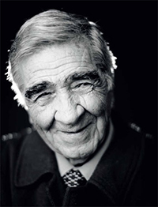

# Humberto Giannini Iñiguez

Hijo de Osvaldo Giannini Piga y Olga Íñiguez Maturana. Nació en San Bernardo el 25 de febrero de 1927. Vivió gran parte de su niñez y adolescencia en Valparaíso.

#### Estudios

**Tenía 16 años cuando dejó el colegio para entrar a la marina mercante.** Durante esas travesías, en esas largas horas de contemplación del cielo por las noches, surgieron las preguntas y de esas preguntas, derivó naturalmente su pasión por la filosofía.

Al volver de sus viajes tomó un taller de poesía con el poeta Gonzalo Rojas. Pero más que los versos, fueron de nuevo las preguntas que surgen de la poesía, las que lo afirmaron en su inclinación por la filosofía.

A los 26 años, en 1953, entró a estudiar **Pedagogía en Filosofía en el Instituto Pedagógico de la Universidad de Chile.** En 1959, obtuvo una **beca del gobierno de Italia para cursar estudios en la Universidad de la Sapienzia, Roma**. Allí conoció a Enrico Castelli, filósofo italiano de quien se hizo discípulo, y quien inspiró profundamente su pensamiento.

En 1960, obtuvo el título de **Profesor de Estado en Filosofía por la Facultad de Filosofía y Educación de la Universidad de Chile**. Su tesis de grado _La metafísica del lenguaje_, fue aprobada con distinción. Años más tarde, esta tesis fue publicada y se convirtió en uno de sus libros más importantes.

#### Trayectoria

Dictó cátedras regulares y seminarios en pregrado, magistratura y doctorado **en diversas universidades nacionales y extranjeras**. Se desempeñó en el **Departamento de Filosofía de la Facultad de Filosofía y Humanidades de la Universidad de Chile**, al que estuvo ligado durante seis décadas.

**Fue profesor adjunto en la Facultad de Filosofía de la Universidad Católica.**

En 1972 participó en la **fundación del Departamento de Filosofía de la Sede Norte de la Universidad de Chile**, institución de la que fue director desde sus inicios hasta su disolución a mediados de la década de 1970. En esa posición, apoyó a sus colegas perseguidos y exiliados políticos. La Sede Norte se cerró por expresa  petición de la dictadura de Pinochet.

En 1978 **integró la Comisión Chilena de Derechos Humanos**, organismo no gubernamental que promovió la defensa de los Derechos Humanos y documentó las violaciones a los derechos fundamentales cometidas durante la dictadura cívico-militar en Chile.

Hacia el final de la década de los 80, **formó parte del comité de la Enciclopedia Iberoamericana de Filosofía**, dirigida por el filósofo español Manuel Reyes Mate.

En 1988, fue nombrado **miembro fundador del Comité de Honor del Collège International de Philosophie** con sede en París.

Durante 1995, participó en la **fundación de la Cátedra Unesco de Filosofía**, primera cátedra de filosofía en el mundo, con sede en Santiago de Chile. Fue Presidente desde su fundación hasta el fin de su vida en el año 2014.

En mayo de 1995, organizó junto a otros filósofos nacionales y extranjeros el **Coloquio Internacional** _**Spinoza: teología, ética y política**_. 

Durante el gobierno de Ricardo Lagos, en 2001, se le otorgó el cargo de **Agregado Científico y Tecnológico del Ministerio de Relaciones Exteriores en Italia.** Renunció al cargo para retomar la vida académica hasta sus últimos días.

#### Publicaciones

La obra de Gianinni ha sido fundamental para el desarrollo de la filosofía en Chile. Ha publicado _**Reflexiones acerca de la convivencia humana**_ **\(1965\) y** _**El mito de la autenticidad**_ **\(1968\).** En 1981 se editó su obra _Desde las palabras_. En 1985 se publicó _**Breve Historia de la Filosofía**_**, libro que a la fecha cuenta con más de una veintena de ediciones** y que se convirtió en material de cabecera para el estudio de la filosofía en la educación secundaria chilena.

En 1987, publicó otro hito importante en su bibliografía: **L**_**a reflexión cotidiana: hacia una arqueología de la experiencia**_**, obra prologada por el filósofo francés Paul Ricoeur**, y que luego fue traducida al francés y publicada en Francia bajo el título de _La réflexion quotidienne: Vers une archéologie de l'expérience_, en 1992. Ese mismo año se publicó _La experiencia moral_.

Algunos años más tarde, publicó _**La razón heroica \(Sócrates y el Oráculo de Delfos\), obra en que expone los últimos días de la vida de Sócrates**_ a modo de una obra de teatro.

En el año 1997 se publicó _Del bien que se espera y del bien que se debe_.

Fue en 1999 que finalmente se publicó su tesis _**La metafísica del lenguaje**_**, con la que se había titulado casi cuatro décadas antes.** 

En 2001 se publicó _El pasar del tiempo y su medida \(la temporalidad en Aristóteles, con comentario de Santo Tomás de Aquino y otras anotaciones\)_.

En 2007 se lanzó la primera edición de _La metafísica eres tú_.

#### Reconocimientos

En 1984 recibió el **Premio Municipal de Santiago**.

En 1992 fuer galardonado con el **Premio Jorge Millas**, otorgado por la Universidad Austral.

En 1993 recibió el **Premio Manuel Montt**.

En 1998 fue elegido **miembro de número de la Academia Chilena de la Lengua.**

Fue nombrado **Doctor Honoris Causa de la Universidad de París en 2008**_._ 

En 2009 recibió el **Premio Altazor** de Ensayo por _La metafísica eres tú._

Ese mismo año fue condecorado como **Cavaliere Ordine Della Stella Della Solidarietá Italiana**. 

Dos años más tarde, fue distinguido por **Ilustre Municipalidad de Ñuñoa**, comuna en la que residió gran parte de su vida.

Fue nombrado **Profesor Emérito de la Universidad de Chile en 2012.**

En 2013 recibió la **Medalla Juvenal Hernández Jaque**, también en la Universidad de Chile. El mismo año la Universidad Arcis le otorgó el título de Doctor Honoris Causa.

Fue distinguido con el **Premio Nacional de Humanidades y Ciencias Sociales en 1999**, por su aporte en el desarrollo de la filosofía en el ámbito universitario. Esta premiación fue apoyada por el destacado filósofo italiano Gianni Vattimo.

#### Fuentes

[Universidad Católica](https://www.uc.cl/es/la-universidad/premios-nacionales/7385-humberto-giannini-iniguez-1927)

[Universidad de Chile](http://www.humbertogiannini.uchile.cl/)

[Filosofía Universidad de Chile](http://www.filosofia.uchile.cl/humberto-giannini/117103/biografia)

