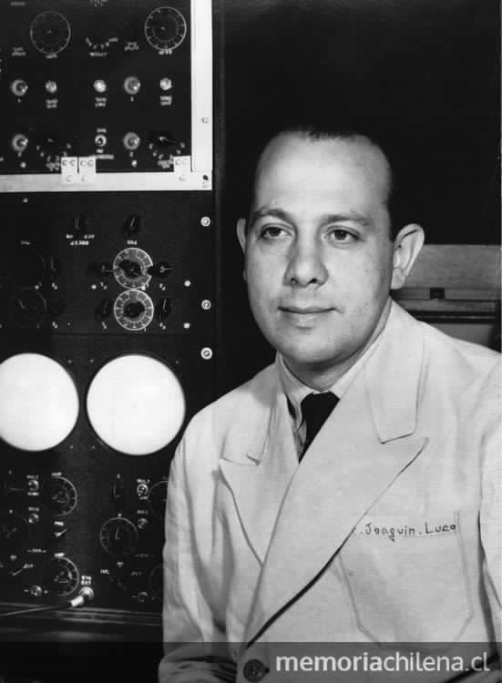

# Joaquín Luco Valenzuela

Si hay algo que distingue la trayectoria de Joaquín Luco Valenzuela \(18 de julio de 1913\), es haber hecho de la investigación científica, su forma de vida.

#### Influencia

La influencia que ejerció sobre algunos de los más trascendentes investigadores chilenos, como Humberto Maturana o Francisco Varela, se entiende no solo por el qué de sus hallazgos, de sus descubrimientos, de sus **procesos en el área de las neurociencia y la neurofisiología**, sino también por el cómo transmitió a colegas y alumnos sus vastos conocimientos. Su apodo de "El loco Luco", con el que se le conoció por años, es una señal clara de la **creatividad como rasgo esencial de su trabajo**, aunque quizás no hace justicia a su seriedad, meticulosidad y profesionalismo.

#### Estudios y vida académica

Entró a estudiar medicina en la Universidad de Chile en 1929. No pasó mucho tiempo antes de que este avezado estudiante descubriera que **lo suyo no era el ejercicio práctico de la medicina, sino la investigación**. Esto lo llevó en 1931, a trabajar como ayudante ad honorem en el recientemente creado Laboratorio de Fisiología de la Escuela de Medicina de la Universidad Católica. Al terminar su carrera, partió a hacer una r**esidencia al laboratorio de la Universidad de Harvard**, en Estados Unidos, donde conoció a quien fuera su mentor, el científico mexicano Arturo Rosenblueth. Por eso época ya se distinguía por su particular acercamiento a la ciencia.

Al volver a Chile, con apenas 26 años, fue nombrado **director de la Escuela de Medicina de la Universidad Católica de Chile**, cargo en el que estuvo durante diez años. En ese período, Luco le dio énfasis a la investigación, lo que se plasmó, entre otros hitos, al fundar el **Laboratorio de biología experimental**. En esta casa de estudios ejerció también como docente de las cátedras de fisiología y farmacología. **En 1950 inauguró su cátedra de neurofisiología**.

**Legado y premios**

La originalidad fue lo que siempre caracterizó su ejercicio de investigación. En Chile y el mundo es reconocido como **pionero de la Neurociencia**, campo en el que abordó problemas como la integridad del sistema nervioso. En ese ámbito desarrolló una aproximación experimental para **estudiar el aprendizaje y la memoria utilizando como modelo la cucaracha Blatta orientalis**. Estos trabajos fueron precursores en un campo promisorio y se publicaron en la revista Nature.

Joaquín Luco cumplió un **papel fundamental en el proceso de institucionalización de la Universidad Católica** pero también influyó de manera importante en otros organismos educativos como la Universidad de Chile, Universidad Austral y en la creación de CONYCIT.

Su legado en el campo de la neurociencia es invaluable.

En agosto de 1955, la UC lo nombró Doctor Honoris Causa. Y a pesar de ser un férreo opositor a la dictadura en el seno de la ciencia, **en 1975 se le otorga el Premio Nacional de Ciencias** por su desempeño como neurofisiólogo experimental.

Murió el 19 de julio de 2002.

**Fuentes:**

[Universidad Católica](https://www.uc.cl/es/la-universidad/premios-nacionales/7421-joaquin-luco-valenzuela-1913-2002)

[Memoria Chilena](http://www.memoriachilena.gob.cl/602/w3-article-338857.html)

[EcuRed](https://www.ecured.cu/Joaqu%C3%ADn_Luco_Valenzuela)

[Universidad de Chile](http://www.uchile.cl/portal/presentacion/historia/grandes-figuras/premios-nacionales/ciencias-/6662/joaquin-luco-valenzuela)

