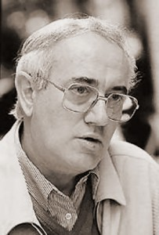

# Jorge Díaz Gutiérrez

Nació el 20 de febrero de 1930 en Rosario, Argentina. Fue hijo de padres españoles. Su padre era asturiano, de un pueblito que miraba al mar. Su madre, en tanto, católica devota, era vasca nacida en San Sebastián.

#### Estudios

La familia de Jorge Díaz llegó a Chile en 1934, cuando el dramaturgo tenía apenas cuatro años. En cuanto llegó, lo nacionalizaron. Estudió en un colegio de curas en San Miguel y luego en el San Pedro Nolasco.

Tras salir del colegio **entró a estudiar arquitectura en la Universidad Católica de Chile**, de donde egresó en 1955. En esa época **montó exposiciones pictóricas** y comenzaba a fortalecerse su vínculo con el teatro.

Desde 1961 empezó a ejercer como dramaturgo. Su **primera obra fue** _**Manuel Rodríguez**_**,** estrenada por el Teatro Independiente de Chile.

#### Trayectoria

Su vocación teatral lo llevó hasta el **ICTUS, donde en principio desempeñó todo tipo de labores** escenográficas y pequeños roles, hasta que empezó a escribir obras especialmente para esta compañía. Se alcanzaron a estrenar **siete obras de su autoría en el ICTUS**. De esa época es una de sus **más renombradas,** _**El cepillo de dientes**_**, estrenada en 1961**. A través de la ironía y el humor ácido, lograba una punzante crítica social del Chile de la época.

En ICTUS también **incursionó en la dirección** con obras como _Réquiem por un girasol_ \(1961\) y _Variaciones para muertos de percusión_ \(1964\).

Luego **viajó a España, donde permaneció por tres décadas**.

En España en los años 1960, llegó a formar parte activa de una generación de autores que vivían el **teatro desde una perspectiva global**. Esto es, que cada integrante de la compañía se involucraba en la obra desde su creación hasta su realización, dirección y escenografía. Otro de los sellos que marcó a esa generación, era **su compromiso social y político**.

En 1969 formó el **grupo Teatro del Nuevo Mundo**. Este grupo empezó a recorrer España y luego partes de América presentando conferencias dramatizadas, que por su formato eludían la censura, y de esta forma daban a conocer nuevos textos teatrales latinoamericanos.

Más tarde, junto a Pedro Meyer, Mari Paz Ballesteros y el director teatral Vicente Saínz de la Peña, escribió el texto Americaliente, con el que participaron en **el Primer Festival de Teatro Latinoamericano, que se celebró en Puerto Rico en 1971**. Siguió una breve gira por Estados Unidos. En Nueva York actuaron durante una semana en un teatro del Off Off Broadway, también se presentaron en Pittsburgh y Buffalo.

Al regresar a España montaron obras con las que luego viajaron hasta Australia para actuar ante inmigrantes de habla hispana, y australianos estudiantes de español en Universidades del país.

#### Teatro, narrativa, radio, televisión

Escribió **más de 100 obras de teatro para adultos y 37 obras de teatro infantil**; publicó más de 50 libros en Chile, España y otros países. Su producción dramatúrgica tuvo esencialmente dos grandes ejes temáticos: por un lado, una **indagación profunda en las relaciones entre hombres y mujeres**, y por otro, la **denuncia de las torturas y las consecuencias del exilio**, inspiradas en el golpe militar de 1973 en Chile y otras realidades iberoamericanas.

De su época con ICTUS, se pueden mencionar algunas como _La paloma y el espino_ \(1957\), _El cepillo de dientes_ \(1960\), _**Un hombre llamado isla**_ \(1961\), _Réquiem para un girasol_ \(1961\), _El velero en la botella_ \(1962\), _El lugar donde mueren los mamíferos_ \(1963\), _Variaciones para muertos de percusión_ \(1964\), _El nudo ciego_ \(1964\).

Ya en España, _Mear contra el viento_ \(1974\), _Toda esta larga noche_ \(1976\) y _La puñeta_ \(1977\) . Más adelante escribió _**Las cicatrices de la memoria**_ ****\(1984\), _Muero, luego existo_ \(1985\) y _La otra orilla_ \(1986\), _**Nadie es profeta en su espejo**_ ****\(1990\), _Canción de cuna para un anarquista_ \(2003\), _El Quijote no existe_ \(2005\).

El teatro no fue su único campo de acción en la literatura. Escribió **cuentos** \(_Escrito en la vía pública_ en 1995\), **radioteatros** \(_La travesía_, 2004\) y **libretos de televisión** para Chile \(_La Cosiaca_, 1972\) y España \(_El último verano_, 1988\).

Incursionó también en **la ilustración y el collage**, entre otros oficios.

Durante sus últimos 20 años escribió obras inspiradas en **grandes figuras como Pablo Neruda y Miguel de Cervantes**, además de piezas de carácter social como _Ópera inmóvil_ \(1994\).

#### Premios

Una prolífica trayectoria como la que ha tenido Sergio Díaz, le han valido por cierto una gran variedad de premios. Entre ellos, el **Premio Palencia de Teatro** \(España\), en 1980; **El segundo premio en el Cuarto Concurso de Dramaturgia Eugenio Dittborn,** otorgado por la Escuela de Teatro de la Universidad Católica, por su obra _Fragmentos de alguien_, En 1987 **Premio de Teatro Centenario de la Caja de Ahorros de Badajoz**, en 1989; el **Premio Antonio Buero Vallejo** de Guadalajara, en 1992; Premio Born de Teatro 1990 y 1992.

Tras recibir el **Premio Nacional de las Artes de la Representación y Audiovisuales, en 1993**, volvió definitivamente a residir en Chile.

En 1996 su obra _La marejada_ fue galardonada con el **Premio a la Dramaturgia Pedro de la Barra** de la Universidad de Chile.

Murió el 13 de marzo de 2007 en Santiago.

#### Fuentes

[Página Oficial del autor](https://www.jorge-diaz.org/biografia-jorge-diaz-gutierrez-1930-2007/)

[Memoria Chilena](http://www.memoriachilena.gob.cl/602/w3-article-659.html)

[EcuRed](https://www.ecured.cu/Jorge_D%C3%ADaz_Guti%C3%A9rrez)

[Universidad Católica](https://www.uc.cl/es/la-universidad/premios-nacionales/7361-jorge-diaz-gutierrez-1930-2007)

[Universidad de Chile](http://www.uchile.cl/portal/presentacion/historia/grandes-figuras/premios-nacionales/teatro-y-artes-de-la-representacion/6578/jorge-diaz-gutierrez)

