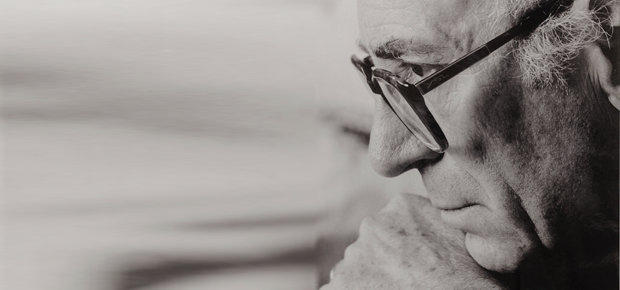

# José Balmes Parramón

Nació el 20 de enero de 1927, en Montesquiu, Cataluña, España.

#### Inicios

Siendo muy niño sus padres lo estimularon a seguir el camino del arte.

Llegó a Chile en 1939, con 12 años, **huyendo de la Guerra Civil española, a bordo del Winnipeg**.

#### Trayectoria

Entre 1943 y 1949 estudió en la **Escuela de Bellas Artes de la Universidad de Chile**, donde fue alumno de Pablo Burchard y Camilo Mori. Por esa época, formó el **Grupo de Estudiantes Plásticos \(GEP\)**, junto a Eduardo Martínez Bonati, Gracia Barrios, Gustavo Poblete, Guillermo Núñez y Hardy Wistuba, entre otros.

Su simbiosis con Chile y su gente fue tan profunda que **en 1947 le fue concedida la nacionalidad chilena.**

En 1952 se casó con la pintora Gracia Barrios, quien fue su pareja de toda la vida. Entre 1954 y 1955 fue becado por la [Universidad de Chile](http://www.uchile.cl/portal/presentacion/historia/grandes-figuras/premios-nacionales/artes/6538/jose-balmes-parramon), para continuar su **formación artística en Francia e Italia**.

En la década de los sesenta fundó el **Grupo Signo junto a Gracia Barrios, Alberto Pérez y Eduardo Martínez Bonati**. Ellos planteaban una posición crítica frente a lo que consideraban un excesivo formalismo en la pintura chilena contemporánea de la época.

En 1966 fue nombrado **Director de la carrera de Artes Plásticas de la Escuela de Bellas Artes** y en 1972 **Decano de la Facultad de Artes de esa institución**, cargo que desempeñó hasta 1973. Ese año **partió al exilio a Francia** junto a su familia.

Fue Profesor de Pintura asociado de la Unité de Formation et de Recherche Arts Plastiques et Sciences de l'Art de l'Université París I Pantheon, La Sorbone, Francia \(1974 a 1985\).

A partir de 1986 fue **profesor de pintura de la Escuela de Arte de la Universidad Católica**, donde en 1993 fue nombrado **Profesor Emérito**. Tres años después, recibió la misma distinción en la Universidad de Chile.

En esta extensa [entrevista televisiva](https://www.13.cl/c/programas/documentales/capitulos/el-pintor-jose-balmes-en-off-the-record-2005) un año antes de su muerte, permite comprender en profundidad su imaginario, su trayectoria y su trabajo.

#### Obra

La obra de José Balmes ha estado estrechamente ligada **al acontecer social y al compromiso del artista** con una conciencia colectiva.

Su obra podría situarse cerca del **expresionismo abstracto**, pero va mucho más allá, **experimentando con formatos y soportes**, pintando con lo que tuviera a mano, muchas veces con escobas viejas. En sus telas, a su vez, es posible encontrar manchas, objetos y materiales de diversa índole que incorpora a su pintura, dándole una expresividad única.

Sus temas fueron los grandes hitos que han marcado la historia de Chile, España y el mundo. La Guerra Civil, La dictadura, el exilio, la libertad, los derechos humanos.

En este enlace puedes apreciar [algunas de sus obras](http://www.artistasvisualeschilenos.cl/658/w3-article-39918.html#biografia) más representativas y otros detalles de su vida.

#### Premios

Su extensa trayectoria y el compromiso de su obra le valieron un sinnúmero de premios. Entre ellos se cuentan, el Segundo Premio Honorífico a extranjeros del Salón Oficial, Santiago, Chile, en 1948. Tres años más tarde, obtuvo el **Primer Premio del Salón Oficial en el Museo Nacional de Bellas Artes** de Santiago. En 1954 fue galardonado con el Primer Premio de Pintura en el Salón Oficial de Santiago de Chile. En 1960 recibió el **Premio en la II Bienal de México**. En 1961 le fue concedido el Premio de Pintura en la II Bienal de París. En 1971 **Primer Premio Mención Dibujo en la Bienal Americana de Arte de Cali**, Colombia. En 1977 el Primer Premio de Grabado, Exposición Internacional Intergraphic en Berlín, Alemania. En 1984 recibió **Premio de la Crítica en Artes Visuales en Chile**. En 1995 fue condecorado por el Rey Juan Carlos I de España con la Encomienda de la **Orden Isabel la Católica** por haberse destacado en el quehacer artístico e intelectual chileno. Dos años más tarde recibió la Orden al Mérito Docente y Cultural Gabriela Mistral otorgada por el Gobierno de Chile, Santiago, Chile.

En 1999 recibió el **Premio Nacional de Arte** y en 2002 fue premiado por sus pares con el Premio Altazor.

Murió el [28 de agosto de 2016](https://www.cultura.gob.cl/destacado/consejo-de-la-cultura-lamenta-la-partida-del-maestro-jose-balmes/).

