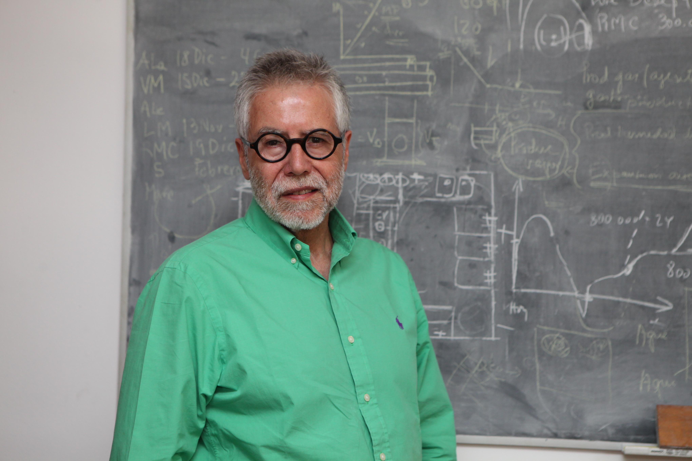

# José Miguel Aguilera Radic

Nació en Santiago en 1947.

#### Estudios

Es **Ingeniero Civil Industrial \(mención Química\) de la Universidad Católica**.

Al terminar el grado, viajó a Estados Unidos a hacer un **MBA en Texas A&M University.** También cuenta con un **Magíster en Tecnología de Alimentos del Massachusetts Institute of Technology \(MIT\)**, y un doctorado en **Ciencia de los Alimentos de Cornell University**.

#### Docencia

Es **Profesor Titular** del Departamento de **Ingeniería Química y Bioprocesos de la Univeridad Católica** desde 1986, especializado en **biomateriales, bioprocesos** de recursos marinos e ingeniería de alimentos.

#### Premios

Obtuvo el **Premio Nacional de Ciencias Aplicadas y Tecnológicas en 2008** por su pionero aporte en el estudio de las estructuras de los alimentos para hacerlos más saludables y funcionales, además de su destacada trayectoria como docente e investigador, tanto a nivel nacional como internacional.

Fue **presidente de la Comisión Nacional de Investigación Científica y Tecnológica** entre 2010 y 2013.

En 2010 se convirtió en el **primer chileno en ser elegido como miembro de la National Academy of Engineering** de los Estados Unidos.

[Museo Interactivo Mirador](https://www.mim.cl/index.php/pnc-35)

[Explora](https://www.explora.cl/blog/2014/07/31/jose-miguel-aguilera-radic/)

[Universidad Católica](https://www.uc.cl/es/la-universidad/premios-nacionales/7433-jose-miguel-aguilera-radic-1947-)

