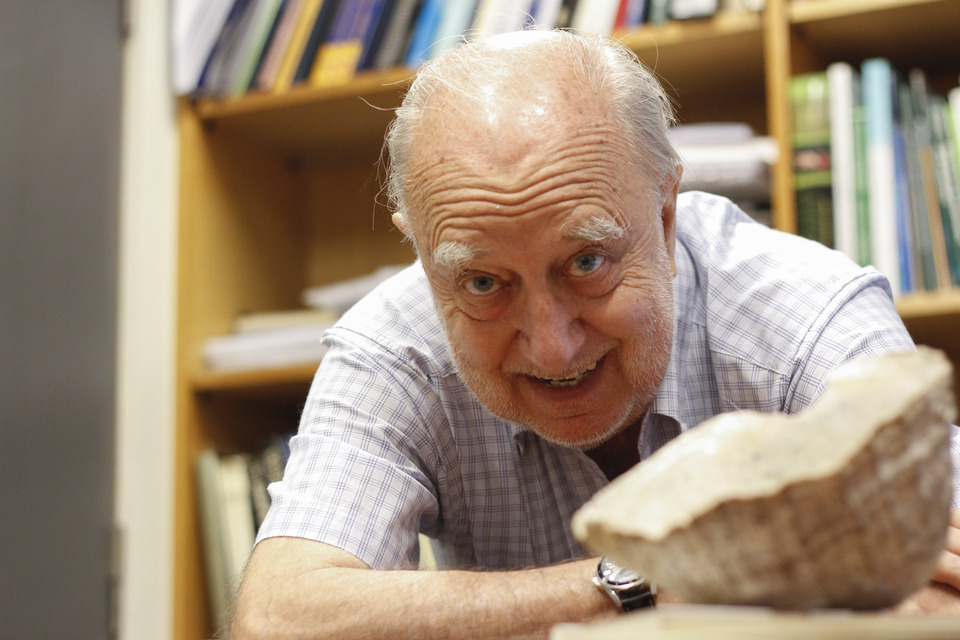

# Juan Carlos Castilla Zenobi

Estudió en el **Liceo Nº 6 de San Miguel**. Debió terminar la enseñanza media en un liceo nocturno, porque de día trabajaba en una ferretería.

#### Estudios

Es **Profesor de Estado con mención en Química y Ciencias Naturales de la Facultad de Ciencias Biológicas de la Universidad Católica**. Ph.D. en **Biología Marina de la Universidad de Gales**, en Reino Unido y Doctor en Ciencias de la misma universidad. Además tiene estudios de posgrado en Zoología y Ecología Marina.

Se especializó en el estudio del **comportamiento de moluscos como el loco**, así como en la conservación de recursos costeros.

#### Investigación

En 1982, junto a algunos colegas, cercó para su posterior estudio un kilómetro cuadrado de playa a toda intervención humana, en Las Cruces \(Región de Valparaíso\). Fundó así su proyecto más emblemático: **la Estación Costera de Investigaciones Marinas de la Universidad Católica \(ECIM\)**.  Con esta experiencia pionera contribuyó de manera significativa a la conservación marina e investigación sobre el manejo de los recursos a nivel nacional e internacional. Esta reserva fue decretada Área Marina Protegida de Chile en 2005.

Encabezó la implementación de una red mixta de áreas marinas protegidas y de manejo a lo largo del territorio nacional.

Ha sido **asesor en Medio Ambiente** de organismos de Gobierno \(nacionales e internacionales\) y privados. 

Su principal aporte ha sido **generar el conocimiento científico sobre el que se sustenta toda la legislación nacional** sobre manejo de recursos marinos costeros.

#### Premios y membresías

Es miembro de la **Academia Chilena de Ciencia**s, la **Academia de Ciencias de EE.UU**., asesor científico de la Presidencia y **Premio Pew** en Conservación Marina.

En 1992 recibió el **Premio Gobierno de Chile**, Servicio Nacional de Pesca a la Preservación del Medio Ambiente Marino Chileno.

La **Sociedad Chilena de Ciencias del Mar** le entregó el Premio Ciencias del Mar por su destacada trayectoria en 2004.

En 2006 recibió el **Zayed International Prize for Environment**.

En 2007 fue galardonado con el **Premio Internacional en Conservación y Biodiversidad de la Fundación BBVA.**  

En 2010 recibió el **Premio Nacional de Ciencias Aplicadas y Tecnológicas en 2010** por su contribución al estudio de los ecosistemas costeros y su sustentabilidad, por generar el conocimiento científico sobre el que se apoya toda la legislación nacional al respecto, su alta productividad científica, reconocida nacional e internacionalmente; y por la contribución a la formación de recursos humanos de alto nivel

#### Fuentes

[CONICYT](https://www.conicyt.cl/blog/2010/10/18/juan-carlos-castilla-y-como-la-investigacion-puede-inspirar-a-la-ley-2/)

[Museo Interactivo Mirador](https://www.mim.cl/index.php/pnc-36)

[Universidad Católica](https://www.uc.cl/es/la-universidad/premios-nacionales/7429-juan-carlos-castilla-zenobi-1940)

[Universidad de Chile](http://www.uchile.cl/noticias/65221/jc-castilla-conocimiento-para-alimentar-la-toma-de-decisiones)

