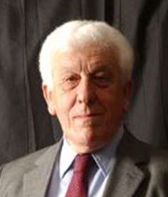

# Juan de Dios Vial Larraín

Nació el 10 de agosto de 1924.

#### Estudios

Estudió **Derecho en la Pontificia Universidad Católica de Chile** y posteriormente **Filosofía en la Universidad de Chile**, de donde se recibió como Bachiller en Humanidades.

En 1946 recibió una beca para estudiar en el **Instituto de Estudios Políticos de Madrid**. Más tarde hizo cursos sobre la **filosofía de Aristóteles en la Universidad de Harvard,** Estados Unidos. También recibió una **beca de la Universidad de París**, donde profundizó sus estudios sobre Kant, Descartes y Freud. En 1963 tomó los cursos de **Filosofía de la Ciencia y Platón en la Universidad de Lovaina, Bélgica**. En 1965 otra beca le permitió estudiar a **Hegel y la Poética, en la Universidad de Kansas**, Estados Unidos.

#### Trayectoria

Se desempeñó como **profesor visitante de las Facultades de Filosofía de la Universidad Autónoma de Barcelona**; de **Filosofía y Letras de la Universidad de Navarra**, y de la **Facultad de Filosofía y Letras de la Universidad de Granada, España.**

Fue **profesor titular de la Facultad de Filosofía de la Universidad Católica de Chile** y de la Facultad de Filosofía y Humanidades de la Universidad de Chile.

En 1978 representó a Chile como **delegado ante la Asamblea de la OEA en Washington DC**. Entre 1977 y 1980 fue miembro del **Comité Interamericano de Cultura**, con sede en esa misma ciudad.

Entre 1979 y 1981 se desempeñó como **Director del Departamento de Estudios Humanísticos de la Facultad de Ciencias Físicas y Matemáticas de la Universidad de Chile**. Luego fue **director del Instituto de Filosofía de la Universidad Católica de Chile**. Posteriormente asumió como **Decano de la Facultad de Filosofía de esta casa de estudios**.

Entre 1987 y 1990 fue **Rector designado en la Universidad de Chile** y más tarde ejerció el cargo de **presidente de la Academia Chilena de Ciencias Sociales, Políticas y Morales**. Por esa época fue **presidente del Instituto de Chile**. En 1994 fue **miembro de la Comisión Nacional para la Modernización de la Educación**.

Forma parte del **Comité Directivo de la Federación Internacional de Sociedades de Filosofía** \(FISP\).

#### Publicaciones

Sus publicaciones suman 11 libros de filosofía, **desde su** _**Metafísica Cartesiana**_ **de 1971, premio Gabriela Mistral de ese año, hasta** _**Estructura Metafìsica de la Filosofía**_ **de 1997** y _Filosofía Moral_ de 1998. A través de ellos ha ido recorriendo el argumento de la filosofía, **principalmente en el pensamiento de Aristóteles y Platón, pero también de Descartes, Kant y Heidegger**. Además, han aparecido aproximadamente un centenar de artículos y ensayos suyos en volúmenes colectivos y revistas nacionales y extranjeras.

Entre sus publicaciones se cuenta también _Filosofia y teoría del amor; Descartes: meditaciones metafísicas. Selección, glosas y notas;_ _Tres ideas de la filosofía y una teoría, Aristóteles, Descartes, Heidegger y Platón_; _El sofista, la metafísica platónica_; _Una ciencia del ser_; _Breve tratado de filosofía moral_ y  _Una teoría de la inteligencia_, entre otras.

#### Premio Nacional

Obtuvo en **1997 el Premio Nacional de Humanidades y Ciencias Sociales,** por haber destacado la influencia de la filosofía clásica en el mundo de hoy y analizado en profundidad el pensamiento de Aristóteles, Platón, Descartes, Kant y otros pensadores como pilares de la cultura occidental. Se consideró además la trascendencia que ha tenido **su contribución intelectual en el plano nacional e internacional y su dedicación a la vida universitaria y a la formación de discípulos y alumnos** a lo largo de su carrera académica.

#### Fuentes

[Universidad Católica](https://www.uc.cl/es/la-universidad/premios-nacionales/7403-juan-de-dios-vial-larrain-1924-)

[Filosofía Universidad Católica](http://filosofia.uc.cl/academicos/vial-larrain-juan-de-dios)

[Universidad de Chile](http://www.uchile.cl/portal/presentacion/historia/grandes-figuras/premios-nacionales/humanidades/6549/juan-de-dios-vial-larrain)

