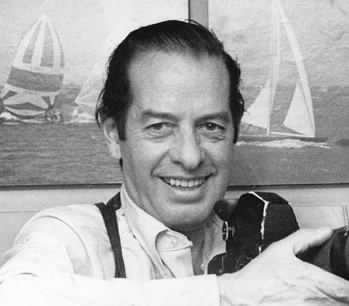

# Juan Enrique Lira Vergara

#### Inicios

Nació en Santiago, el 31 de diciembre de 1927.

Cursó la educación primaria en el **Colegio Saint George**. Posteriormente viajó a Estados Unidos, donde realizó sus estudios secundarios en el **Granwell College de Massachussets.**

#### Trayectoria

Tuvo una destacada carrera deportiva, fue **jugador de hockey sobre hielo, golf, corredor de autos, tirador y ajedrecista**. El año 1965 fue el **primer chileno recibir un título mundial de tiro al vuelo.**

En paralelo se desempeñó como reportero gráfico en medios como **El Diario Ilustrado y El Debate.**

Fue el **primer editor fotográfico de Chile**, ejerciendo dicha labor **en "El Mercurio" durante treinta años**. Durante este período fue testigo directo de parte importante de la historia de Chile. En este diario fue uno de los creadores de la Revista del Domingo.

Entre 1969 y mediados de la década de los 70 fue **profesor de fotografía periodística en la Universidad Católica.**

Aquí un artículo sobre [fotógrafos de prensa](http://www.memoriachilena.gob.cl/archivos2/pdfs/MC0041728.pdf), en el que se reseña el trabajo de Vergara Lira**.**

#### Premio Nacional

Por su larga y múltiple trayectoria ganó el **Premio Nacional de Periodismo en 1987**, mención fotografía.

[Murió el 12 de marzo de 2007](https://www.emol.com/noticias/nacional/2007/03/13/248917/a-los-79-anos-murio-el-destacado-fotografo-juan-enrique-lira.html).

