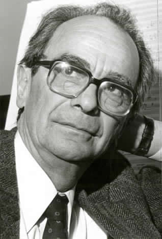

# Juan Orrego Salas

Nació el 18 de enero de 1919.

#### Formación

Este musicólogo y compositor estudió entre 1936 y 1943 en el **Conservatorio Nacional de Música** adscrito a la Facultad de Bellas Artes de la Universidad de Chile. Rápidamente le fue adjudicada la cátedra de historia de la música en esa institución. En paralelo comenzó a estudiar **arquitectura en la Universidad Católica**, carrera de la que se tituló en 1943.

**Fundó el Coro de la Universidad Católica en 1938**. Con esta agrupación realizó varias giras nacionales hasta 1944.

#### Primer viaje a Estados Unidos

Becado por las **fundaciones Rockefeller y Guggenheim** entre 1944 y 1946, viajó a perfeccionarse a Estados Unidos. **En la Universidad de Columbia, estudió musicología** con el destacado musicólogo Paul Henry Lang, Etnomusicología con George Herzog y Contrapunto con William Mitchell. **En la Universidad de Princeton, estudió con el compositor Randall Thompson**. El contacto con estos y otro músicos, como el compositor argentino Alberto Ginastera, permitieron a Orrego Salas romper la rigidez academicista con la que él se había formado, lo que lo hizo valorar de otro modo el folclor chileno y del continente.

Viaja a Europa y **representa a Chile en el Festival de la Sociedad Internacional de Música Contemporánea**. También presenta algunas de sus obras en Estados Unidos. 

#### Trayectoria

En 1947, de regreso en Chile, vuelve a hacer **clases de Historia de la Música y de Composición** en la Universidad de Chile.

Entre 1949 y 1953 **edita la** _**Revista Musical Chilena**_. A partir de 1957 y durante dos años, dirigió **el Instituto de Extensión Musical**. Posteriormente se desempeñó como **crítico musical del diario El Mercurio**, entre 1950 y 1961

En 1959 **fundó el Departamento de Música de la Universidad Católica,** que posteriormente fue transformado en el Instituto de Música, y lo dirigió hasta 1961.

El año 1961 se radicó en Estados Unidos, en Bloomington, Indiana, para desempeñarse como **profesor en la Universidad de Indiana.** Gracias al financiamiento de la Fundación Rockefeller **creó el Centro Latinoamericano de Música** de esa Universidad y en 1975 pasó a ser director del Departamento de Composición, donde se mantuvo hasta 1987. Este cargo, lo involucró en la promoción de la música latinoamericana a través de festivales, conciertos, programas de radio y la recopilación de la mayor biblioteca de partituras y grabaciones existentes con obras del siglo XX de autores americanos. Fue académico de la Universidad de Indiana hasta 1987.

Ha sido uno de los **compositores chilenos más interpretados y grabados en el extranjero**. Su catálogo incluye más de 120 obras en todos los ámbitos y un estilo que ha influido en autores latinoamericanos. Ha hecho además una vasta contribución de artículos musicales para diarios, revistas y estudios musicológicos. Su obra se ha caracterizado por combinar **elementos neoclásicos y procedimientos formales de todos los periodos**, desde la Edad Media hasta el siglo XX. 

#### Premios y distinciones

Los mejores intérpretes del mundo como una gran cantidad de orquestas de cámara y sinfónicas del planeta la han comisionado.

Ha recibido, además, una gran cantidad de distinciones, entre las que se cuentan el Premio Olga Cohen de Composición \(1956 y 1958\), **Doctor Honoris Causa de la Universidad Católica** de Chile \(1971\), el Diploma de miembro, de la Academia de Bellas Artes, el **Premio Interamericano de la Cultura Gabriela Mistral de la OEA** \(1988\).

En 1992 fue distinguido con el Premio Nacional de Artes Musicales.

#### Fuentes

[Memoria Chilena](http://www.memoriachilena.gob.cl/602/w3-article-97011.html)

[Música Popular](http://www.musicapopular.cl/artista/juan-orrego-salas/)

[Universidad de Chile](http://www.uchile.cl/portal/presentacion/historia/grandes-figuras/premios-nacionales/musica/6609/juan-orrego-salas)

[Universidad Católica](https://www.uc.cl/es/la-universidad/premios-nacionales/7399-juan-orrego-salas-1919-)

