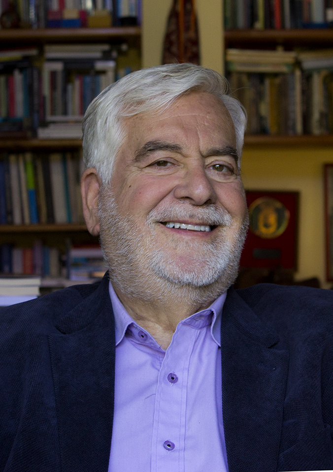

# Juan Pablo Cárdenas Squella

Estudió Periodismo en la Universidad Católica. Antes de egresar ya trabajaba como redactor de la revista _Debate Universitario_, de la cual llegó a ser director.

#### Trayectoria

Fue fundador y director de las revistas _Análisis_ y _Los Tiempos_ y del diario electrónico _Primera Línea_. Ha colaborado como columnista de prestigiosos medios internacionales, entre ellos _El País_, en España y _Helsinky Sannomat_, de Finlandia.

Fue por más 18 años **director de la Radio Universidad de Chile y de su diario digital**. 

#### Docencia

Desde 1991 hace clases en la **Escuela de Periodismo de la Universidad de Chile** y en la **Pontificia Universidad Católica de Valparaíso**. Es Profesor Titular de la Universidad de Chile e integrante del Senado Universitario.

#### Publicaciones

Cuenta a su haber con varios libros de opinión y crónicas: _Por un Chile Libre_; _NO a Pinochet_; _Crónicas Impertinentes_; _América Latina: Democracias en Penumbra_; _Contigo en la Distancia_; _Bajo el Agua, Desobediencia Debida, El Periodismo Comprometido_; _Un Peligro para la Sociedad y Lo Esencial en el Periodismo_.

#### Premios

Su trabajo ha sido reconocido internacionalmente con los premios **Golden Pen of Freedom**, de la Federación Mundial de la Prensa \(París\); el **Premio Latinoamericano de Periodismo**, concedido por la Federación Latinoamericana de Periodistas \(Ciudad de México\); **Premio Valenciano de Periodismo**, de la Federación de Periodistas de Valencia \(España\); Premio Heuten Camera, de la Asociación de Periodistas de Holanda y los premios de Derechos Humanos Vladimir Herzog \(Brasil\), Monseñor Leonidas Proaño \(Ecuador\) y de un galardón otorgado por la Organización Latinoamericana de Militares Democráticos; **La Pluma de Oro de la Libertad**, otorgada por la Federación Mundial de la Prensa.

Además forma parte de los **sesenta periodistas del mundo considerados Héroes de la Libertad de Expresión**, reconocimiento hecho por la Federación Internacional de Periodistas.

En Chile, recibió el **Premio Nacional de Periodismo en 2005**.

#### Fuentes

[Universidad de Católica](https://www.uc.cl/es/la-universidad/premios-nacionales/7401-juan-pablo-cardenas-squella-1941-)

[Universidad de Chile](http://www.uchile.cl/portal/presentacion/senado-universitario/65765/juan-pablo-cardenas-squella)

[Página Oficial del periodista](http://juanpablocardenas.cl/)

