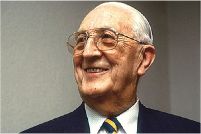

# Julio Meneghello Rivera

#### Inicios

Nació en Los Andes. Cursó sus primeros estudios en el colegio de los Hermanos Maristas. Por esa época, creó una pequeña revista llamada Luna, la que publicaba de forma periódica y a distribuía gratuitamente entre sus amistades. Eso hasta que tuvo que trasladarse con su familia a Viña del Mar. Hizo los últimos tres años de bachillerato en el Liceo de Hombres de esa ciudad.

En 1928 entró a la **Facultad de Medicina de la** [**Universidad de Chile**](http://www.uchile.cl/portal/presentacion/historia/grandes-figuras/premios-nacionales/ciencias-/6552/julio-meneghello-rivera) de la que se tituló como médico en 1936. Siendo estudiante hizo sus primeras ayudantías. Luego ejerció como **Profesor en la misma carrera**.

Desde que entró a estudiar medicina, supo que su vocación era la pediatría. Obtuvo **becas de las Universidades de Harvard, John Hopkins y Cornell en Estados Unidos** para profundizar sus conocimientos en esa área.

Revisa el perfil de Julio Meeghello en [Museo Interactivo Mirador](https://mim.cl/index.php/pnc-29).

#### Trayectoria

A su regreso a Chile entró al **Hospital Manuel Arriarán**, donde se desempeñó por veinte años, durante los cuales generó un vínculo importante con su equipo de trabajo. Tanto, que se trasladó con todos ellos cuando **se cambió al Hospital Roberto del Río.**

En 1950 ayudó a formar el **Laboratorio de Investigaciones Pediátricas**, organismo que en 1977 daría origen al **Instituto de Nutrición y Tecnología en Alimentos** \(INTA\) de la Universidad de Chile.

Inauguró la **cátedra de Pediatría en la Universidad Católica** en 1954.

Su lucha incansable fue siempre **mejorar la situación de la pediatría en Chile y muy especialmente la salud de los niños,** en una época en la que Chile tenía una alta tasa de mortalidad infantil, debido a problemas ambientales y de desnutrición.

El trabajo que desarrolló en ese sentido, lo han llevado a ser considerado **padre de la pediatría moderna en Chile**. Su método de administración sistemática de sueros por vía oral, para evitar diarreas y la consiguiente deshidratación en niños desnutridos, que puso en práctica en 1955, ha sido **recomendado con ciertas modificaciones, por la Organización Mundial de la Salud**. La revista especializada The Lancet reconoció su trabajo científico y pedagógico como **uno de los avances médicos más importantes del siglo XX** para los países en vías de desarrollo.

En este enlace otro perfil en [Explora CONICYT](https://www.explora.cl/blog/2013/11/18/julio-meneghello-rivera-1911-2009/).

#### Publicaciones

Es autor de más de 240 trabajos de alto valor y ha publicado libros tales como: _La desnutrición del lactante mayor_, _Psiquiatría y Psicología de la infancia y adolescencia_ en colaboración con el Dr. Arturo Grau, _Pediatría Práctica en Diálogos._

En 1972 publicó _**Pediatría**_**, conocido entre los aspirantes a pediatras como** _**El Meneghello,**_ **libro que convirtió en manual de uso obligado** en las escuelas de Medicina del país.

#### Premios

Se le confiere en 1995 la Medalla Rector Juvenal Hernández por su destacado servicio en el ejercicio de su profesión. Ese mismo año la Academia Americana de Pediatría le otorga el Pediatric Education Lifetime Achievement Award.

En 1996 recibe el **Premio Nacional de Ciencias Aplicadas y Tecnológicas** por su trabajo en pos de la erradicación de la desnutrición y la reducción de la mortalidad infantil en el país.

En 2002 se le concede también el [**Premio Nacional de Medicina**](https://www.cooperativa.cl/noticias/cultura/julio-meneghello-recibira-el-primer-premio-nacional-de-medicina/2002-01-18/111600.html), por ser el precursor de la pediatría social en el país.

Falleció en Santiago, el [15 de Agosto el año 2009](https://www.latercera.com/noticia/fallecio-el-premio-nacional-de-medicina-julio-meneghello-a-los-97-anos/), a los 97 años.

