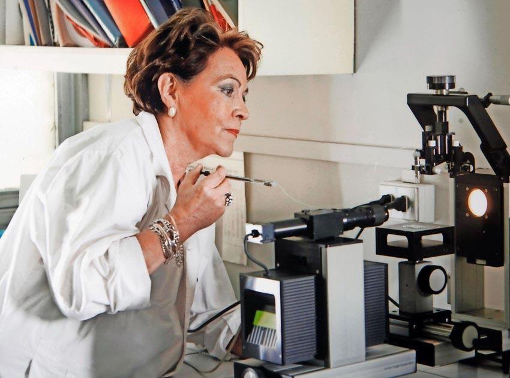

# Ligia Gargallo González

Desde muy niña dejó entrever su interés por la ciencia.

#### Estudios

Al salir del colegio entró a estudiar **Química Farmacéutica a la Universidad de Concepción**. Tras terminar sus estudios viajó a Francia a trabajar en el **Laboratorio de Química Física Pierre et Madame Curie, de la Universidad de París**, de donde se licenció en Química. Tiempo después, se doctoró en **Ciencias Químicas en la Universidad de Lieja en Bélgica**.

Parte fundamental de su carrera la ha desarrollado como **académica e investigadora en la Universidad Católica de Chile**, donde formó el Laboratorio de Macromoléculas en la Facultad de Química en los cuales realizó un trabajo pionero en el desarrollo de la química física de polímeros.

Miembro de número de la **Academia Chilena de Ciencias y de la Academia de Ciencias de América Latina \(ACAL**\).

#### Premios

Recibió el **Premio L’Oreal-Unesco para Mujeres en Ciencia**, como representante de la mujer científica de Latinoamérica y del Caribe \(2007\). La Pontificia Universidad Católica de Chile le otorgo el grado Académico Honorifico de **Doctor Scientiae et Honoris Causa en el 2007**.

En 2014 recibió el **Premio Nacional de Ciencias Naturales**, distinción que vino a destacar su aporte a la Ciencia y los años de estudio que esta investigadora chilena le ha dedicado a las macromoléculas y a la Química.

Actualmente es **profesora titular en retiro de la Universidad Católica**, trabaja en el programa de doctorado en **Química de la Universidad de Tarapacá** y en investigación con polímeros naturales y macromoléculas.

#### Fuentes

[CONICYT](https://www.conicyt.cl/mujeres-en-ciencia-y-tecnologia/mujeres-destacadas/premios-nacionales/ligia-gargallo/)

[Academia de Ciencias de América Latina](http://acal-scientia.org/miembros-activos/ligia-gargallo-gonzalez/)

[Museo Interactivo Mirador](https://www.mim.cl/index.php/pnc-50)

[Universidad Católica](https://www.uc.cl/es/la-universidad/premios-nacionales/31443-ligia-gargallo-gonzalez)

