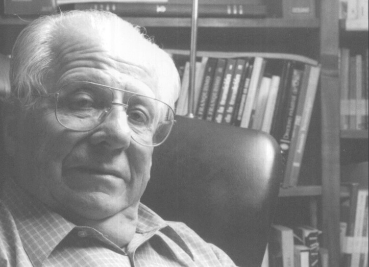

# Luis Emilio Filippi Murato

#### Inicios

Nació en Valparaíso el 8 de noviembre de 1928. Su vocación viene desde niño. **En el colegio dirigió el periódico estudiantil** _El Segundino_, en Valparaíso. Por esa misma época comenzó a trabajar como ayudante en _La voz de la comuna_, un **periódico de Villa Alemana del cual llegó a ser subdirector.**

Al finalizar el colegio, rindió bachillerato y entró a la Escuela de Leyes de los SS.CC., hoy Escuela de Derecho de la Universidad Católica de Valparaíso. Fue dirigente del Centro de Alumnos y delegado en la Federación de Estudiantes de la UCV. De esa época datan sus primeros textos teóricos sobre comunicaciones y periodismo.

**Trayectoria** 

A mediados de los 50, trabajó como redactor en el diario _La Unión_. En paralelo, se desempeñaba en radio, donde creó el programa _Panoramas_ y **dio vida a** _**El Diario de Cooperativa** Vitalicia_, en la radio de ese nombre en Valparaíso, un programa que se extendió a la emisora en Santiago y que existe hasta el día de hoy. El éxito que tenía ese programa radial, lo pusieron en la órbita del diario _El Sur_ de Concepción, donde estaban buscando un director de crónica. Asumió el 1 de enero de 1959. Estuvo seis años en el cargo, período en el que **le correspondió dirigir la cobertura de los terremotos en esa ciudad y en Valdivia**, labor que desarrolló en medio de grandes daños estructurales y de comunicaciones. Volvió a Santiago a encabezar la sección latinoamericana de la agencia de noticias _Interpress Service_. También estuvo a cargo de las publicaciones periodísticas de la prestigiosa editorial _Zig Zag_.

En 1968 fue nombrado **director de la revista** _**Ercilla**_, en Santiago, uno de los medios más influyentes de la época. Fue **presidente del Colegio de Periodistas** de Chile, entre 1967 y 1968.

Dejó la dirección de revista Ercilla en 1976 por presiones de la dictadura.

La multitudinaria cena que se organizó con motivo de su salida de _Ercilla_, fue el virtual lanzamiento de la revista _Hoy_, fundada en 1977, **la primera publicación contraria al régimen de Pinochet.**

Una década después, junto a un grupo de políticos de lo que posteriormente se conoció como _Concertación_, **fundó el diario** _**La Época**_, donde también cubrió con valentía el acontecer nacional de ese período en el que los grandes medios de comunicación, estaban controlados por Pinochet.

Fue **embajador de Chile en Portugal**, durante el gobierno de Eduardo Frei Ruiz-Tagle.

Aquí puedes revisar una edición completa de la revista [_Veintidos caracteres_](http://www.memoriachilena.gob.cl/archivos2/pdfs/mc0032495.pdf) dedicada a Filippi.

En este enlace una [entrevista televisiva a Filippi](https://www.youtube.com/watch?v=kGcpyLOg8cU) realizada en la Universidad de Concepción.

#### Premios

Premio Círculo de la Prensa de Valparaíso al mejor reportero del año en 1954.

**Premio Nacional de Periodismo en 1972** con mención en redacción.

Premio Internacional de **Periodismo Rey de España** y el María Moors Cabot, ambos en 1983.

**Premio Embotelladora Andina en 1997**.

En 2005 fue nombrado, por iniciativa de colegas italianos y chilenos, Presidente Honorario de la Asociación bi-nacional de los profesionales de la información. 

Falleció [el 12 de agosto de 2014 a los 85 años](https://www.24horas.cl/tendencias/espectaculosycultura/fallece-el-premio-nacional-de-periodismo-emilio-filippi-1371316).

\*\*\*\*

