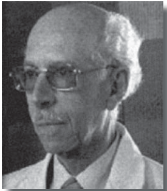

# Luis Vargas Fernández

#### Inicios

Nació en Santiago el 10 de junio de 1912.

Cursó sus estudios secundarios en el Liceo Alemán de Santiago. Fue **alumno fundador de la Escuela de Medicina de la Universidad Católica**, al ingresar en la primera camada de alumnos en 1930. El tercer año de la carrera lo cursó en la Universidad de Concepción y a partir de cuarto año fue alumno de la Facultad de Medicina de la Universidad de Chile de donde egresó en 1937 y obtuvo el **premio Clin al mejor egresado de su generación**.

En 1938 fundó con el Dr. Arturo Atria el primer policlínico de enfermedades endocrinológicas en el Hospital Salvador. Colaboró como **Ayudante Jefe del Departamento de Medicina Experimental** recién creado por el Profesor de Fisiología Dr. Alejandro Lipschütz, de quien tomó el interés por la endocrinología sexual femenina y la relación entre hormonas y tumores.

Aquí puedes ver el perfil del Doctor Vargas Fernández, realizado por la [Revista Médica](https://scielo.conicyt.cl/scielo.php?script=sci_arttext&pid=S0034-98872011001100022) de Chile.

#### Trayectoria

Una beca de la **Fundación Guggenheim** le permitió investigar en el Carnegie Institution de Baltimore, en Estados Unidos. También fue becario de la **Fundación Rockefeller** para estudiar en la Universidad de Cambridge.

Regresó a Chile en en 1943. A partir de una solicitud del Dr. Joaquín Luco, fundó la cátedra de **Fisiopatología, que se dio por primera vez en la Universidad Católica.** Luego colaboró con cátedras similares que se crearon en la [Universidad de Chile](http://www.uchile.cl/portal/presentacion/historia/grandes-figuras/premios-nacionales/ciencias-/6639/luis-vargas-fernandez) y en la Universidad de Concepción.

Fue Director de la Escuela de Medicina de la Universidad Católica entre 1949 y 1955 y nuevamente en 1963. **Ejerció un rol clave para lograr que la Escuela de Medicina de la Universidad Católica admitiera alumnas mujeres.**

Además de Director, fue Decano subrogante de la Facultad de Medicina, profesor titular en 1970 y decano de la Facultad de Ciencias Biológicas de la Universidad Católica entre 1973 y 1982. 

Fue Presidente de la Sociedad de Biología de Chile entre 1965 y 1967, y de la Sociedad Chilena de Endocrinología y Metabolismo entre 1973 y 1974. En 1972 se incorporó como Miembro de Número a la Academia de Ciencias, Instituto de Chile, llegando a ser su Vicepresidente en 1980 y Presidente entre 1986 y 1991. En 1981 fue incorporado como Miembro Honorario a la Academia de Medicina.

Revisa aquí el texto [Relato histórico de mi investigación en la área de la diabetes mellitus](https://arsmedica.cl/index.php/MED/article/view/527/346), escrito por el Doctor Vargas Fernández.

Aquí un perfil en formato audiovisual desarrollado por [Explora Conicyt](https://www.youtube.com/watch?v=9b7805xck04).

#### Premios

Recibió numerosos premios y distinciones, entre ellos, **Comendador de la Orden Ecuestre de San Silvestre Papa**, y Doctor Scientiae et Honoris Causa de la Pontificia Universidad Católica de Chile. 

**En 1985 fue distinguido con el Premio Nacional de Ciencias** por sus estudios en el área de la fisiología renal y en el análisis de los tumores relacionados con hormonas.

Socio Honorario de la Sociedad Médica de Santiago en 1986.

Murió el 29 de septiembre de 2011 a los 99 años.

Aquí [el obituario](http://www.revistasoched.cl/4_2011/13-4-2011.pdf) publicado por la Revista de Endocrinología y Diabetes.

#### 

