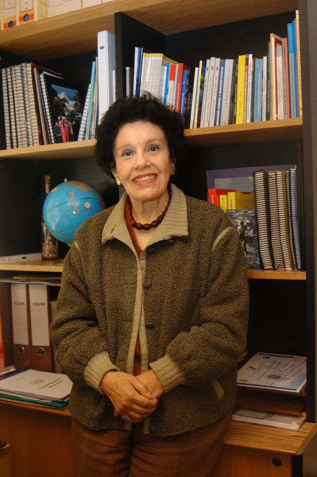

# Mabel Condemarín Grimberg

Se tituló de Profesora en la Escuela Normal de La Serena y continuó sus estudios sobre enseñanza de la lectura y escritura en el State College de Los Ángeles, Estados Unidos. En 1972 se integró como profesora en el Departamento de Educación Especial y Diferencial de la **Facultad de Educación de la UC** y, luego, en el Magíster de la Escuela de Psicología, donde permaneció por 20 años. En 1990 se incorporó al Ministerio de Educación para hacerse cargo del área de lenguaje del **Programa de las 900 escuelas**. Fue una gran divulgadora de los métodos de enseñanza de la lectura en toda Latinoamérica. En el año 2003 recibió el **Premio Nacional de Ciencias de la Educación.**

Mabel Condemarín nació en Iquique, en noviembre de 1931. Era la sexta hija de una familia de siete hermanos formada por el matrimonio de Amalia Grimberg con Guillermo Condemarín. Su madre era heredera de un emigrante ucraniano adinerado. Su padre era un obrero metalúrgico analfabeto, hijo de un matrimonio peruano, que con el apoyo de su esposa aprendió a leer, desarrolló una carrera política y llegó a ser candidato a diputado por el Partido Obrero. A los 45 años murió afectado por silicosis y tuberculosis. La mayoría de sus hermanos tuvo que trabajar tempranamente y no completó su escolaridad, pero siempre fueron buenos lectores y continuaron educándose incentivados por su madre.

#### Formación

Mabel inició sus estudios en la **escuela pública Santa María de Iquique**, donde ingresó a los 6 años, los que continuó en la Escuela Normal de La Serena Isabel Bongard. En 1952 se traslada a Santiago, comienza a trabajar como **profesora primaria e ingresa a la Escuela Normal Superior José Abelardo Núñez,** donde comenzó su interés por el tema de la lectura. En 1966 se incorpora al State College School of Education de Los Ángeles, California, en donde se especializa en enseñanza de la lectura y escritura. Un año después, en Chile, vuelve a hacer clases a niños pequeños y **comienza a aplicar enfoques nuevos en la enseñanza de la lectura**. Paralelamente, se incorpora al equipo de **psiquiatría infantil del Hospital Calvo Mackenna**, en donde continuó profundizando en el tema de las dificultades de los niños en el aprendizaje de la lectura. Allí conoció también al psicólogo y académico UC Luis Bravo Valdivieso, reconocido investigador en trastornos del aprendizaje, quien la invita a colaborar en los proyectos que desarrolla en la Facultad de Educación del plantel. Por aquellos años también conoció a Felipe Alliende, académico de la U. de Chile, con quien se casó en 1971 y con quien trabajó y publicó muchos de sus trabajos.

#### Huella en la UC

A comienzos de los años setenta, la profesora ingresa como **alumna al programa UC de Postítulo en Educación Especial y luego al Magíster**. Incorporada como académica en programas de magíster del área educacional, forma a numerosas generaciones de profesores, psicopedagogos y psicólogos durante 20 años de trabajo académico incesante. Así la describe Yulan Sun, investigadora del Mide UC, en un homenaje publicado en la revista Psykhe, en el 2004, el año en que falleció: “**Mabel era una trabajadora infatigable y entusiasta**, y una compañera de trabajo extremadamente sabia y cariñosa. Quienes fuimos sus alumnos, sus compañeros de trabajo, sus amigos, conocimos también su ingenio y su lúcido sentido del humor”. En 1990 aceptó la invitación del Ministerio de Educación para integrarse al equipo a cargo de la Reforma Educacional. Por más de una década, coordinó el **programa de mejoramiento de la Calidad y Equidad de las Escuelas de Sectores Pobres** y trabajó por acercar el lenguaje y la lectura a los niños más necesitados. Asimismo, a partir del 2002 trabajó en la campaña LEM \(Lectura, Escritura y Matemáticas\) orientada a la población escolar básica de mayor vulnerabilidad social y educativa.

"Mabel Condemarín es un ejemplo y fue pionera en el área educacional en conectar la producción de conocimiento educativo, en este caso de la escritura y lecto escritura, con las políticas públicas. \(...\) **Llegó al Mineduc cuando no había programas lectores**, ni programas que tuvieran efectos en el aula. Este tipo de programas no existían. Ella tuvo la fuerza y la pasión de levantar desde cero iniciativas que tuvieron impacto nacional en las aulas", destaca el director del Centro de Estudios de Políticas y Prácticas en Educación, CEPPE UC, Alejandro Carrasco.

#### Legado

En el marco de un homenaje organizado por la UC y la U. Alberto Hurtado en 2011, la académica de esta última universidad Viviana Galdames, escribió respecto a su legado: “Mabel **jugó un importante papel en un cambio de paradigma respecto al enfoque didáctico de la enseñanza de la lectura y escritura** desde etapas tempranas de los niños y niñas; este enfoque llamado Modelo Equilibrado \(o Integrado\) está en la base de los programas de estudio actuales y ha influido fuertemente en la formación inicial y continua d generaciones de docentes en todos los niveles escolares”.

En este mismo encuentro, Cristián Cox, entonces director del CEPPE UC, la destacó como una figura inspiradora; un modelo a seguir. “Nuestra homenajeada **unió como pocos el saber de punta sobre su área de especialización, con la pasión por la igualdad y la justicia**: ambas dimensiones de su ser anidadas en una actitud esencialmente acogedora y dispuesta siempre a empatizar con el otro y a salvar la proposición del contrario. Una actitud amorosa. En primer lugar para con la niñez a la que sirvió como profesora en la fase inicial de su carrera; como formadora de sus profesores más tarde, y finalmente, como diseñadora y líder de programas nacionales con los que trabajarían miles de profesores”, dijo.

En el año 2003 fue distinguida con el **Premio Nacional de Ciencias de la Educación por sus contribuciones a la educación diferencial, la lectoescritura y el currículum**, entre otras. Murió en marzo de 2004, después de una corta enfermedad.

A través de sus numerosas publicaciones sobre lectura, escritura y necesidades educativas especiales en lenguaje escrito, influyó en la enseñanza de toda América Latina. Perú y Colombia tienen escuelas con su nombre, además del ex Liceo Técnico de Chillán en Chile. En agosto del año pasado **el Centro de Políticas y Prácticas en Educación UC reinauguró una sala con su nombre**. En la ceremonia el rector Ignacio Sánchez destacó su trabajo como educadora: “Ella hace carne lo que uno quiere en un académico, su legado que fue hacer escuela”. También intervino su marido, Joaquín Alliende, quien habló del “sueño” que tuvo Mabel desde niña: “Su misión era influir en los modos de aprendizaje, influir en la enseñanza de la lectura, de la escritura, en borrar los prejuicios que había contra los niños pobres”.

#### Fuente

[Universidad Católica](https://www.uc.cl/es/la-universidad/noticias/30656-mabel-condemarin-un-referente-en-ensenanza-de-la-lectura-en-latinoamerica-)

