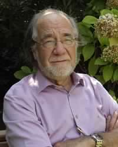

# Manuel Antonio Garretón

Nació en Santiago el 23 de mayo de 1943.

Fue uno de los primeros estudiantes de la carrera de **Sociología en la Universidad Católica de Chile**. Tras titularse, viajó a París, a hacer un Doctorado en **L'Ecole des Hautes Etudes en Sciences Sociales**.

Entre 1970 y 1973 fue **Director y Decano del Centro de Estudios de la Realidad Nacional y de la Revista Cuadernos de la Realidad Nacional, de la Universidad Católica de Chile**.

Tras el Golpe Militar, fue **Coordinador de los grupos de emergencia de las Ciencias Sociales** en Chile.

#### Docencia

En los años posteriores al golpe, desarrolló una intensa carrera docente en diversas universidades en el extranjero. **Oxford** \(1976\), **Universidad Notre Dame** \(1987-1990\), **Universidad California San Diego** \(1986,1997\), **Universidad de Chicago** \(1983\), **Ecole des Hautes Etudes en Sciences Sociales** \(1987\), **UNAM-Mexico** \(1979\), **Universidad Católica de Peru** \(1978\), **Visiting Fellow Wilson Center, Washington DC** \(1980\), **Universidad Hebrea de Jerusalem** \(1993\), **Cátedra Simón Bolívar del Institut des Hautes Etudes de l'Amérique Latine** \(1994\), **FLACSO-México** \(1998\), **Profesor Adjunto Universidad de Georgetown** \(Programa Latinoamericano 1992-1995\), **Universidad Libre de Bruselas**, **Universidad Empresarial Siglo XXI de Córdoba** \(2000\), **Universidad Nacional San Martín de Buenos Aires** \(2000-2012\), **Cátedra de Estudios Chilenos de l’Institut des Hautes Etudes de l’Amérique Latine en la Sorbonne Nouvelle**, Paris 3 \(2001-2002, 2005\), **Universidad de Lovaina**, Cátedra Jacques Leclerc \(2002\), **New School University, Nueva York** \(2002\), **Doctorado FLACSO Buenos Aires**.

A partir de 1993 comenzó a hacer clases en la **Universidad de Chile, donde ejerce como profesor hasta hoy**. En 1994 y durante cuatro años, ejerció la **docencia en la Universidad Católica de Chile**. Entre 1994 y 2006 fue profesor de la **Universidad Academia de Humanismo Cristiano**. También hizo clases en la **Universidad ARCIS**, entre el 2005 y 2012 y en la **Universidad Diego Portales** entre 2005 2006.

Su especialidad es la sociología política, democratizaciones y transiciones, Estado y sociedad, regímenes autoritarios, actores y movimientos sociales, partidos políticos, universidad y educación superior, opinión pública y demandas sociales, cultura y educación, desarrollo de las ciencias sociales, teoría sociológica y política, reforma del Estado y políticas públicas, modernidad y sociedad en América Latina.

#### Cargos y membresías

Durante su trayectoria ha formado parte como asesor o miembro de diversas organizaciones, tanto públicas como privadas en Chile y en el extranjero.

**Profesor Investigador y Coordinador del Area de Estudios Políticos de la Facultad Latinoamericana de Ciencias Sociales** FLACSO-Chile entre 1975 y 1995. **Asesor Coordinador del Ministro de Educación** entre 1990-1994. En 1991 **fundó la Universidad Academia de Humanismo Cristiano**, institución de la que fue decano hasta 1993. Al año siguiente asumió como **Director del Departamento de Sociología de la Facultad de Ciencias Sociales Universidad de Chile** \(1994-1996\). Entre 1998 y 2002 fue **Coordinador del Proyecto Pensamiento Renovado de Integración**, Convenio Andrés Bello. A partir de 2004 y hasta hoy es **Director del Instituto de Asuntos Públicos de la Universidad de Chile**.

Fue miembro del **Joint Committee on Latin American Studies del Social Science Research Council de EEUU**. Fue co-fundador de la S**ociedad Chilena de Sociología Miembro del Comité Ejecutivo de LASA**, institución que presidió entre 1998 y 2000\). Presidió el **Comité de Investigación RC 47 Clases y Movimientos Sociales**. Fue Coordinador del **Grupo de Trabajo de Partidos Políticos y Comisión Política y Estado de CLACSO** entre 1994 y 1999. Organizó y presidió cuatro **Congresos Chilenos de Sociología**. En 2009 **presidió el Comité Local Organizador del Congreso Mundial de Ciencia Política** Santiago 2009. A su vez fue miembro Grupo de Trabajo CLACSO _Ciudadanía, organizaciones populares y representación política_.

#### Publicaciones

Cuenta a su haber con más de cuarenta publicaciones en las cuales ha participado como autor, co-autor, editor o compilador. Ha firmado también cerca de doscientos artículos especializados, muchos de los cuales han sido traducidos a distintos idiomas.

Entre sus principales publicaciones se cuentan: _**La Unidad Popular y el conflicto político en Chile**_ \(en colaboración, 1976, 1983,1993\). _Dictaduras y democratización_ \(1984\). _El Proceso político chileno_ \(traducido al inglés\) \(1983\). _Reconstruir la Política. Muerte y resurrección: los partidos políticos en el autoritarismo y la democratización de América Latina_ \(co-editor\) \(1985\). _Fear at the edge, state terror and resistance in Latin America_ \(co-editor\) \(1989\). _Los partidos políticos al inicio de los noventa: seis casos latinoamericanos_ \(ed. 1993\). _La transformación socio-política y los partidos en América Latina_ \(ed. 1993\). _Cultura, autoritarismo y redemocratización en Chile_ \(co-editor, 1993\). _**La faz sumergida del iceberg: ensayos sobre la transformación cultural**_ ****\(1994\). _Hacia una nueva era política. Estudio sobre las democratizaciones_. \(1995\). _América Latina: un espacio cultural en un mundo globalizado_. \(editor 1999\). _**Política y sociedad entre dos épocas. América Latina en el cambio de siglo**_ ****\(2000\). _La sociedad en que vivi\(re\)mos. Introducción sociológica al cambio de siglo_ \(2000\), _Cultura y desarrollo en Chile. Dimensiones y perspectivas en el cambio de siglo_ \(coordinador, 2001\). _Democracy in Latin America. Reconstructing political society_ \(co-editor, 2002\). _Latin America in the 21st century. Toward a new socio-political matrix_ \(co-autor, 2003, versión en castellano América Latina en el siglo XXI. Hacia una nueva matriz socio-política, 2004\)\). _El espacio cultural latinoamericano. Bases para una política de integración cultural_ \(coordinador y co-autor, 2003\). _The incomplete democracy. Studies on politics and society in Latin America and Chile_. \(2003\). _Encuentros con la memoria_ \(co-editor, 2004\). _**Del post-pinochetismo a la sociedad democrática. Globalización y Política en el bicentenario**_ \(2007\) _Neoliberalismo corregido y progresismo limitado. Los gobiernos de la Concertación en Chile, 1990-2010_ \( 2012\) _Las ciencias sociales en la trama de Chile y América Latina. Estudios sobre transformaciones sociopolíticas y movimiento social_ \(2014\).

#### Premios

Ha tenido una impecable trayectoria ligada al debate político-intelectual y cultural de Chile y América Latina. Por eso y por su aporte de vida a los estudios latinoamericanos, fue galardonado con el **Premio Kalman Silvert 2015 Latin American Studies Association** \(LASA\).

En 2016 el **Colegio de Sociólogos y Sociólogas de Chile** lo premió en reconocimiento al aporte y compromiso que ha tenido en su profesión y en el desarrollo del país.

Antes, en 2007, recibió el **Premio Nacional de Humanidades y Ciencias Sociales**, por su permanente contribución al desarrollo de las Ciencias Sociales y las Humanidades en nuestro país, así como también por su singular creatividad y su constante producción.

#### Fuentes

[Universidad Católica](https://www.uc.cl/es/la-universidad/premios-nacionales/7415-manuel-antonio-garreton-1943)

[Universidad de Chile](http://www.uchile.cl/portal/presentacion/historia/grandes-figuras/premios-nacionales/humanidades/42699/manuel-antonio-garreton-merino)

[Universidad de Chile II](http://www.uchile.cl/portal/presentacion/consejo-de-evaluacion/presentacion/116998/prof-manuel-antonio-garreton)

[Página oficial del académico](http://www.manuelantoniogarreton.cl/)

