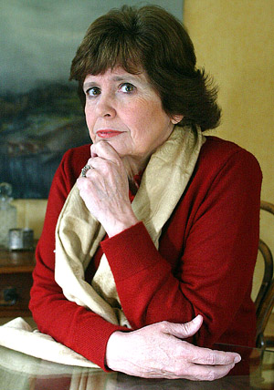

# María Olivia Mönckeberg Pardo

Es periodista de la Universidad Católica de Chile.

#### Trayectoria

Inició su carrera profesional en 1971 en la desaparecida revista _**Debate Universitario**_ **de esta casa de estudios.**

A partir de 1973 **trabajó en la revista** _**Ercilla**_. En 1977 participó en la **fundación de la revista** _**Hoy**_**,** donde fue la editora de la sección Economía y Sociedad hasta 1981. Ese mismo año se unió al equipo de la revista _**Análisis**_**, donde llegó a ser editora general y subdirectora** hasta 1987.

En 1987 entró al recién creado **diario** _**La Época**_, donde desarrolló periodismo de investigación hasta 1990, año en que asumió como **editora general del diario** _**La Nación**_**.** Fue directora de prensa de **Radio Nacional entre 1992 y 1994** y desde ese año estuvo a cargo de las entrevistas políticas dominicales de _La Nación_.

Entre 1985 y 1990 fue **Consejera Nacional del Colegio de Periodistas de Chile** y miembro de la Directiva Nacional. Fue **Presidenta de la Comisión de Libertad de Expresión del Colegio de Periodistas** desde 1985 hasta 1988.

Durante los años 80 también fue creadora del **movimiento** _**Mujeres por la Vida**_, junto a Mónica González, Marcela Otero y Patricia Verdugo. Este estuvo conformado por **mujeres opositoras al régimen con diversas profesiones**, afiliaciones políticas y orígenes sociales, pero que tenían la meta común de restaurar la democracia.

Con el retorno de la democracia enfocó sus esfuerzos en **denunciar los crímenes contra los derechos humanos**, pero muy especialmente, **desenmascarar las maquinaciones de los grupos de poder** surgidos en dictadura.

Desde julio de 2011 es **Directora del Instituto de la Comunicación e Imagen de la Universidad de Chile**, donde imparte los cursos de Periodismo de Investigación y Ética y Tratamientos Periodísticos. 

#### Premios

En 1984 recibió el **Premio Internacional de Periodismo Louis Lyon**, otorgado por la Nieman Foundation de la U. de Harvard, que destaca anualmente a un periodista en el mundo.

En **2009 obtuvo el Premio Nacional de Periodismo** por su trabajo en el área de la investigación y la publicación de varios libros de alto impacto social.

Recibió el **Premio Municipal de Literatura en la categoría Investigación Periodística** el año 2016 por su libro _La máquina para defraudar._

 

#### Publicaciones

Su primero libro lo publicó como coautora. Se trató de _**Crimen bajo estado de sitio**_ \(1987\).

Optó por publicar libros, ante la falta de espacio que tienen este tipo de investigaciones en los medios locales.

Fue a partir del año 2000 que comenzó a publicar con mayor frecuencia. Cada dos años remece a la opinión pública con sus investigaciones sobre los grupos de poder religiosos, políticos y económicos.

En 2011 publicó _El saqueo de los grupos económicos_

_**El imperio del Opus Dei**_ ****\(2003\)

_La privatización de las universidades_ \(2005\)

_**El negocio de las universidades**_ \(2007\)

_Los magnates de la prensa_ 2009

_**Karadima, el señor de los infiernos**_ \(2011\)

_Con fines de lucro. La escandalosa historia de las universidades privadas en Chile_ \(2013\)

_**El saqueo de los grupos económicos al Estado chileno**_ \(2015\)

_La máquina para defraudar_ \(2015\)

_**El poder de la UDI. 50 años de gremialismo en Chile**_ \(2017\), es su más reciente trabajo. Una acuciosa investigación sobre el partido y las consecuencias de su despliegue en la política chilena.

#### Fuentes

[Universidad Católica](https://www.uc.cl/es/la-universidad/noticias/30765-maria-olivia-moenckeberg-temeraria-investigadora-tras-los-mecanismos-del-poder)

[Instituto de la Comunicación e Imágen](http://www.icei.uchile.cl/instituto/estructura/cuerpo-academico/maria-olivia-monckeberg-pardo)

[Universidad de Chile](http://www.uchile.cl/portal/presentacion/historia/grandes-figuras/premios-nacionales/periodismo/54271/maria-olivia-monckeberg-pardo)

