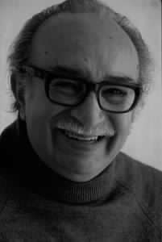

# Mario Carreño Morales

Nació en La Habana, Cuba, el 24 de junio de 1913.

#### Estudios

Inició su extensa trayectoria artística en 1925 cuando entró a estudiar a la **Academia de San Alejandro en La Habana**. En 1932 viajó a Europa donde continuó sus estudios de **Artes Gráficas en la Escuela San Fernando, en Madrid**. La Guerra Civil lo obligó a salir de España, por lo que partio a **México, donde tomó contacto con los principales exponentes del muralismo**: Diego Rivera, José Clemente Orozco y Rufino Tamayo.

Tras una breve estadía en Cuba, viaja a **París donde ingresó a la Academia Julien**. En esa ciudad obtiene notoriedad con una exposición que realizó en 1939 en la Galería Berheim-Jaune.

#### Nueva York - La Habana

Una nueva guerra lo hace moverse. Esta vez el inicio de la Segunda Guerra Mundial lo obliga a dejar Europa y partir a Estados Unidos, donde se radica en Nueva York, ciudad donde vivió los siguientes diez años, alternando su estancia con largas estadías en La Habana. Por esos años gozó de gran reconocimiento como pintor al óleo, muralista, dibujante, grabador y también académico de importantes instituciones. Fue **profesor de pintura en The New School for Social Research, en Nueva York** y realizó importantes actividades docentes y artísticas en La Habana, donde fue **profesor en la Escuela de San Alejandro**, impartiendo un curso de arte moderno.

Su vínculo con Chile se estableció mucho tiempo antes de que el pintor visitara nuestro país. Carreño mantenía una **estrecha amistad con Pablo Neruda** y estaba casado con la pintora chilena María Luisa Bermúdez.

#### Su obra

Su obra siempre guardó relación con **el espíritu caribeño de sus orígenes**, pero en la década del cincuenta evolucionó hacia la abstracción geométrica, siguiendo la tendencia impuesta por el neo-plasticismo de Mondrian. Más tarde entregó **su propia visión surrealista** del mundo.

#### Su acercamiento a Chile

Su primer viaje a Chile fue con motivo de una invitación que recibió para exponer en **la Sala del Pacífico**.

Posteriormente en 1956 recibió una invitación de la **Universidad de Chile para ofrecer el curso "Evolución del Arte Actual"**. Dos años más tarde se radicó en el país.

#### Escuela de Arte UC

Junto a **Nemesio Antúnez** y otros artistas y arquitectos, fundó la **Escuela de Arte de la Universidad Católica** en 1959. Allí ejerció como **profesor de los Talleres de Pintura** hasta 1969, fecha en la que fue nombrado **Subdirector de la Escuela**. Ese mismo año recibe la nacionalidad chilena.

#### Premio Nacional

Convertido en uno de los pintores más representativos de Chile y ampliamente reconocido en los circuitos de arte extranjeros, fue galardonado con el **Premio Nacional de Arte en 1982**.

Falleció en Santiago de Chile el 20 de diciembre de 1999.

El 2013 se creó la **Fundación Mario Carreño**, liderada por sus hijas Mariana y Andrea Carreño, fue presentada durante el Homenaje a 100 años de su Natalicio, que se realizó en el Museo Nacional de Bellas Artes. La Fundación busca organizar, conservar y preservar sus archivos para finalmente difundir la obra del artista.

#### Fuentes

[Fundación Mario Carreño](http://fundacionmariocarreno.com)

[Artistas Visuales Chilenos](http://www.artistasvisualeschilenos.cl/658/w3-article-39912.html)

[EcuRed](https://www.ecured.cu/Mario_Carreño_Morales)

[Universidad Católica](https://www.uc.cl/es/la-universidad/premios-nacionales/7373-mario-carreno-morales-1913-1999)

