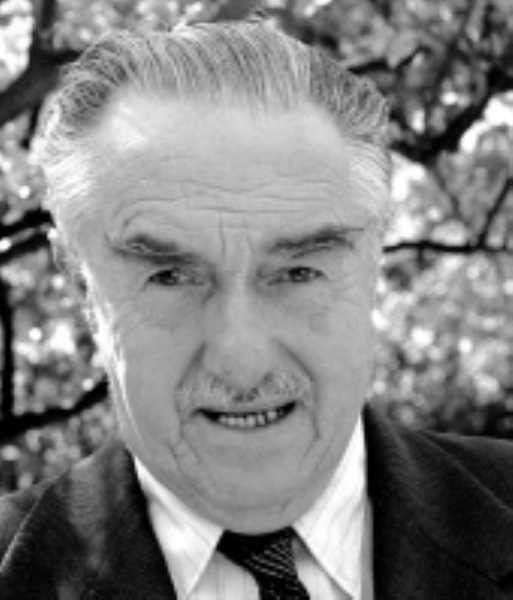

# Mario Góngora del Campo

Es considerado uno de los historiadores chilenos más destacados del siglo XX.

**Diario de vida**

Nació en Santiago el 22 de junio de 1915. Tenía 19 años cuando comenzó a escribir un diario de vida, en 1934. Lo mantuvo hasta que anunció su primer viaje tras terminar de **estudiar derecho en la Universidad Católica. No quiso titularse de abogado**. En las páginas de su diario dejó consignada su total desinterés por el derecho y las leyes.

#### Su encuentro con la historia

De vuelta a Chile, entró a estudiar **pedagogía en la Universidad de Chile**, donde alcanzó el grado de licenciado en filosofía con mención en historia, en 1944. Un año después, se incorporó a la Universidad de Chile como **jefe del Seminario de Historia Universal en la Facultad de Filosofía**. Comenzaba de esta forma, una carrera académica que lo llevaría a ser profesor titular de **Historia Medieval** \(1952\), encargado del **Instituto de Investigaciones Histórico-Culturales** \(1953\) y director del **Seminario de Historia Colonial** \(1960-1968\). A fines de esa década se integró al **Departamento de Estudios Humanísticos de la Facultad de Ciencias Físicas y Matemáticas de la Universidad de Chile**, asumiendo como director del departamento entre 1975 y 1976.

Tuvo una larga y fructífera carrera docente e investigadora, en la que también participó como **profesor visitante en otras universidades** como la de Concepción, además de colaborar en publicaciones especializadas de América y Europa.

Su trayectoria en la docencia, lo hizo consolidarse como **referente de la intelectualidad chilena**. Eran habituales sus entrevistas en distintos medios, donde se le consultaba su opinión sobre la actualidad nacional.

#### Publicaciones

Su obra estuvo centrada en el estudio de la **historia colonial e historia social.** Sobresalen sus investigaciones sobre el **derecho indiano, el origen de los inquilinos, los encomenderos y estancieros** y un sobresaliente estudio sobre el vagabundaje rural.

De todas sus publicaciones, probablemente la más importante, la más discutida, la más leída, fue _**Ensayo histórico sobre la noción de Estado en Chile en los siglos XIX y XX**_, de 1981.

Se publicaron dos libros póstumos que recopilan algunos de sus textos y algunas entrevistas: _Libertad política y concepto económico de gobierno en Chile hacia 1915-1935_ \(1986\), y _Civilización de masas y esperanza y otros ensayos_ \(1987\).

#### Premio Nacional

En 1976 fue nombrado **decano de la Facultad de Filosofía y Humanidades de la Universidad de Chile** y el mismo año obtuvo el **Premio Nacional de Historia**. En 1978 se integró al Instituto de Historia UC, donde permaneció hasta su muerte.

Fue miembro del Comité Científico Internacional de la Colección Unesco de la Historia General de América Latina y perteneció, hasta su muerte, a la **Comisión editora de la revista Historia de la Pontificia Universidad Católica de Chil**e.

Murió el 18 de noviembre de 1985

#### Fuentes

[Memoria Chilena](http://www.memoriachilena.gob.cl/602/w3-article-3385.html)

[MCN Biografías](http://www.mcnbiografias.com/app-bio/do/show?key=gongora-del-campo-mario)

[Facultad de Derecho UC](http://derecho.uc.cl/es/noticias/derecho-uc-en-los-medios/13613-mario-gongora-el-historiador-que-leyo-621-libros-en-3-anos)

[Universidad Católica](https://www.uc.cl/es/component/content/article/275-premios-nacionales/7335-mario-gongora-del-campo-1915-1985)

