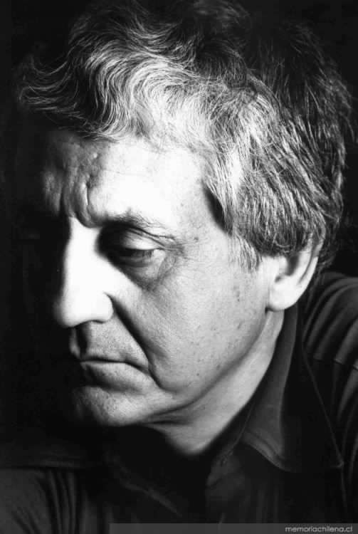

# Miguel Arteche Salinas

#### Inicios

Nació en Nueva Imperial el 4 de junio de 1926.

Estudió en el Liceo de Los Ángeles y luego en el Instituto Nacional de Santiago.

En 1945 entró a estudiar **Derecho en la** [**Universidad de Chile**](http://www.uchile.cl/portal/presentacion/historia/grandes-figuras/premios-nacionales/literatura/6555/miguel-arteche-salinas), pero desencantado de la carrera, sólo alcanzó a estudiar dos años.

En 1951 viajó a Europa, específicamente a España, para estudiar **Literatura en la Universidad de Madrid.** Durante esos años recorrió Francia, Bélgica, Italia y el norte de África.

#### Trayectoria

Participó en el **I Congreso Internacional de Poesía**, Segovia, España \(1952\); en el **II Congreso Internacional de Poesía, Salamanca** \(1953\); en el **Primer Encuentro de Escritores chilenos**, Concepción, Chile \(1958\); en el **Primer Encuentro de Escritores Americanos**, auspiciado por la Universidad de Concepción \(1960\).

En 1963 se incorporó como **miembro de número de la Academia Chilena de la Lengua**, correspondiente a la Real Academia de la Lengua Española.

Fue **agregado cultural de la embajada de Chile en Madrid \(1965\)**. 

En 1970 fue **designado en el mismo cargo en la Embajada de Chile en Honduras**. Luego ocupó el cargo de **Director de talleres de poesía en la Universidad de Chile, Universidad Católica y Biblioteca Nacional**.

De regreso en Chile, publicó profusamente en medios escritos como **Ercilla, Qué Pasa, Mampato, Hoy, Las Últimas Noticias, El Diario Ilustrado** y las revistas Finis Terrae, Atenea y Ercilla.

Perteneció al **Colegio de Periodistas y a la Sociedad de Escritores de Chile**.

En 1990 asumió como **subdirector de la Dirección de Bibliotecas Archivos y Museos**, junto con su labor como académico de la **Escuela de Periodismo de la Universidad Católica de Chile.**

Revisa un perfil más detallado del autor en ****[Memoria Chilena](http://www.uchile.cl/portal/presentacion/historia/grandes-figuras/premios-nacionales/literatura/6555/miguel-arteche-salinas).

En [este enlace](https://www.youtube.com/watch?v=RCVzbu0hrR8), un perfil del escritor en formato audiovisual.

#### Publicaciones

Su obra lo posicionó como un **referente de la Generación Literaria de 1950**.

Escribió poemas

_La invitación al olvido_ \(1947\).

_Oda fúnebre_ \(1948\)

_Una nube_ \(1949\)

_El sur dormido_ \(1950\)

_Cantata del desterrado_ \(1951\).

Quince poemas \(1961\)

Destierros y tinieblas \(1963\)

En 1972, la **Editorial Universitaria publicó** _**Antología de veinte años**_**, una recopilación que reúne lo mejor de su producción poética** editada más un número considerable de poemas inéditos.

En 1994 apareció, _**Fénix de madrugada**_**, con el que obtuvo el Premio de Poesía del Consejo Nacional** del Libro y la Lectura, en 1995. En 2002 editó el que sería su último libro: _Jardín de relojes_.

**Novelas**

_**La otra orilla**_ **\(1964\)**

_El Cristo hueco_ \(1969\)

_La disparatada vida de Félix Palissa_ \(1971\), finalista del Premio Biblioteca Breve de la editorial española Seix Barral.

_El alfil negro_ \(1992\).

Ensayos

_Notas para la vieja y la nueva poesía chilena_ o _La extrañeza de ser americano_.

Su trayectoria fue reconocida en **1996, cuando recibió el Premio Nacional de Literatura.**

[Falleció el 22 de julio de 2012](https://www.theclinic.cl/2012/07/22/murio-miguel-arteche-premio-nacional-de-literatura-1996/), tras varios años alejado de la actividad pública.

