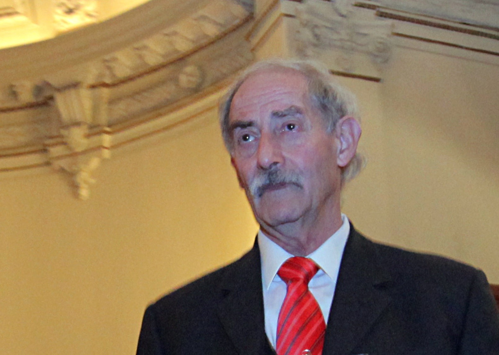

# Miguel Kiwi Tichauer

#### Sus inicios

Nació en Santiago en 1938.

**Sus padres llegaron a Chile huyendo del nazismo** desde Alemania. En 1938, cuatro años después de asentados en el país, nació Miguel, el primer hijo de este matrimonio de inmigrantes, que _**criaron a sus hijos bajo una fuerte influencia alemana**_. En ese sentido, el ambiente familiar fue algo confuso para Miguel, dado que según él mismo ha confesado, para sus padres, todo lo bueno venía de Alemania y todo lo malo venía de Alemania, en dosis similares. Además, **en su casa solo se hablaba alemán** y como aprendió a hablar ese idioma antes que español, tenía una pronunciación del castellano que enfatizaba su condición de inmigrante. La familia Kiwi se estableció en un tranquilo barrio de la comuna de Ñuñoa. Durante muchos años vivió con ellos **el abuelo paterno, quien ejerció una profunda influencia** en su nieto mayor.

Entró a estudiar al Oxford HighSchool, en Santiago, pero lo cambiaron al **Liceo Manuel de Salas, donde experimentó un gran vuelco** en su manera de ver la vida. El contacto con compañeros que venían de distintas realidades sociales, lo hizo confrontar su propia experiencia en una familia de conservadores inmigrantes. Fue sin duda el primer impulso, el que lo motivó a hacerse preguntas y a estudiar.

#### Trayectoria

Terminado el colegio, se fue a estudiar Ingeniería Civil Mecánica en la **Universidad Técnica Federico Santa María, en Valparaíso**. Fue estudiando ingeniería, que **se dio cuenta de que su verdadera pasión no era la exactitud de las matemáticas, sino la física como ciencia natural**. Ese fue un punto de inflexión en su forma de acercarse al conocimiento.

Al terminar sus estudios, volvió a Santiago para realizar su memoria de título en la Universidad de Chile. Luego, en 1963, **se fue becado a Estados Unidos, donde se doctoró en Física**, en la Universidad de Virginia.

A su regreso encuentra un **país convulsionado**, con gran agitación política, pero en paralelo, un ambiente de gran creatividad científica, en el 68 vive la reforma universitaria.

Miembro de la Academia Chilena de Ciencias y **dos veces presidente de la Sociedad Chilena de Física**. Kiwi es profesor titular del departamento de Física de la [Universidad de Chile](http://www.uchile.cl/portal/presentacion/historia/grandes-figuras/premios-nacionales/ciencias-/116604/miguel-kiwi-tichauer), desde donde dirige la investigación en agregados atómicos del Centro para el Desarrollo de la Nanociencia y la Nanotecnología \(Cedenna\).

Revisa aquí el capítulo que le dedicaron en la serie [_Mentes brillantes_ ](https://infantil.cntv.cl/videos/miguel-kiwi)del Consejo Nacional de Televisión.

#### Premios

**En 2007 recibe el** [**Premio Nacional de Ciencias Exactas 2007**](https://www.cooperativa.cl/noticias/cultura/premios/premios-nacionales/miguel-kiwi-se-quedo-con-el-premio-nacional-de-ciencias-exactas-2007/2007-08-27/123002.html) por sus 40 años dedicado al desarrollo de la Física en el país, su rol como **formador de nuevos doctores** en el área y el gran impacto de sus investigaciones en la física de la materia condensada y el **fenómeno Exchange-bias en magnetismo**.

En 2014 el Ministerio de Ciencia, Tecnología e Innovación Productiva de Argentina le otorgó el **Premio a la Cooperación Internacional en Ciencia**, Tecnología e Innovación _Dr. Luis Federico Leloir_.

