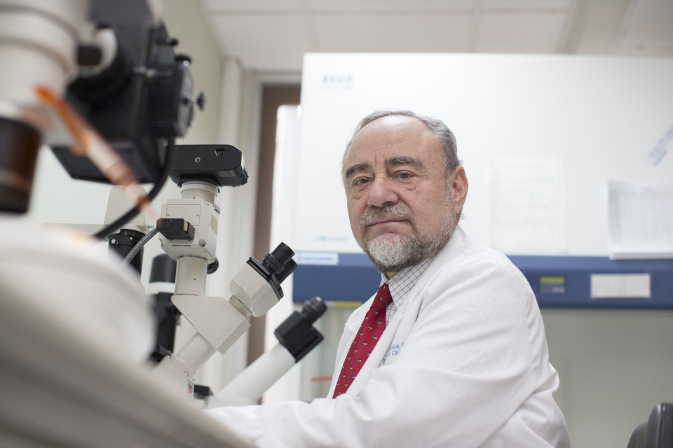

# Nibaldo Inestrosa Cantin

#### Inicios

Nació en Puerto Montt el 26 de agosto de 1951.

Sus primeros acercamientos a la ciencia se dieron cuando era muy niño. **Su padre le regaló un microscopio a los 10 años**. A partir de ahí no paró de explorar e investigar.

Cursó sus **primeros estudios en la Escuela Primaria Nº 2**, de Puerto Montt, hoy República Argentina. Para continuar con **sus estudios secundarios debió trasladarse a Valdivia** donde ingresó al Instituto Salesiano. **Terminó sus estudios secundarios en Santiago**, con motivo del traslado de sus padres.

Por esa época, la mayoría de los científicos habían estudiado medicina. Él hizo lo mismo. **Entró a estudiar Medicina a la Universidad de Chile, pero con la expresa intención de dedicarse a la ciencia**. De hecho al tiempo deja esta carrera y entra a la **Universidad Católica donde se gradúa en 1974 como Licenciado en Ciencias Biológicas**, para luego doctorarse en la materia en la misma Universidad.

Luego hizo un **Postdoctorado en Neurobiología** molecular en la **Universidad de California**.

De vuelta en Chile, tuvo a su cargo el **Laboratorio de Neurobiología Molecular de la Universidad Católica** siendo designado como Profesor Titular, en 1993.

Dirigió el **Centro Fondap de Biomedicina** y es **Miembro de Número de la Academia de Ciencias de Chile**.

En [este microprograma](https://www.youtube.com/watch?v=pm04VDFihXc) puedes conocer un poco más sobre sus estudios sobre el Alzheimer.

#### Trayectoria

Ha dedicado parte importante de su vida a **estudiar el origen de la enfermedad de Alzheimer,** una de las causas de muerte más frecuentes según estadísticas de la Organización Mundial de la Salud.

Sus esfuerzos han estado dedicados a tratar de **encontrar una cura y a procurar obtener paliativos** para los devastadores efectos que produce la enfermedad en el paciente y su entorno.

Sus estudios le han permitido determinar que el **Alzhaimer se origina por una pérdida de comunicación al interior de las células cerebrales**. Como consecuencia de sus estudios, pudo lograr establecer que algunos componentes que se extrajeron de la hierba de San Juan, en especial la que se denomina hiperforina, al menos en animales, ha logrado crear alguna capacidad para revertir problemas conductuales provocados por la enfermedad.

**Revisa aquí el perfil de** [**Explora**](https://www.explora.cl/blog/2013/11/18/nibaldo-inestrosa-cantin-1951/) **sobre el académico**

Gracias a sus investigaciones se ha logrado determinar, entre otras cosas, que **disminuir las carnes rojas y los alimentos altos en grasas es esencial, ayuda a prevenir el Alzhaimer** ya que su consumo excesivo produce un estrés oxidativo negativo para nuestro organismo, debido a que estimula la actividad radicalaria.

Hoy trabaja con fármacos naturales para combatir esta enfermedad y la fibrosis.

Actualmente se desempeña como académico de la **Facultad de Ciencias Biológicas de la Universidad de Chile** y es director del Centro de Envejecimiento y Regeneración \(Care Chile UC\).

Ha visto publicados, tanto en Chile como en el extranjero, numerosos trabajos de su autoría y, en la actualidad es D**irector del Centro de Envejecimiento y Regeneración**, financiado por el Gobierno de Chile.

Aquí puedes [ver y oír de su propia](https://www.youtube.com/watch?v=8b7eLBNTY08) voz las investigaciones que desarrolla en el Laboratorio de Neurobiología Molecular.

Y aquí puedes revisar completa la ponencia [Cómo combatir la enfermedad de Alzheimer](https://www.youtube.com/watch?v=8qVT9yGQuSQ), en el marco del Ciclo de Charlas _Bibliociencia_ desarrollada por el Proyecto Asociativo Regional EXPLORA CONICYT en conjunto con la Biblioteca Regional de Puerto Montt.

#### Premios

Ganador en 1999 de la **beca Guggenheim**.

Premio **Científico Bernardo Hussay** del Consejo Nacional de Investigaciones de Argentina.

En tres oportunidades se le concedió la **Cátedra Presidencial en Ciencias** del Gobierno de Chile.

El [**2008 le fue otorgado Premio Nacional de Ciencias**](https://www.emol.com/noticias/nacional/2008/08/26/319226/nibaldo-inestrosa-nuevo-premio-nacional-de-ciencias.html) en consideración a su notable trabajo en beneficio de la ciencia. En 2008 obtuvo el Premio Nacional de Ciencias Naturales de Chile.

