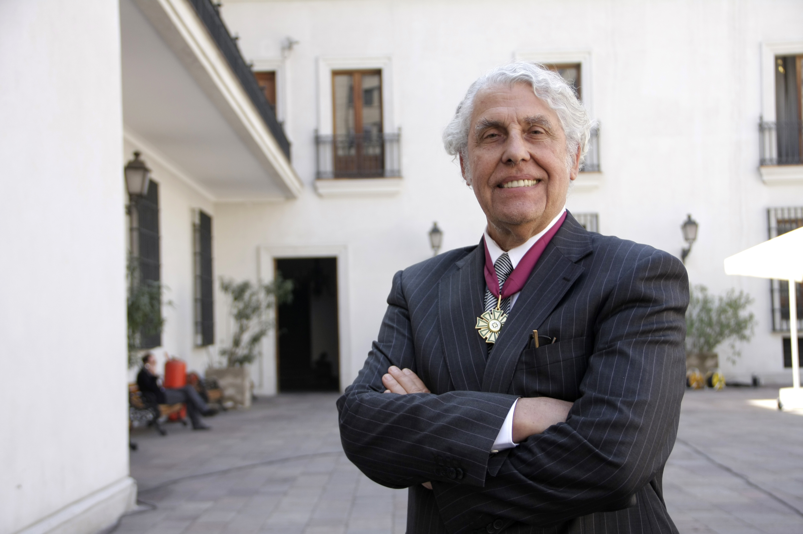

# Pablo Valenzuela Valdés

Bioquímico de la Universidad de Chile. Doctorado en Química de la Universidad Northwestern \(1970\) y Postdoctorado de la Universidad de California, Estados Unidos.

#### Pionero en biotecnología

Después de obtener su doctorado y postdoctorado en los Estados Unidos, volvió a Chile y se hizo cargo del **Laboratorio de Bioquímica, en 1971**. Con los profesores Federico Leighton y el ex Rector Juan de Dios Vial Correa crearon el **primer Programa de Doctorado en Ciencias Biológicas.**

En el año 1974 recibió la **beca del International Scientific Fellow \(NIH\)** y retornó a Estados Unidos.

#### Empresas y fundaciones

En 1981 **fundió la empresa biotecnológica Chiron Corporation**, donde fue hasta 1994 el vicepresidente de Investigación y Desarrollo. Bajo su dirección, científicos de esa empresa **secuenciaron el genoma del virus SIDA**, descubrieron el **virus de la hepatitis C** y desarrollaron un sistema de controles o test para la detección de estos virus en bancos de sangre, hoy usado en todos los países.

En 1986 **fundó GrupoBios S.A.**, compañía biotecnológica chilena, de la que actualmente es presidente.

#### Principales estudios y descubrimientos

Es reconocido mundialmente por secuenciar el genoma del virus SIDA, descubrir el virus de la hepatitis C, por sus estudios en materia de **genética molecular del virus de hepatitis B** y por descubrir la tecnología para la vacuna de la hepatitis B, la primera de clase recombinante y de mayor venta en el mundo. Descubrió el virus de la hepatitis C y **desarrolló un proceso para la producción de insulina humana** mediante levaduras.

En paralelo ha desarrollado también métodos de diagnóstico y vacunas **para patógenos de la industria salmonicultura**. Otros de los programas que ha impulsado incluyen estudios genómicos del dinoflagelado **causante de la marea roja y del Hanta Virus.**

#### Otras actividades académicas y profesionales

Fue cofundador y presidente del directorio de Andes Biotecnologies S.A.; cofundador y director del Instituto Milenio de Biología Fundamental y Aplicada \(MIFAB\); miembro del directorio de Applied Imaging Inc., empresa de diagnóstico citogenético de Santa Clara, Estados Unidos; fundador y director de la compañía de biotecnología de algas marinas, Algisa S.A., y fundador de Austral Biologicals, filial de BiosChile en San Ramón, California.

También es profesor de la Universidad Católica de Chile y de la Universidad Andrés Bello, miembro de la Academia Chilena de Ciencias y director del Instituto de Biología Fundamental y Aplicada de la Iniciativa Científica Milenio \(ICM\). Fue nombrado Doctor Scientiae Et Honoris Causa 2009 por la Universidad San Sebastián.

#### Cargos y premios nacionales e internacionales

Desde 1986 a 1988, fue **Asesor del Congreso de los Estados Unidos en la Oficina de Evaluación Tecnológica**, en el área de Biotecnología.

En la década de los noventa, fue **consultor de la Organización de Desarrollo Industrial de Naciones Unidas \(ONUDI\)** y miembro del panel de asesores científicos del **Centro de Ingeniería Genética y Biotecnología de Naciones Unidas en Trieste.**

Es miembro del **Advisory Board del Kellogg Center for Biotechnology**, Kellogg School of Management de Northwestern University.

Recientemente, ha sido nominado **miembro de la Comisión Nacional para el Desarrollo de la Biotecnología en Chile**, encargada de proponer una política nacional en esta materia y presentarla a consideración del Presidente de la República.

Fundó junto a Bernardita Méndez de la **Fundación Ciencia para la Vida,** desde donde dirige investigaciones enfocadas en producir innovaciones científicas y tecnológicas nacionales. 

Bajo el alero de la fundación, ha desarrollado un **Parque de Ciencias y Negocios**, único en Chile, con más de 15 instituciones participantes, figurando entre ellas los **laboratorios de empresas tecnológicas extranjeras** como Austral Biologicals, The Tree Lab, Ventria Bioscience y Medivation Inc.

Uno de los últimos logros de esta organización, a través de la compañía Andes Biotechnologies, es el desarrollo de una revolucionaria terapia contra el cáncer que acaba de entrar en etapa de pruebas clínicas humanas en Estados Unidos.

En 2002 recibe el **Premio Nacional de Ciencias Aplicadas y Tecnológicas**, debido al impacto mundial que han tenido sus hallazgos tecnológicos, entre los que se cuentan la creación de la primera vacuna contra la hepatitis B y el descubrimiento del virus causante de la hepatitis C. Otro de sus logros científicos es que bajo su dirección un grupo de científicos de la empresa norteamericana Chiron pudo clonar y secuenciar el genoma del virus del Sida.

Acaba de ser distinguido con el **LifeTime Achievement Award de la BayBio Association** de California, EE.UU.

#### Fuentes

[Universidad de Chile](http://www.uchile.cl/portal/presentacion/historia/grandes-figuras/premios-nacionales/ciencias-/6512/pablo-valenzuela-valdes)

[Universidad Católica](https://www.uc.cl/es/la-universidad/premios-nacionales/7423-pablo-valenzuela-valdes-1941)

[Universidad San Sebastián](http://www.uss.cl/la-universidad/grados-de-honor/pablo-valenzuela-valdes/)

[Museo Interactivo Mirador](https://mim.cl/index.php/pnc-32)

[Scielo](https://scielo.conicyt.cl/scielo.php?script=sci_arttext&pid=S0716-97602002000300003)

