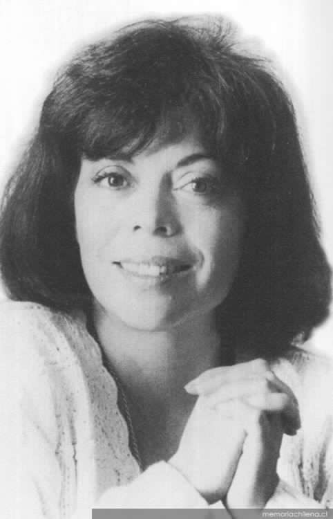

# Patricia Verdugo Aguirre

## Patricia Verdugo Aguirre

Periodista y escritora exalumna de la Escuela de Periodismo UC. Recibió el Premio Nacional de Periodismo en 1997.

#### Sus inicios

**Patricia Verdugo Aguirre nació el 20 de octubre de 1947 y murió el 13 de enero de 2008 a los 60 años**.

Sus relaciones familiares marcaron su carácter y el rumbo de su profesión.  Aprendió a leer a los tres años, repasando las letras junto al escritorio de su padre, el constructor civil Sergio Verdugo Herrera, militante DC, y a quien perdería en 1976. Por su rol como presidente del sindicato de la Sociedad Constructora de Establecimientos Educacionales, fue asesinado a los 50 años por miembros de la Dirección de Inteligencia de Carabineros, DICAR.

Así, **Patricia experimentó de primera mano y con profundo dolor la división del país que comenzó en el gobierno de Allende y que devino en fractura con el Golpe Militar.** 

Su hermano menor, Roberto, y su tío Gustavo Verdugo pertenecían a las Fuerzas Armadas, las mismas que le arrebataron a su padre. 

La pregunta que la rondó por años fue “¿qué le pasó a mi hermano oficial de Ejército? ¿Cómo es que el chiquito que fue criado en mí mismo hogar, con los mismos principios cristianos y demócratas, me declaraba ahora enemiga de la patria? **Durante la investigación \(para el libro** _**Los Zarpazos del Puma**_**\) fui entendiendo, ya que ahí supe del terror soterrado que vivieron los mismos militares y que los obligó a cumplir órdenes inhumanas e ilegales.** Mi padre fue asesinado en julio de 1976. Obviamente su muerte impregna toda mi vida de ahí en adelante. No hay cómo separar a la hija sufriente de la periodista que investiga. Soy una sola persona”, contó en una [entrevista con la periodista María Isabel de Martini.](http://ciperchile.cl/2009/01/13/el-legado-periodistico-de-patricia-verdugo/)

#### Su carrera 

**Estudió periodismo en la Universidad Católica entre 1965 y 1968 y no pudo abstraerse de la toma que concluyó con la designación del primer rector laico de la UC.** 

Paradójicamente al rumbo que tomó su carrera después, comenzó siendo relacionadora pública de la Escuela Militar entre 1969 y 1973.

Luego trabajó 3 años en revista Ercilla, a la que renunció debido a la censura y en solidaridad con el director Emilio Filippi.  

**Después fundó la revista Hoy, donde hizo – hasta 1990— un periodismo de denuncia, libre en relación a los derechos humanos.** Posteriormente en Apsi, dio voz a personajes invisibilizados de la vida pública y espacio a discursos más controversiales.

#### Sus publicaciones

La pregunta sobre las motivaciones de su hermano fue determinante para dar origen a una [extensa lista de publicaciones](https://es.wikipedia.org/wiki/Patricia_Verdugo) donde denunció los abusos y crímenes del régimen militar.

Uno de sus trabajos con mayor impacto fue ****_**Los Zarpazos del Puma**_**, de 1989. En él reveló las acciones de la Caravana de la Muerte, expedición del helicóptero militar que ejecutó a 72 prisioneros políticos, encabezada por el general Sergio Arellano Stark.** 

El libro sigue ostentando un récord editorial en Chile con más de 100 mil ejemplares vendidos en pocos meses. Nada del crudo relato de la periodista ha podido ser desmentido.

**Otra de sus investigaciones,** _**Quemados vivos**_ **de 1986**, narra la historia de Carmen Gloria Quintana y Rodrigo Rojas De Negri, dos jóvenes que fueron rociados por combustible por una patrulla militar. Pese a que fue citada a declarar por la publicación, fue absuelta de las acusaciones.

**Junto a Carmen Hertz escribió** _**Operación Siglo XX**_, en 1990, sobre el atentado a Augusto Pinochet. 

Pero **su título personal fue** _**Bucarest 187**_**, de 1999**, donde reflexionó sobre cómo el crimen de su padre afectó el eje emocional de su familia y cómo el periodismo disidente luchó contra la censura y la dictadura.

#### Premios y reconocimientos

En 1997 recibió el Premio Nacional de Periodismo.

Cuatro años antes había recibido el premio María Moors Cabot de la Universidad de Columbia, y posteriormente, en 2000, fue reconocida con el premio LASA, otorgado por la Latin American Studies Association. 

Pero estos galardones son considerados insuficientes por sus pares, porque sus trabajos de investigación fueron armas para la justicia y su valor y consistencia, un ejemplo para las futuras generaciones.

“Da lo mismo si el signo ideológico por el que se mata es de izquierda o derecha, si es en nombre de los musulmanes o de la Iglesia Católica, **la barbarie es matar.** Para las generaciones que siguen deseo un mundo sin armas. Las mías son la paz y la razón. Así como mi padre fue asesinado, seguramente lo será un nieto o un bisnieto. Pero **no voy a renunciar ni como persona ni como periodista a ese sueño de que la vida sea una copia del paraíso, porque si lo hiciera renunciaría a ser persona**”, aseguró en [entrevista con La Tercera.](http://www.memoriachilena.cl/archivos2/pdfs/mc0032487.pdf)

#### Texto tomado de la[ nota de Constanza Flores L.](https://www.uc.cl/es/la-universidad/noticias/30712-patricia-verdugo-valiente-defensora-de-los-derechos-humanos), Dirección de Comunicaciones UC.

