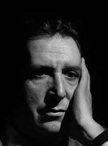

# Pedro Mortheiru Salgado

#### Inicios

Nació en Lebu en 1919. Desde niño fue un admirador del arte y la estética. Siendo un liceano estableció un fuerte vínculo con la música, la literatura, el cine y el teatro.

Estudió Arquitectura en la Universidad Católica de Chile. Fue en esa época que participó activamente en el movimiento teatral universitario. Participó en la **creación del Teatro Experimental de la** [**Universidad de Chile**](http://www.uchile.cl/portal/presentacion/historia/grandes-figuras/premios-nacionales/teatro-y-artes-de-la-representacion/6659/pedro-morheiru-salgado) ****en 1941. En 1943 fundó junto a Fernando Debesa, Teodoro Lowey y Gabriela Roepke, el Teatro de Ensayo de la Universidad Católica de Chile \(TEUC\), institución a la que estaría ligado por once años. De esta forma se convierte en una **figura relevante en el desarrollo del teatro** en Chile.

En [este enlace](http://www.academiachilenadebellasartes.cl/premios-nacionales/#toggle-id-10), un perfil desarrollado por Academia Chilena de Bellas Artes.

#### Trayectoria

A principios de los 50, recibió la beca del **British Council,** del gobierno francés y de la **Rockefeller Foundation** para estudiar en Inglaterra, Francia y Estados Unidos. Esto le permitió conocer y relacionarse con lo más selecto del teatro internacional y profundizar su propio vínculo con la producción teatral.

Entre 1960 y 1963 asume la **dirección del Teatro de la Universidad de Concepción** \(TUC\). En 1962, fue invitado por Rockefeller Foundation a dirigir la obra _Deja que los perros ladren_ en Dallas, Estados Unidos.

Tras dejar la TUC, **se retira voluntariamente del teatro**, y durante once años se vuelca por completo a la arquitectura. Esto hasta que en 1974 **vuelve como docente a la Escuela de Teatro de la Universidad de Chile.**

A lo largo de su carrera, dirigió un sinnúmero de montajes, con un altísimo nivel de excelencia.

#### Premios

**Recibió el Premio Nacional de Arte en 1978**.

Murió en año 1994.

#### 

