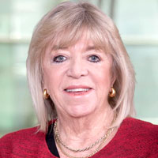

# Pilar Vergara Tagle

**María del Pilar Vergara Tagle \(1947-\) estuvo ligada a los medios de comunicación desde chica.** Su padre, Ruperto Vergara, era publicista y dueño de varias radios y ya en el colegio, ella se dio cuenta de su afición por las letras: en los veranos escribía los ensayos de sus compañeras para cambiarlos por las tareas de alemán.

#### Formación

A pesar de tener más de un 6,5 de promedio y habilidad para escribir, no le fue tan bien en el Bachillerato. El bajo puntaje puso en peligro su vocación y su carrera, y tuvo que dar un examen ante el director de Periodismo de esa época, Patricio Prieto, que por suerte aprobó. **A la escuela entró con su mejor amiga, la ex decana de la Facultad de Comunicaciones UC Silvia Pellegrini.**

#### Trayectoria

En 1967 **partió como periodista y animadora en el programa cultural de Canal 13 “Cinco octavos”.** Tres años después comienza a colaborar en las revistas “Desfile”, una publicación política y “Eva”, una revista femenina. Después estuvo a cargo del espacio “Magazine” en el programa “Pasado meridiano” de la misma estación.

Arribó a El Mercurio como periodista de “Espectáculos”. Llegó a ser editora de la sección. **En 1976 creó el suplemento “Wikén”,** revista con panoramas para el fin de semana, entrevistas, cartelera de teatro, televisión y farándula, inspirada por la sección “Weekend” de The New York Times. Además, fue redactora de reportajes especiales y editora del cuerpo D.

En 1981, Cristián Zegers, subdirector de El Mercurio, quiso refundar La Segunda y convertirlo en el primer y principal diario político del país. Para lograrlo eligió a **Pilar como jefa de informaciones y al poco andar la ascendió a editora de servicios informativos.** La prisa del cierre de un diario de circulación vespertina nunca impidió que ella mantuviera la calma o estuviera impecablemente arreglada con su look ejecutivo.

Su jefe y mentor fue nombrado director de El Mercurio en 2006 y ella asumió su lugar**. Al dirigir La Segunda, Pilar se convirtió en la segunda mujer en comandar un diario en Chile.** Su predecesora fue la emblemática Silvia Pinto, quien estuvo a cargo del diario El cronista, que en 1975 reemplazó a La Nación. Estuvo al mando hasta 2011, siendo una de las piezas claves dentro de la consolidación del medio.

#### Premios

Su carrera profesional la ha hecho ganar de numerosos premios como el Helena Rubinstein \(1980\), Avon \(1984\), Lenka Franulic \(1988\) y el Embotelladora Andina \(1991\). **El corolario de estos logros fue el Nacional de Periodismo en \(1993\),** donde sucedió a [Raquel Correa.](https://www.uc.cl/es/la-universidad/noticias/30600-raquel-correa-periodista-independiente-y-aguda-entrevistadora)

Paralelamente a su intenso ejercicio periodístico, **durante varios semestres dictó el ramo Técnicas Periodísticas en la universidad.** Muchos de sus alumnos, que aprendieron de ella que el periodismo es, por, sobre todo, una actividad de servicio público, han pasado por la sala de redacción y las jefaturas del diario al que ella dedicó 30 años de trabajo.

Ese principio fue rector de su quehacer profesional. “El periodismo que se compromete con el servicio a la opinión pública es el que vale la pena… el que justifica las incomprensiones y sacrificios que muchas veces trae, y el que, la más de las veces, **da inmensas gratificaciones, cuando se percibe que, gracias a la información que tú has dado, la realidad que tú has informado, las personas toman sus decisiones libremente”**, declaró en [una columna de 1988.](http://www.memoriachilena.cl/archivos2/pdfs/mc0032477.pdf)

#### Fuente

[Universidad Católica](https://www.uc.cl/es/la-universidad/noticias/30627-pilar-vergara-directora-y-lider-en-la-segunda)

