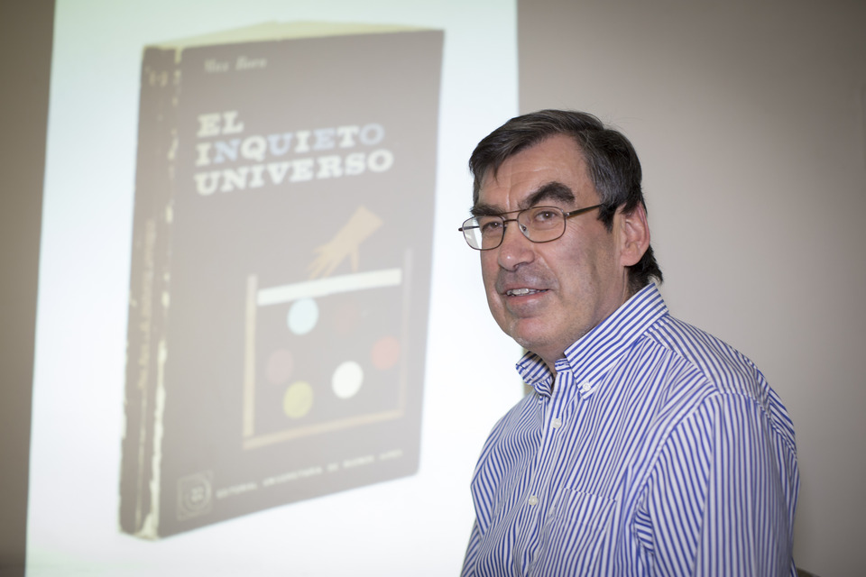

# Rafael Benguria Donoso

#### Inicios

Nació en Santiago, el 25 de octubre de 1951.

Se tituló de **Ingeniero Civil Eléctrico y de Magíster en Física en la** [Universidad de Chile](http://www.uchile.cl/portal/presentacion/historia/grandes-figuras/premios-nacionales/ciencias-/8812/rafael-benguria-donoso) ****en 1974. En 1976 obtuvo el grado de **Master y luego en 1979 el de Doctor en Física, ambos en la Universidad de Princeton**, Estados Unidos.

#### Trayectoria

Se desempeñó como académico hasta comienzos de la década de 1990 en el **Departamento de Física de la Facultad de Ciencias Físicas y Matemáticas** de la Universidad de Chile.

Entre 1993 y 1996 fue miembro del **Consejo Superior de Ciencias de FONDECYT**. Actualmente es integrante del Comité de Honor de la celebración del Bicentenario de la Biblioteca Nacional.

En 2003 se incorporó como **Miembro de Número de la Academia Chilena de Ciencias** y ha sido integrante del **Executive Committee of the International Association of Mathematical Physics, del Consejo Superior de Ciencias de FONDECYT** y Presidente de la Sociedad Chile de Física.

Ha tenido una extensa participación en proyectos de investigación [CONICYT](https://www.conicyt.cl/blog/2005/11/16/rafael-benguria-donoso-galardonado-con-premio-nacional-de-ciencias-exactas-2005/) tanto nacionales como de cooperación internacional. Tiene a su haber más de **13 proyectos como investigador responsable y co-investigador y ha sido tutor de tesis de doctorado en el Fondo Nacional de Desarrollo Científico y Tecnológico**, FONDECYT de CONICYT.

En esta [extensa conversación](https://www.youtube.com/watch?v=xGXTeGXlQro&list=PLaT8MK8BQGcBe2P_caDFdyOd3eZdaaWlM&index=96&t=0s&pbjreload=10) con Cristián Warnken, el profesor Benguria ahonda en su trayectoria y sus investigaciones. 

#### Publicaciones

Se ha desempeñado como editor de dos de **las más importantes revistas internacionales de Física Matemática**. Entre sus publicaciones, se cuentan más de 100 artículos y libros, 70 de ellos publicados en revistas internacionales \(ISI\).

#### Premio Nacional

Recibió el [**Premio Nacional de Ciencias Exactas en 2005**](https://www.conicyt.cl/blog/2005/11/16/rafael-benguria-donoso-galardonado-con-premio-nacional-de-ciencias-exactas-2005/) **por sus condiciones de científico integral**, con resultados profundos y de alto impacto en disciplinas como la **Física, Matemáticas y Química, incluyendo la mecánica cuántica, ecuaciones en derivadas parciales no lineales**, geometría espectral y en análisis matemático del movimiento browniano. El Premio es también reconocimiento a su labor docente en distintas universidades del país. Más de cinco mil alumnos han pasado por sus clases.

#### 

