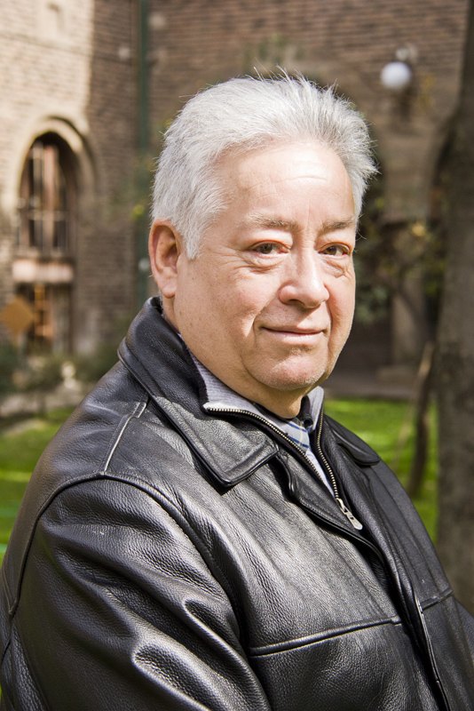

# Ramón Nuñez Villarroel

Nació en Santiago de Chile el 30 de noviembre de 1941.

#### Formación

Desde niño fue un asiduo asistente al Teatro. Tanto el de la Universidad Católica, como el Teatro Experimental de la Universidad de Chile.

Estudió en el **Liceo Barros Arana**. Tenía claro que su vocación era el teatro.

Según propia confesión, se inclinó por estudiar en la **Academia de Arte dramático del Teatro de Ensayo de la Universidad Católica**, porque allí vio actuando a **Sylvia Piñeiro**, quien tendría un rol clave en su vocación por las tablas. Ahí realizó una destacada labor como **actor, director, docente** y administrativo.

Tras sus estudios de grado, realizó estudios de Postítulo en **Dirección Teatral en el prestigioso London Drama Center** entre 1969 y 1971.

Ha participado en numerosos seminarios y cursos de perfeccionamiento en Europa y Estados Unidos.

Ha **dictado cátedras en el pregrado como en el post-título y en magister** tanto en Chile como en el extranjero.

#### Trayectoria

Ha estado ligado al **Teatro de la Universidad Católica por más de 50 años**, siendo su miembro más antiguo. Fue **Director de la Escuela de Teatro desde 1983 a 1987**.

Ha participado como director, actor o profesor en **más de 200 obras, tanto en Chile como en el exterior.**

Con una sólida trayectoria en teatro, entró a la televisión, donde tuvo gran desempeño como **actor y director de programas en el Area Dramática de la corporación de Televisión de la Universidad Católica de Chile, Canal 13**. Su personaje más célebre en la pantalla chica fue **Don Goyo.**

Con **170 obras como trayectoria**, ha dirigido piezas como _**La viuda de Apablaza**,_ de Germán Luco; _**Traición,**_ de Harold Pinter y _**El derrumbe**_, de Arthur Miller, entre otras. Protagonizó _**La pérgola de las flores**_, _El burgués gentilhombre_, _**El rey Lear**_, _Esperando a Godot_, _El vestidor_, y _Ardiente paciencia_, entre otras.

Desde el año 2001 es **miembro activo de la Academia Chilena de Bellas Artes**, de la que  actualmente es secretario.

#### Premios

Ha tenido una carrera brillante que lo han hecho merecedor de una gran cantidad de premios y reconocimientos

En 1993 fue distinguido por el **Consejo Mundial de Educación** como una de las personalidades más relevantes de la cultura nacional.

La Universidad Católica lo premió por su dilatada y **brillante carrera al servicio del Teatro de la Universidad Católica durante la celebración de sus 50 años de vida**.

En 2002 la Pontificia Universidad Católica de Chile lo premió como **uno de los tres profesores titulares de más larga permanencia en la UC**.

En 2005 recibió el **Premio de la Crítica Especializada** como la figura de más larga y exitosa trayectoria en el teatro chileno.

En 2009 fue invitado por el **Departamento de Drama de la Universidad de New York** a hacer una lectura dramatizada de _Becket y Godot_ de Juan Radrigán en inglés.

Ese mismo año recibió el ganador del **Premio Nacional de Artes de la Representación** por su larga e invaluable trayectoria artística.

#### Fuentes

[Universidad Católica](https://www.uc.cl/es/la-universidad/premios-nacionales/7375-ramon-nunez-villarroel-1941)

[Escuela de Teatro UC](http://escueladeteatro.uc.cl/escuela/profesores/56-ramon-nunez-villarroel)

[Academia Chilena de Bellas Artes](http://www.academiachilenadebellasartes.cl/premios-nacionales/#toggle-id-27)

