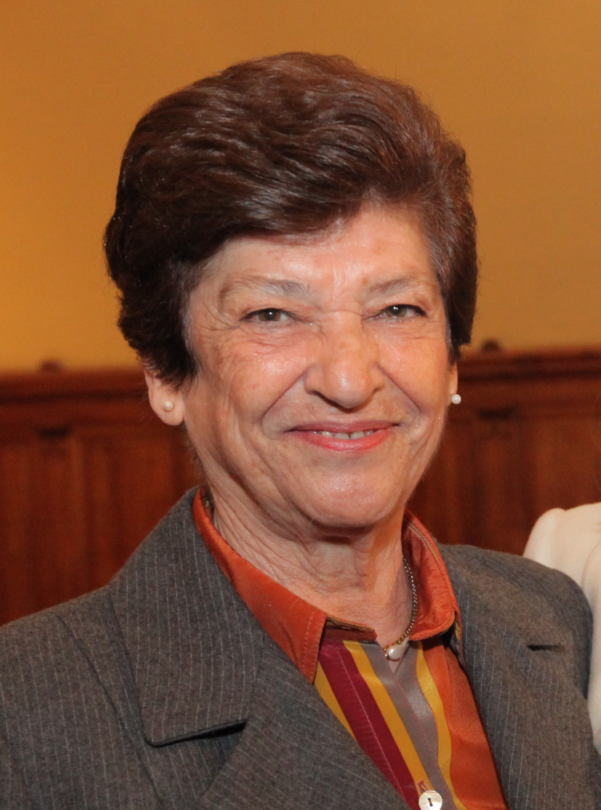

# Raquel Correa Prats

## Raquel Correa Prats

Alumna y profesora de Periodismo en la Universidad Católica. Premio Nacional de Periodismo 1991.

La primera vocación de Raquel Teresa Correa Prats \(1934 - 2012\) quedó trunca a los 17 años. Siempre inquieta, rebelde y obstinada, se matriculó en secreto en la academia de Hugo Miller persiguiendo el sueño de la actuación. Pero su madre asistió a su debut en la polémica obra “Esquina Peligrosa” –donde fumaba con boquilla e interpretaba a la esposa de un homosexual— y, **para suerte del periodismo nacional, la hizo jurar que abandonaría las tablas.**

#### Periodismo no era la primera opción

En la búsqueda se matriculó en psicología en la Universidad de Chile, pero recién en tercero descubrió su verdadera pasión de mano de Lenka Franulic, la primera periodista chilena. Ella la invitó a participar junto a otros alumnos en el programa "Apuntes" de Radio Minería. **Todos desertaron del proyecto menos ella y desde ese momento, nunca abandonaría el periodismo.** Tras tres años de estudio, dejó su primera carrera y se dedicó de lleno al oficio.

#### Gran entrevistadora

Despegó profesionalmente en Revista Vea –donde trabajó entre 1965 y 1975—  y pronto se fue perfilando como una incisiva reportera. En el programa "Las mujeres también improvisan", en radio Cooperativa, demostró sus habilidades en el arte de la entrevista. **Trabajó en radio Minería, Revista Cosas, La Tercera, El Mercurio, TVN, Canal 13** y pudo conversar con figuras como Sor Teresa de Calcuta, Raúl Alfonsín, Henry Kissinger y Mario Vargas Llosa, entre otros.

Capaz de retratar a un entrevistado con una sola frase o mostrar la fragilidad de los duros con un pequeño detalle, por más de cuatro décadas mostró los cambios políticos y sociales del país y del mundo al poner en aprietos a los protagonistas de la historia.  Salvador Allende, Sebastián Piñera, el cardenal Raúl Silva Henríquez, el general Carlos Prats, Augusto Pinochet, Jaime Guzmán, Gladys Marín, Manuel Contreras y Carlos Cardoen son algunos de los personajes que desfilan por [“Preguntas que hacen historia”](http://www.catalonia.cl/preguntas-que-hacen-historia-40-anos-entrevistando-19702010-p-2553.html), una antología que recoge sus mejores entregas.

#### Periodismo en dictadura

Ejerció con dignidad el oficio de periodista pese a que la dictadura suprimió la libertad de prensa. “La independencia y objetividad eran mi regla de oro”, señaló en una [conversación con Revista Caras](http://www.caras.cl/politica/raquel-correa-y-sus-40-anos-de-entrevistas-saludar-de-beso-al-mamo-contreras-perturbaba/) en 2010. Ella misma es un personaje de la transición y protagonizó uno de los momentos de antología de la televisión chilena.  Una pregunta suya en el programa de Canal 13 “De cara el país” –que conducía junto a otros panelistas— le dio pie a [Ricardo Lagos para encarar a Augusto Pinochet mirándolo y apuntando con su dedo](https://www.youtube.com/watch?v=tvFqmjcj3ZQ) directamente a la cámara. El episodio sucedió en 1988, antes del plebiscito que marcaría el retorno a la democracia.

#### Premio Nacional

Fue la primera mujer en recibir el Premio Nacional de Periodismo en 1991 y también, la primera en obtener el Lenka Franulic –denominado así en honor a su mentora— entre otros muchos galardones que distinguieron su trayectoria.  Fue co-autora de los libros “Ego Sum Pinochet” y “Los generales del régimen” y también, **profesora de la Facultad de Comunicaciones UC en el ramo "Entrevista en Medios".**

Por su clase pasaron [cinco generaciones de Periodistas UC](http://comunicaciones.uc.cl/las-lecciones-de-raquel-correa-en-la-uc/), a quienes animó **a ser perseverantes y determinados en su búsqueda de la verdad, y a no temer incomodar al entrevistado para conseguir lo necesario.** Su secreto para lograrlo era conectarse con la artista que tenía dentro: “Muchas veces pienso que me desdoblo cuando estoy ejerciendo periodismo. Ahí estoy actuando, asumo el papel de entrevistadora ... como una verdadera actriz”, dijo.

#### Fuente

[Universidad Católica](https://www.uc.cl/es/component/content/article/244-noticia-principal/30600-raquel-correa-periodista-independiente-y-aguda-entrevistadora)

