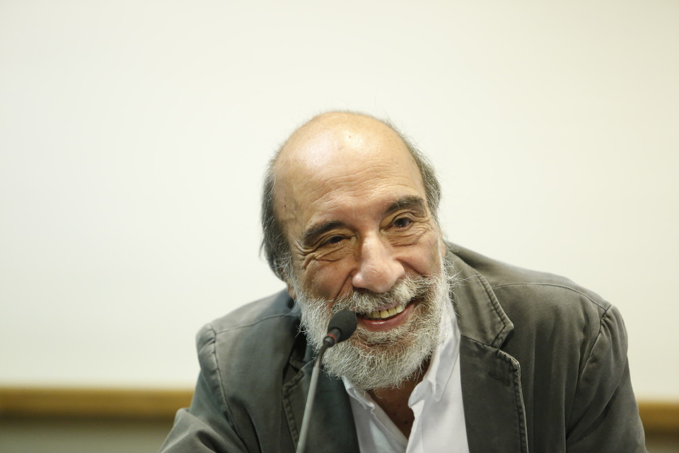

# Raúl Zurita Canessa

#### Inicios

Nació en Santiago el 10 de enero de 1950.

A los ocho años ingresó al **Liceo José Victorino Lastarria**. 

En 1967 entró a estudiar **Ingeniería Civil en la Universidad Técnica Federico Santa María de Valparaíso**. 

Durante 1973 asistió al mítico **taller literario que realizaba Enrique Lihn en la Universidad Católica de Chile**.

#### Trayectoria

Durante la dictadura ideó, produjo y protagonizó **múltiples acciones de arte**, la mayoría de ellos bajo el alero del CADA \(Colectivo de Acciones de Arte\), que fundó en 1979 junto a Diamela Eltit y los artistas visuales Lotty Rosenfeld y Juan Castillo y el sociólogo Fernando Balcells. Este colectivo fue concebido como una plataforma para realizar un arte de protesta, de gran formato y de carácter político y de resistencia a la dictadura militar de Pinochet. 

Durante 1984 participó activamente en la lucha democrática contra la dictadura leyendo su poesía en múltiples actos a lo largo de Chile.

En 1987 participó en la **exposición** _**Chile Vive en Madrid**_, muestra de la cultura de resistencia que se hacía en Chile.

En 1990, Patricio Aylwin, lo nombró **Agregado Cultural de la Embajada de Chile en Italia.** En ese país vivió hasta 1995.

Años después, recorrió Chile junto al candidato presidencial **Ricardo Lagos en señal de apoyo** a su campaña.

Ha dado clases y ofrecido lecturas en prácticamente todos los continentes.

Revisa el perfil de Zurita en [Memoria Chilena](http://www.memoriachilena.gob.cl/602/w3-article-3669.html).

En este enlace, un recorrido por la vida de Zurita a través de sus [Documentos públicos](https://documentospublicos.udp.cl/podcast/poesia/).

Y aquí una [extensa conversación con Cristián Warnken](https://www.youtube.com/watch?v=fDqRpKiveDk) en 1995, en el clásico _La belleza de pensar._

#### Obras

A principios de los 70 publicó los poemas _**El sermón de la montaña**_ **y la serie de poemas** _**La tiempo blanca para nuestro mundo negro**_**.**

**En 1975 publicó** _**Áreas Verdes**_ **en la revista** _**Manuscritos**._ 

En 1976 publicó _El desierto de Atacama_. 

_Purgatorio,_ de 1979, está sin duda entre sus obras más importantes. 

Publicó _Anteparaíso en_  1982, años álgidos de la dictadura. 

En 1983 publicó el libro de ensayos _Literatura, lenguaje y sociedad_ _\(1973-1983\)_.

Le siguen las colecciones de poemas

_El paraíso está vacío_ \(1984\)

_Canto a su amor desaparecido_ \(1985\)

_El amor de Chile_ \(1987\)

_**La vida nueva**_ **\(1994\)**

_Canto de los ríos que se aman_ \(1997\)

_El día más blanco_ \(1999\)

_Sobre el amor, el sufrimiento y el nuevo milenio_, ensayo, \(2000\)

_Poemas militantes_, \(2000\),

_**INRI**_ ****\(2003\)

_Mi mejilla es el cielo estrellado_ \(2004\)

_Poemas,_ antología \(2004\)

_Tu vida derrumbándose_ \(2005\)

_Mis amigos creen_ \(2005\)

_Los poemas muertos_, ensayos, \(2006\)

_Los países muertos_ \(2006\)

_LVN. El país de tablas_ \(2006\)

_Poemas de amor_ \(2007\)

_Las ciudades de agua_ \(adelanto de _Zurita_, 2007\)

_In memoriam_ \(2008\)

_Cinco fragmentos_ \(adelanto de _Zurita_, 2008\)

_Cuadernos de guerra_ \(adelanto de _Zurita_, 2009\)

_Poemas 1979-2008_, antología \(2009\)

_Sueños para Kurosawa_, \(adelanto de _Zurita_, 2010\)

_**Zurita**_ \(2011\)

_Zurita x 60: textos críticos sobre su obra y su ensayo Los Poemas Muertos_ \(2011\). 

En este enlace, una grabación de 1986 de [Zurita leyendo poemas](https://www.youtube.com/watch?v=s-g7wbLbcMw) de _La vida nueva_, _Canto a su amor desaparecido_ y parte de _Anteparaíso_.

**Premios**

Su vasta obra y su compromiso con la libertad y los Derechos Humanos, lo ha hecho merecedor de una gran cantidad de reconocimientos. Entre ellos:

**Premio Pablo Neruda**, otorgado por la Fundación Neruda por el conjunto de su obra.

**Premio Pericle d’ Oro, 1994** Calabria, Italia.

En 1995 le fue otorgado el **Premio Municipal de Literatura por** _**La Vida Nueva**_.

Recibió el **Premio José Lezama Lima de Casa de las Américas de Cuba** por _INRI_.

Recibió el **Premio Nacional de Literatura en 2000**, por la valorada renovación de su obra lírica, así como el reconocimiento que ha tenido en la crítica especializada y su trabajo en talleres literarios.

