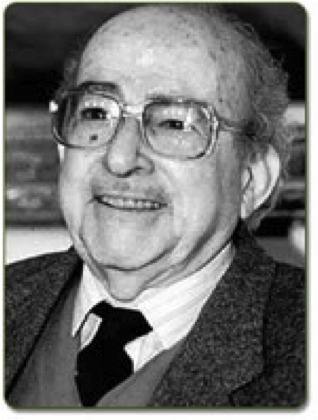

# René Cortázar Sagarminaga

#### Inicios

Nació en Temuco, el 19 de Septiembre de 1917. Hizo sus estudios en la ciudad de Madrid, España, de donde egresó en 1934.

Ingresó a la [**Universidad de Chile**](http://www.uchile.cl/portal/presentacion/historia/grandes-figuras/premios-nacionales/ciencias-/6571/rene-cortazar-sagarminaga) **el año 1935 y se tituló de Ingeniero Agrónomo en 1939**. Tres años más tarde obtuvo una **beca de la Fundación Rockefeller**, la que le permitió hacer profundos estudios sobre genética y mejoramiento de plantas. Esto le permitió obtener el grado de **Master of Science de la Universidad de Minnesota**, Estados Unidos.

#### Trayectoria

Fue un destacado **académico de la Facultad de Agronomía e Ingeniería Forestal de la Universidad Católic**a, donde enseñó de genética vegetal y mejoramiento de plantas. Fue uno de los **fundadores de la Sociedad de Genética de Chile** \(1964\).

Fue parte de la **Primera Reunión de Profesores de Genética de América Latina** donde presentó un trabajo sobre Genética Vegetal. Como docente contribuyó al mejoramiento de los planes de estudio de la enseñanza de la Agronomía en Chile.

Sus investigaciones permitieron **mejorar la producción de trigo en el país.** Fue un gran impulsor en la creación del **Instituto de Investigaciones Agropecuarias** \(INIA\).

Diseñó un intenso programa de **mejoramiento varietal** basado en la incorporación, selección y cruzamiento de semillas de todo el mundo.

Aquí el perfil del académico en el sitio [Explora CONICYT](https://www.explora.cl/blog/2013/11/18/rene-cortazar-sagarminaga/).

#### Premios

Entre los galardones que ha recibido a lo largo de su trayectoria se cuentan el **Premio Lemus** al mejor alumno, **Premio Colegio de Ingenieros Agrónomos**, **Miembro de Número de la Academia Chilena de Ciencias**.

En 1994 obtuvo el **Premio Nacional de Ciencias Aplicadas y Tecnológicas** por sus investigaciones en el mejoramiento genético y nuevas formas de producción del trigo.

En el año 1984, al cumplir 40 años como profesor de nuestra Facultad, recibió el grado de **Profesor Emérito de la Universidad Católica de Chile**.

[Murió el 18 de diciembre](https://www.emol.com/noticias/nacional/2008/12/18/335862/muere-padre-del-ministro-rene-cortazar.html) de 2008.

