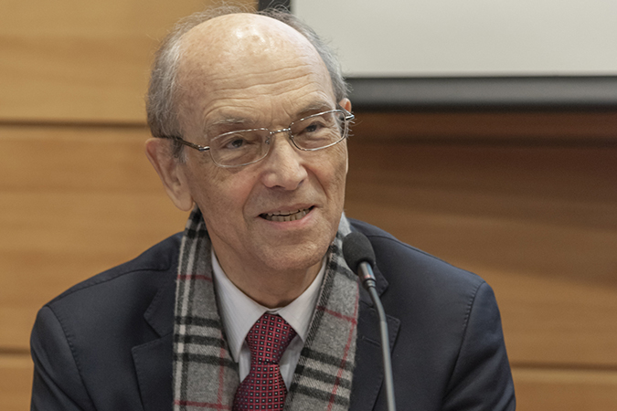

# Ricardo Ffrench-Davis Muñoz

#### Inicios

Nació el 27 de junio de 1936.

Estudió Ingeniería Comercial en la Universidad Católica de Chile. Hizo el Doctorado y Magíster en Economía en la Universidad de Chicago. 

#### Trayectoria

A diferencia de la camada de estudiantes y posteriormente profesores que pasaron por la Universidad de Chicago, Ffrench-Davis no abrazó las ideas del neoliberalismo, fue un opositor a la dictadura de Pinochet y lejos de colaborar con el régimen, enfocó su trabajo en comercio internacional, macroeconomía y desarrollo, crecimiento con equidad, historia económica comparada de Chile y América Latina, y finanzas internacionales.

En este artículo, Ffrench Davis asevera ["Es un mito decir que la dictadura lo hizo bien en economía y que la Concertación simplemente administró el modelo"](https://www.elmostrador.cl/mercados/2018/03/19/ricardo-ffrench-davis-es-un-mito-decir-que-la-dictadura-lo-hizo-bien-en-economia-y-que-la-concertacion-simplemente-administro-el-modelo/)

En cuanto se restableció la democracia, fue nombrado **Director de Estudios del Banco Central de Chile**, donde ejerció entre abril de 1990 y marzo de 1992. A partir de ese año y hasta el 2004 fue **asesor regional principal de la Cepal**.

Fue también **director de la Corporación de Investigaciones Económicas para América Latina** \(CIEPLAN\).

Junto al profesor Joseph Stiglitz, Premio Nobel de Economía, codirigió un **Grupo Internacional sobre** _**Macroeconomía para el Desarrollo**_, entre 2002 y 2006.

#### Publicaciones

Es autor o editor de más de una veintena de libros y ciento cincuenta artículos técnicos, publicados en nueve idiomas.

Entre sus libros se cuentan

_**Chile entre el neoliberalismo y el crecimiento con equidad: reformas y políticas económicas desde 1973**_;

_Reformas para América Latina: después del Fundamentalismo Neo-Liberal_

_Políticas económicas en Chile: 1952-70_

_Macroeconomía, comercio y finanzas: para reformar las reformas en América Latina_.

_Reformas económicas en Chile 1973-2017._ En [este enlace](https://www.tele13radio.cl/podcast/fm/conversamos-con-ricardo-ffrench-davis-de-su-libro-reformas-economicas), una entrevista a Ffrench Davis con motivo del lanzamiento de este libro_._

En este enlace de CIEPLAN puedes revisar [el libro completo](http://www.cieplan.org/biblioteca/detalle.tpl?id=27) en formato pdf.

#### Premios y distinciones

Siendo presidentes, **Ricardo Lagos y Michele Bachelet lo nombraron representante en el Grupo Técnico** designado por los Presidentes de Brasil, Chile, Francia, España, y Alemania, para identificar fuentes innovadoras de financiamiento para combatir el hambre y la pobreza en el mundo.

**Doctor Honoris Causa por la Universidad de Talca** y **Profesor Extraordinario de la Universidad Católica de Valparaíso**.

Ha sido miembro de los Consejos de la Fundación para Superación de la Pobreza y del Centro de Estudios del Desarrollo.

En el año **2005,** [**obtuvo el Premio Nacional de Humanidades y Ciencias Sociales**](http://www.cieplan.org/biblioteca/detalle.tpl?id=27) ****por la solidez científica y creatividad que ha demostrado en el ámbito de la economía, lo que le ha valido un reconocimiento nacional e internacional, así como en su notable capacidad para integrar factores estructurales, como también aspectos sociales, de equidad y el rol de las instituciones públicas, en el diseño de las políticas económicas.

Presidió el **Comité de las Naciones Unidas de Políticas para el Desarrollo \(CDP\)** entre 2007 y 2010.

Ha sido invitado a dar clases a las universidades de **Oxford, Complutense de Madrid y Boston,** y en institutos de España, Francia, Italia y Suecia.

Aquí puedes revisar completa, la [XV Cátedra Prebisch 2017](https://www.cepal.org/es/videos/xv-catedra-prebisch-dictada-economista-ricardo-ffrench-davis) en la Comisión Económica para América Latina y el Caribe CEPAL..

