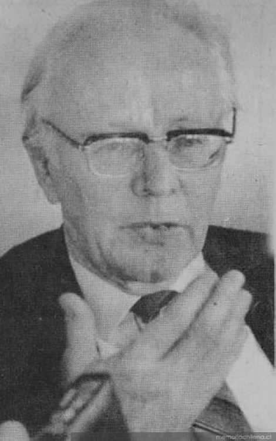

# Ricardo Krebs Wilkens

#### Inicios

Nació el año 1918 en el seno de una familia de inmigrantes alemanes radicados en Valparaíso.

Tras finalizar sus estudios secundarios en el Colegio Alemán de Valparaíso, en 1936, viajó a Alemania para cursar sus estudios universitarios. **Se tituló de Doctor en Filosofía con mención en Historia en la Universidad de Leipzig** en 1941.

#### Trayectoria

A su regreso a Chile, se incorporó como **profesor de Historia Universal, en la recién creada Escuela de Pedagogía de la Universidad Católica**. Más tarde, en 1947, por intermedio de Juan José Millas, llegó a la [Universidad de Chile](http://www.uchile.cl/portal/presentacion/historia/grandes-figuras/premios-nacionales/historia/6647/ricardo-krebs-wilkens). Allí fue profesor extraordinario de Historia Universal y Contemporánea. Más adelante ejerció como profesor titular de Historia Moderna en la Universidad de Colonia, Alemania \(1970\).

Su obra se expresó fundamentalmente en **artículos publicados en revistas especializadas** y abarcó diversos temas de historia europea, en particular la historia de las ideas y del pensamiento filosófico, así como la historia de la Iglesia Católica. Fue activo colaborador en la **elaboración de manuales de enseñanza escolar relativos a historia universal**. Uno de los principales promotores de las corrientes filosóficas e historiográficas europeas en Chile.

Fue miembro de la Academia Chilena de la Historia desde 1955.

En [este enlace](http://www.memoriachilena.gob.cl/602/w3-article-3685.html) un perfil más detallado del historiador

#### Publicaciones

_El pensamiento histórico, político y económico del Conde de Campomanes_ \(1960\)

_**La ciencia económica en Adam Smith**_. \(1977\)

_La monarquía absoluta en Europa: el desarrollo del estado moderno en los siglos XVI, XVII y XVIII_ \(1979\)

_**Catolicismo y laicismo: las bases doctrinarias del conflicto entre la iglesia y el estado en Chile**_ \(1981\) 

_La Iglesia de América Latina en el siglo XIX_ \(2002\)

Con motivo del centenario de la fundación de la Universidad Católica de Chile, Krebs escribe la _**Historia de la Pontificia Universidad Católica de Chile: 1888-1988**_.

#### Premios

En 1982 le fue otorgado el **Premio Nacional de Historia**.

#### En 1992, la Universidad Católica le otorgó el grado de **Doctor Scientiae et Honoris Causa**, por su aporte a la institución.

Ricardo Krebs [falleció a la edad de 93 años](http://www.lasegunda.com/Noticias/CulturaEspectaculos/2011/12/707412/Esta-tarde-fallecio-el-historiador-Ricardo-Krebs-Wilckens), el 23 de diciembre de 2011.

[¿](http://www.memoriachilena.gob.cl/602/w3-article-3685.html)

