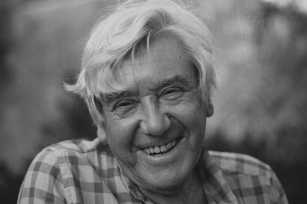

# Roberto Matta Echaurren

#### Inicios

Nació el 11 de noviembre de 1911 en Santiago de Chile. Su familia era de origen vasco-francés. La inusual fecha de su nacimiento \(11.11.11\) la utilizó con frecuencia en su carrera artística.

Estudió en el **Colegio de los Sagrados Corazones de Santiago**, donde destacó por sus dibujos y su caligrafía.

**Asistió a los Talleres Libres de la Escuela de Bellas Artes de la** [Universidad de Chile](http://www.uchile.cl/portal/presentacion/historia/grandes-figuras/premios-nacionales/artes/6614/roberto-matta-echaurren) donde fue alumno del pintor Hernán Gazmuri.

Cursó estudios en la **Escuela de Arquitectura de la Universidad Católica de Chile**. Trabajó como **ilustrador en la revista**_**Topaze**_. Se tituló de arquitecto en 1935.

#### Trayectoria

Tras titularse viajó a Europa en un barco mercante. Vivió en París, Londres y Nueva York, donde conoció de cerca a los más grandes artistas de la época: **Le Courbusier, André Breton**, **Pablo Picasso, Marcel Duchamp, Federico García Lorca, Salvador Dalí**, **Max Ernst**, entre muchos otros.

En Europa pasó a formar parte del movimiento surrealista.

En Nueva York **realizó su primera exposición individual** en 1940.

En 1957 fijó su residencia en Tarquinia, Italia.

Hizo siete viajes a Chile entre 1948 y 1972. En una de ellas pintó **en colaboración con jóvenes de la Brigada Ramona Parra, el mural** _**El primer gol del pueblo chileno**_ **en la piscina municipal de la comuna de La Granja**, en 1971.

**La dictadura le negó la renovación de su pasaporte y le impidió volver**. 

#### Su obra

Entre 1942 y 1944 aparecieron **los primeros personajes en su pintura.** 

Durante las décadas de 1940 y 1950, su pintura reflejó **el perturbador estado de la política internaciona**.

En su etapa en Italia, **su trabajo fue una denuncia** de los poderes que esclavizan al ser humano en la sociedad moderna. 

A fines de la década de los cincuenta, Matta ya era **un artista consagrado** que presentaba sus obras en importantes galerias y museos ****del mundo.

Durante los años **sesenta reapareció la figuración de sus primeras obras**.

En los 70 sus pinturas, **de grandes dimensiones, se alejan de la temática política, para dar paso nuevamente a los temas metafísicos**.

Experimentó también distintas formas de expresión artísticas, incluyendo **producciones de videos, fotografía y otros medios de expresión**.

En este enlace, [las obras de Matta](https://www.museoreinasofia.es/coleccion/autor/matta-echaurren-roberto) que son parte de la colección del Museo Reina Sofía, de España.

En este enlace, un [interesante recorrido por su vida y su trayectoria](https://trianarts.com/roberto-matta-el-ultimo-surrealista/#sthash.VYJrt1dg.dpbs) acompañada de las obras de cada época.

Y aquí, [Matta un siglo D mente](https://www.youtube.com/watch?v=A1y3qK-EzJc), documental que registra una larga conversación entre Matta y Volodia Teitelboim, en la que recorrieron toda su vida, su obra y su pensamiento.

#### Premios

Ha recibido una gran cantidad de premios y reconocimientos. Estos son algunos de ellos:

**Medalla de Oro de las Bellas Artes Españolas** \(1985\).

En 1990, en cuanto se recuperó la democracia, Chile lo galardonó con el **el Premio Nacional de Arte.**

En 1992, se le otorgó el Premio Príncipe de Asturias de las Artes

En 1995 obtuvo el Premium Imperiale de Pintura, Asociación de Arte de Japón

**En 1997 Premio Gabriela Mistral, Orden al Mérito Cultural y Docente del Estado de Chile** 

Vocal del Patronato del Instituto Cervantes, España \(1998\)

Falleció en Civitavecchia el [23 de noviembre de 2002](https://elpais.com/diario/2002/11/25/cultura/1038178801_850215.html). En Chile se decretaron **tres días de duelo nacional**. Fue sepultado en Tarquinia, Italia,  con **altos honores del gobierno italiano**.

