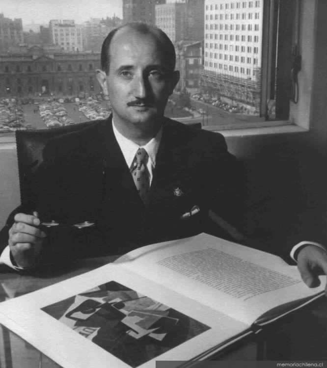

# Roque Esteban Scarpa Straboni

#### Inicios

Nació en Punta Arenas en 1914. Estudió en el colegio San José de los Padres Salesianos y luego en el liceo fiscal de su ciudad natal. En esa institución fundó la revista escolar Germinal y dirigió el grupo literario Revelación.

Fue bachiller a los 15 años. En 1930 se trasladó a Santiago donde **entró a estudiar Química y farmacia**, carrera de la que no egresó. En cambio, **su interés por la enseñanza** lo llevó a estudiar Pedagogía en la Universidad Católica y su amor por las letras, al doctorado de Literatura en la [Universidad de Chile](http://www.uchile.cl/portal/presentacion/historia/grandes-figuras/premios-nacionales/literatura/6654/roque-esteban-scarpa-straboni).

Revisa el perfil del autor en [Memoria Chilena](http://www.memoriachilena.cl/602/w3-article-69884.html)

#### Trayectoria

Fue profesor escolar y universitario por más de 50 años. Participó en la elaboración de textos escolares e hizo un **gran aporte a las bibliotecas públicas**, siendo director de DIBAM.

Destacado **miembro de la Academia Chilena de la Lengua.** Fue **director de la Biblioteca Nacional de Chile** \(1967-1971\) y de la Dirección de Bibliotecas, Archivos y Museos \(DIBAM\) entre 1973 y 1976.

Por largos años ejerció como **crítico literario** en los diarios El Mercurio y La Aurora. En España fue condecorado con La Gran Cruz de Alfonso X, el sabio.

Fue uno de los **más importantes estudiosos de Gabriela Mistral.**

#### Obras

Publicó los libros de poemas

Cancionero de Hammud \(1942\)

Las figuras del tiempo \(1942\)

El árbol deshojado de sonrisas \(1977\)

La ínsula radiante \(1978\)

El laberinto sin muros \(1981\)

Ciencia de aire \(1981\)

Variaciones sobre un antiguo corazón \(1981\)

Madurez de la luz \(1987\)

Aquí un enlace con una breve reseña y [algunos poemas](http://www.poesias.cl/scarpa_poemas.htm) del autor.

#### Premios

Recibió el Premio Atenea y el Premio de la Crítica en 1961.

Recibió el **Premio Nacional de Literatura en 1980.**

Falleció el [11 de enero de 1995](http://www.bibliotecanacionaldigital.gob.cl/bnd/628/w3-article-205569.html).

