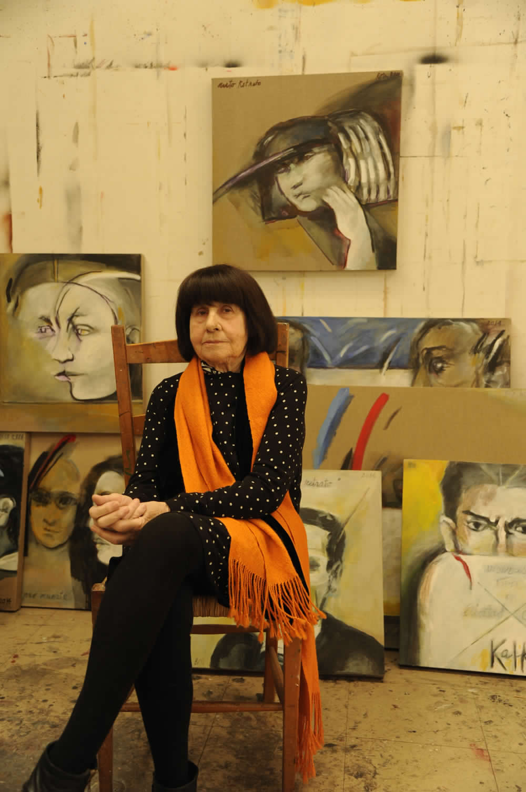

# Roser Bru Llop

Nació en Barcelona, España, el 15 de febrero de 1923. Asistió a la Escuela Montessori y al Instituto Escuela de la Generalitat de su ciudad natal.

#### Inicios

Llegó a Chile en septiembre de 1939, a bordo del **Winipegg**, mítico barco en el que viajó desde Europa junto a otras dos mil doscientas personas. Aún no había terminado el colegio. El mismo año de su llegada entró a la **Escuela de Bellas Artes en Santiago**, donde realizó [estudios libres](http://www.artes.uchile.cl/videos/119150/microdocumental-sobre-la-artista-roser-bru-llop) de acuarela hasta 1942. Fue discípula de **Pablo Burchard e Israel Roa**.

Desde 1964 a 1968, ejerció como **profesora de dibujo y pintura en la Escuela de Arte de la Universidad Católica**, formando parte del equipo de profesores fundadores. También realizó **murales** en distintas técnicas para la **escuela de Talcahuano, la Casa de Arte del Cerro San Cristóbal y el edificio Unctad de Santiago**.

En 1947 pasó a formar parte del **Grupo de Estudiantes Plásticos \(GEP\)** que reunió artistas de la Generación del 50 como José Balmes, Gracia Barrios, Guillermo Núñez, Juan Egenau y Gustavo Poblete, entre otros. En 1957 ingresó al **Taller 99**, creado por Nemesio Antúnez, donde continuó especializándose en técnicas del grabado.

Fue profesora invitada al taller de pintura en la **Escuela de Arte de la Universidad Católica** en 1989.

Otros hitos de su trayectoria se pueden revisar en [este enlace.](https://www.youtube.com/watch?v=fPwmS9CqcCE)

#### Su obra

Su trabajo puede **dividirse en dos etapas**. La primera entre 1960 y 1973 denominada **"Materias",** en la que se aprecian figuras humanas de trazos simples. Una segunda etapa es del 73 en adelante, conocida como **"Desmaterializaciones",** en la que predominan los cuerpos e incorpora nombres, números y hasta fotografías, con las que plasma los hechos políticos del Chile de la dictadura.

Muy conocidas son sus **pinturas de sandías**, símbolo de la mujer, cuerpo y fertilidad. 

Una descripción más detallada de su trabajo se puede apreciar en la [página oficial de la artista](http://roserbru.cl).

#### Premios

Su lugar destacado dentro de la plástica chilena, la ha hecho merecedora de decenas de premios, entre ellos: **Primer Premio de Pintura, Salón Oficial, en Santiago, 1956**; Mención en Grabado, Bienal Interamericana de México en 1960; Premio Club de la Estampa, Buenos Aires, Argentina, 1968; Premio de Honor en el Primer Salón Nacional de Gráfica de la Universidad Católica de Chile realizada en el Museo Nacional de Bellas Artes en Santiago, Chile, 1978. Fue **condecorada por el Rey Juan Carlos I de España con la Encomienda de la Orden de Isabel La Católica**, España en 1995; Recibió el Premio **Altazor de las Artes Visuales**, en 1999; El mismo premio en Pintura por Homenaje a Goya, Chile el 2000; Premio Medalla al **Orden del Mérito Artístico y Cultural Pablo Neruda,** Chile, 2004; Medalla de Oro al Mérito de las Bellas Artes, España, 2018.

En 2015 recibe el **Premio Nacional de Artes Plásticas** por su propuesta estética, la solidez de su obra, su consecuencia como artista y su capacidad de incursionar en otras expresiones plásticas.

