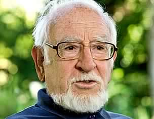

# Sergio Villalobos Rivera

Nació en Angol el 19 de abril de 1930.

#### Vida académica

Empezó su vida académica a los veinte años, cuando entró a estudiar al **Instituto Pedagógico de la Universidad de Chile**. Al año siguiente ya era ayudante de la cátedra de Historia de Chile.

Obtuvo el título de **profesor de Estado en las asignaturas de Historia, Geografía y Educación Cívica**, en 1956. Siguió ligado a la **Universidad de Chile como docente de la Escuela de Periodismo, en la sede Valparaíso** de esa casa de estudios.

En 1968 asumió como **profesor titular de la cátedra de Historia de Chile**, impartiendo hasta hoy esa cátedra en el Departamento de Ciencias Históricas de la Universidad de Chile.

Simultáneamente, en 1970, se integró al **Instituto de Historia de la Pontificia Universidad Católica de Chile, donde permaneció hasta el 2003**, año en que fue distinguido como Profesor Emérito. En la actualidad es también académico titular de la Universidad Andrés Bello.

Realizó estudios en la **Universidad de Cambridge, donde obtuvo el grado de Master in Arts en 1971**. Fue profesor e investigador en el **Instituto Panamericano de Geografía e Historia y en las universidades de California**, Los Angeles \(UCLA\) y Londres.

#### Labor pública

En el ámbito público, destaca su rol como **director de Bibliotecas, Archivos y Museos**, y la **dirección de la Biblioteca Nacional** entre 1990 y 1992. Desde dicho cargo reimpulsó la revista _Mapocho_ y el Centro de Investigaciones Barros Arana, centro neurálgico para nuevas generaciones de historiadores.

#### Bibliografía

Su producción bibliográfica destaca por la vastedad de su obra y la calidad de la misma. Desde su primera publicación _Medina y sus obras \(1852-1830\)_, hasta el recientemente publicado tomo _I**V de La Historia de los Chilenos**_**, Villalobos ha producido cuarenta libros y un centenar de artículos**. Entre ellos: _Chile y su historia_, _El comercio y la crisis colonial_, _**Para una meditación de la conquista**_.

Es también un gran polemista. Ha sostenido álgidas discusiones intelectuales con reconocidos historiadores. Memorable fue **su disputa con Hernán Ramírez Necochea** tras la publicación de _El comercio y la crisis colonial: un mito de la Independencia_, en 1968. Lo mismo **con Mario Góngora a partir de su** _**Ensayo histórico sobre la noción de Estado en Chile en los siglos XIX y XX**_. La más reciente polémica fue con José Miguel Barros sobre diversos aspectos de la Guerra del Pacífico.

En su obra describe la **historia económica de Chile**. Describe también una **sociedad chilena monárquica** y reacia a los cambios políticos. En su libro _Una falsificación histórica_ desarrolla **un perfil de Diego Portales que se aleja del cánon y lo muestra más humano y falible**. En _Vida fronteriza en la Araucanía: el mito de la Guerra de Arauco_ y _Los pehuenches_ _en la vida fronteriza_, **propone una postura crítica en torno a la etapa previa de la Pacificación de la Araucanía** y las creencias ligadas al conflicto permanente en la zona. En su más reciente _La historia que nos une y nos separa 1535-1883_ \(2000\), plantea su punto de vista en torno a la historia de Perú y sus relaciones con Chile. El libro generó un intenso debate en círculos historiográficos peruanos.

Villalobos se ha transformando **un referente de la historiografía chilena contemporánea**. Su vasta trayectoria fue reconocida en 1992 al obtener el Premio Nacional de Historia.

#### Fuentes

[Memoria Chilena](http://www.memoriachilena.gob.cl/602/w3-article-803.html)

[Universidad Católica](https://www.uc.cl/es/la-universidad/premios-nacionales/7409-sergio-villalobos-rivera-1930-)

[Universidad de Chile](http://www.uchile.cl/portal/presentacion/historia/grandes-figuras/premios-nacionales/historia/6608/sergio-villalobos-rivera)

