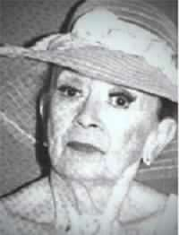

# Silvia Piñeiro Rodríguez

#### Inicios

Nació en Santiago el 27 de junio de 1922 en Santiago.

Se formó como actriz en la **Escuela de Teatro de la Universidad Católica**.

En este enlace puedes revisar el [perfil de la actriz](http://www.memoriachilena.gob.cl/602/w3-article-91995.html) en Memoria Chilena.

#### Trayectoria

Su **carrera profesional comenzó en 1950** con la participación en numerosas obras, entre ellas, _Ángeles en desgracia_, _El hombre que vino a cenar_, _El aniversario_ y _Aprobado en castidad_.

Rápidamente conoció el éxito con obras que fueron éxito de taquilla como

_Entre gallos y medianoche_ \(1957\)

_**¡Esta señorita Trini!**_ ****\(1958\)

_Deja que los perros ladren_ \(1959\)

_**La pérgola de las flores**_ **\(1960\)**. Su interpretación de **la aristócrata Laurita Larraín quedó para siempre en la memoria colectiva** y quedó como referente ineludible para las actrices que han asumido este rol en los distintos montajes del clásico de Isidora Aguirre y Francisco Flores del Campo.

En el teatro una de sus interpretaciones más celebres y valoradas por ella misma fue _**Sara Bernhardt**_**, junto a Ramón Núñez**, también con el Teatro de la Universidad Católica. Entre sus últimas incursiones teatrales figuran _**Al que le toca le toca**_**, bajo la dirección de Tomás Vidiella**; _Los chicos de la fiesta;_ Después del postre y _El protagonista_.

En televisión Silvia Piñeiro marcó época en programas como

_**Los Moller**_

_**En su casa**_

_**Juani en Sociedad**_**, serie que protagonizó durante siete años junto a Emilio Gaete**, Nelly Meruane y Sonia Viveros. Junto a ellos creó en los 60 su propia compañía y junto a Emilio Gaete formó una de las parejas más conocidas en el escenario, con obras como _Cien mujeres y un playboy_ y _Adán y Eva en La mayo_r.

Su último rol en televisión fue en la **producción de TVN,** _**Estúpido Cupido**_ como la solterona perteneciente al "Comité de la Moral y de las Buenas Costumbres". Su figura quedó grabada en el celuloide nacional con películas como _**Nunca en Domingo**_**,** _**Sonrisas de Chile**_ **y** _**El cuerpo y la sangre**_.

En este enlace, el clásico programa [_Inolvidables_ de Raúl Matas](https://www.youtube.com/watch?v=ZDq4-9e0g2Q), dedicado a Silvia Piñeiro.

#### Premios

Fue reconocida en 1977 con el **Premio Onda a la mejor actriz iberoamericana** y en 1994 con el **Premio APES a la trayectoria**.

**Premio Nacional de Arte 1988**, fue una de las mujeres de mayor entrega y trayectoria en las tablas nacionales.

[Murió en Santiago](http://lanacion.cl/2003/05/15/tras-larga-agonia-murio-silvia-pineiro/) el 15 de mayo de 2003.

