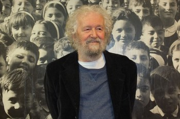

# Tomás Moulian Emparanza

Nació en Santiago en septiembre de 1939.

Tiene una trayectoria de más de **cuarenta años en la investigación**. Sus temas son la sociedad, la política, la dictadura, la transición, el cambio cultural, la globalización, el consumo, los partidos políticos.

#### Inicios

Antes de terminar el colegio, se fue a vivir a la población Santa Julia y al poco tiempo se fue a trabajar a la Biblioteca de la Revista Mensaje. De ahí pasó a ser parte de la primera camada de estudiantes del **Instituto de Sociología de la Universidad Católica entre 1959 y 1963**. Luego fue profesor en la misma institución. Fue becado por la **Universidad Católica de Lovaina, Bélgica**, de donde se licenció en Ciencias sociales del Trabajo.

#### Trayectoria

Formó parte del **Centro de Estudios de la realidad Nacional \(CEREN\)**, que también integraron académicos como Manuel Garretón, Norberto Lechner y Franz Hinkelammert.

Fue director de la **Escuela de Sociología de la Universidad ARCIS** y vicerrector en esta misma casa de estudios.

A principios de los 90 fue **subdirector de** [FLACSO Chile](http://www.flacsochile.org/personajes/tomas-moulian/), además de participar en las sede de FLACSO Ecuador y Brasil.

Formó parte de la **Juventud Demócrata Cristiana durante los 60**. Durante el gobierno de la Unidad Popular fue activo **militante del MAPU Obrero Campesino**. Tras el retorno de la democracia se identificó como **independiente cercano al Partido Comunista**. Fue el propio PC el que lo invitó a ser **precandidato presidencial en la elección de 2005**, donde finalmente cedió su opción al humanista Tomás Hirsch.

Hoy es **militante de Revolución Democrática.**

#### Publicaciones

Autor y coautor de más de [una veintena de libros](https://lom.cl/v/213192b0-7ba0-4a35-acf6-e7555ff0f682/Tom%C3%A1s-Mouli%C3%A1n-es-uno-de-los-intelectuales-m%C3%A1s-influyentes-en-el-Chile-contempor%C3%A1neo-y-en-Am%C3%A9rica-Latina.aspx) y artículos publicados en Chile y el extranjero.

Algunos de los sus títulos más destacados son _**El consumo me consume**_ **\(1999\)**, _En la brecha. Derechos Humanos, Críticas y Alternativas_ \(2002\), _Fracturas: de Pedro Aguirre Cerda a Salvador Allende \(1938-1973\), **El deseo de otro Chile**_ **\(2011\)**, _Contradicciones del desarrollo político chileno \(1920-1980\)_, 2009, _Socialismo del Siglo XXI: la quinta vía , **C**_**onversación interrumpida con Allende** \(1998\), En la brecha: derechos humanos, Críticas y alternativas \(2002\)

Pero no hay duda de que el punto de inflexión en su bibliografía fue _**Chile Actual. Anatomía de un mito**_**, publicado en 1997** y en el que abordó la transición chilena, influyendo de manera decisiva en la forma de mirar la historia reciente del país. **El libro fue un super ventas**, llegando hasta hoy a un público no habituado a ese tipo de publicaciones.

Revisa [aquí una clase magistral ](https://www.youtube.com/watch?v=ssq0ODqwu1Q)que ofreció Moulián, al cumplirse veinte años de la publicación de ese libro.

#### Premios

Ha recibido los premios **Municipal de Santiago en Literatura**, en el género ensayo, Premio Iberoamericano del **Latin American Studies Association, LASA**, de Chicago y el **Premio del Consejo Nacional del Libro y la Lectura.**

Obtuvo el **Premio Nacional de Humanidades y Ciencias Sociales en 2015**, en atención a la [configuración sistemática y rigurosa de su obra](https://www.conicyt.cl/blog/2015/09/01/sociologo-tomas-moulian-obtiene-premio-nacional-de-humanidades-y-ciencias-sociales-2015/) y el impacto que ella ha tenido en el desarrollo del pensamiento social y político chileno.

