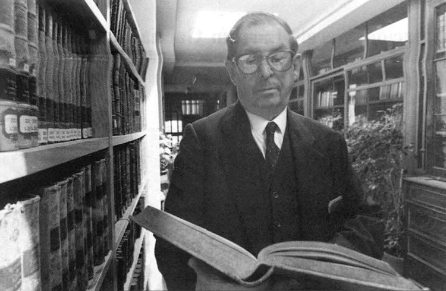

# Walter Hanisch Espíndola

Nació en 1916. Hijo del matrimonio entre Otto von Hanisch Ludwig y Lía Espíndola Molina.

Era muy niño cuando empezó a sentir inclinación por la religión y la vida sacerdotal.

#### Estudios y vida religiosa

Estudió Humanidades en el **Seminario de los Ángeles Custodios de la Arquidiócesis de Santiago**. En 1934 entró a la recientemente creada **Facultad de Teología de la Pontificia Universidad Católica de Chile**. Egresó en 1938 con el grado de Bachiller en Teología.

Terminados sus estudios **se integró a la Compañía de Jesús**, donde desarrolló una intensa labor pedagógica e historiográfica.

Doctorado en Teología por la Universidad Católica, fue también **fundador del Instituto de Historia de la UC**, donde realizó su actividad docente. Fue también investigador de historia en la Biblioteca del Vaticano y en la Universidad de Salamanca en España.

#### Investigaciones

Sus primeras obras fueron publicadas en la década del 60. Entre las más renombradas se cuentan, las **dedicadas a la historia de las ideas durante el período colonial y el siglo XIX**.

Por encargo de la Compañía de Jesús, en 1965 partió a recorrer España e Italia. Hasta fines de esa década dedicó sus esfuerzos a **investigar el destino de los jesuitas allí exiliados, tras ser expulsados de los dominios españoles en 1767.**

En 1970 regresó a Europa, para continuar con su labor de investigación revisando archivos en Roma, Madrid, Salamanca, Valladolid y Santiago de Compostela. Son destacables sus **investigaciones en la Biblioteca Vaticana, donde encontró valiosos documentos sobre la historia eclesiástica chilena.**

Sus investigaciones se orientaron preferentemente a la **historia de la Compañía de Jesús en Chile**. Entre esas obras destacan _Itinerario y pensamiento de los jesuitas expulsos de Chile: 1767-1815_ \(1972\), e _Historia de la Compañía de Jesús en Chile \(1593-1955\)_ \(1974\).

En total suman decenas de artículos y libros sobre cronistas y sabios jesuitas del período colonial, como Alonso de Ovalle, Juan Ignacio Molina y Manuel Lacunza.

**Premio Nacional de Historia de 1996**, sus estudios están dedicados a la historia religiosa y de las ideas filosóficas en el país.

Otros temas investigados por Walter Hanisch fueron la **historia de los viajes que realizaron los misioneros jesuitas y franciscanos en Chiloé** durante los siglos XVII y XVIII, así como la historia de la cocina colonial.

Murió el 13 de octubre de 2001.

#### Fuentes

[Memoria Chilena](http://www.memoriachilena.gob.cl/602/w3-article-7687.html)

[Universidad Católica](https://www.uc.cl/es/la-universidad/premios-nacionales/7439-walter-hanisch-espindola-1916-2001-)

