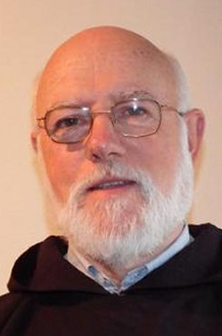

# Gran Canciller

### Monseñor Celestino Aós Braco

#### Gran Canciller

#### Su carrera:

**Ordenado en 1968 sacerdote** de ****la Orden de los Frailes Menores Capuchinos en su tierra natal, España, **en 1983 fue destinado a la Provincia de Chile** como vicario parroquial en la parroquia de Longaví \(diócesis de Linares\), confiada a los Padres Capuchinos.

Ha sido tesorero de la Asociación Chilena de Derecho canónico; promotor de justicia en el Tribunal Eclesiástico de Valparaíso, y psicólogo y juez en el Tribunal Eclesiástico Interdiocesano de Concepción. Miembro de tribunales especiales para estudiar procesos históricos en causas para beatificación y canonización, le correspondió estudiar el milagro para la canonización del sacerdote Alberto Hurtado.

**En 2014 el Papa Francisco lo nombró obispo de la diócesis de Copiapó y el 23 de marzo de 2019 el Santo Padre lo nombró Administrador Apostólico** de la arquidiócesis de Santiago y desde entonces es el Pro Gran Canciller de la Universidad Católica. 

[Más información sobre Mons. Celestino Aós en el sitio de la Iglesia de Chile.](http://iglesia.cl/diocesis_detalle.php?diocesis=12)

#### Sus tareas:

Tiene la **alta tuición de la Universidad**. Es el **vínculo directo e inmediato** con las autoridades jerárquicas de la Iglesia, en especial **con la Santa Sede**. Le corresponde especialmente:

* Velar por la **ortodoxia católica** en la actividad de la Universidad.
* Dirigir las **actividades pastorales** de la Universidad.
* Ser el **canal de información y comunicación** de la Universidad con la Santa Sede y las demás **autoridades jerárquicas de la Iglesia Católica**.
* **Informar a la Santa Sede** de los asuntos de especial relieve que ocurran en la Universidad o que la afecten; **y asimismo a la Conferencia Episcopal**, especialmente en materias de relevancia nacional.
* Presentar a la Santa Sede las **peticiones de la Facultad de Teología** para los candidatos a la docencia en dicha facultad.
* **Nombrar** **al prorrector, al secretario general, vicerrectores,** directores de los centros teológicos y docentes que enseñen teología.
* Velar por el cumplimiento de los **requisitos exigidos para aquellos candidatos a decano**.
* Adoptar las medidas necesarias para **mantener el gobierno de la Universidad.**
* **Resolver** eventuales **conflictos entre el rector y el Consejo Superior.**
* **Suscribir los diplomas** que atestiguan la calidad de profesor Titular, la obtención de los grados académicos de Doctor y Licenciado en Teología; asimismo los diplomas y decretos que confieren los grados honoríficos de Doctor Scientiae et Honoris Causa y de Doctor Honoris Causa.
* Asistir con **derecho a voz a las sesiones de cualquier organismo colegiado de la Universidad**, donde tendrá la presidencia honoraria.
* Aprobar **modificaciones a los Estatutos** **Generales** de la Universidad y de la Facultad de Teología.
* Aprobar los **cursos de formación cristiana** dictados en la Universidad.

El Arzobispo de Santiago es por derecho propio Gran Canciller de la Universidad. Sin embargo, **en caso de vacancia, las funciones de la Gran Cancillería las ejerce el prelado que administre la arquidiócesis**. Lo hará con el cargo de Pro Gran Canciller.

### Su equipo

#### Vice Gran Canciller

Presbítero Tomás Scherz

#### Dirección de Pastoral

Francisco Elorrieta

### Footer

