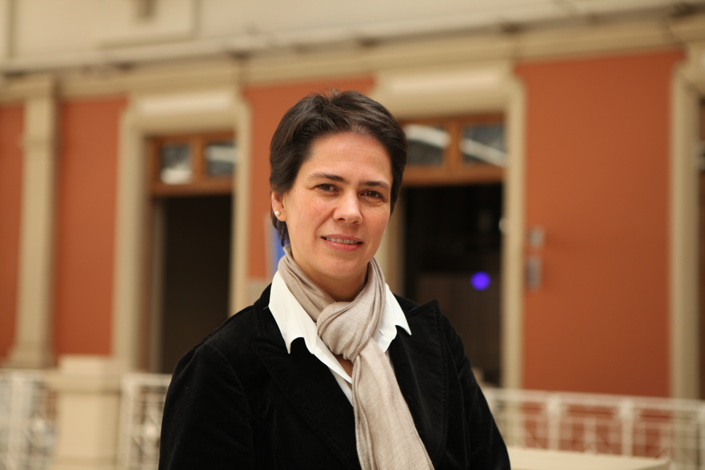

# Prorrector de Gestión Institucional

### Patricio Donoso Ibáñez

#### Prorrector de Gestión Institucional

#### Su carrera

Patricio Donoso Ibáñez es **ingeniero civil de la Pontificia Universidad Católica de Chile y Master of Science en Ingeniería del Massachusetts Institute of Technology \(MIT\).**

Antes de ser prorrector de Gestión Institucional, fue vicerrector Económico y de Gestión de la UC, entre los años 2010 y 2015.

**Es profesor titular de la Facultad de Economía y Administración** de la Universidad, y se desempeñó además como director del Centro de Desarrollo Directivo y del Programa Avanzado de Alta Dirección, realizado conjuntamente con el Kellogg Business School de EE.UU.

Con anterioridad fue profesor y subdirector de la Facultad de Ingeniería de la UC. Estuvo a cargo del Proyecto Centenario de la Universidad, y de la creación de su Centro de Extensión, del cual fue director ejecutivo por varios años.

Ha realizado investigaciones en temas de estrategia y administración de empresas, que han sido publicadas en diversas revistas académicas internacionales. El año 2008 se editó su libro “Organizaciones para la Gestión Tecnológica: Buenas prácticas internacionales” \(Fundación Copec-Universidad Católica\).

**Ha sido consultor en temas de estrategia y gestión de importantes de empresas nacionales**, como: AFP Habitat, Aguas Andinas, Anglo American, Codelco, CTI, Embotelladora Andina, Entel, FASA, Grupo Arauco, LAN, Metro, Movistar, SQM, Sopraval, Unilever, etc. Ha asesorado instituciones como: Corporación de Administración del Poder Judicial, Tesorería General de la República, Carabineros, SEP \(Sistema de Empresas Públicas\), DGAC, etc. También ha prestado apoyo a organizaciones sin fines de lucro.

**En la actualidad es presidente del directorio de la Fundación Duoc UC, y es miembro de los directorios de Dictuc S.A:, Red de Salud UC Christus; y Christus Health Corporation**.

#### Sus tareas

El prorrector de Gestión Institucional es la **autoridad encargada de la vinculación de las organizaciones relacionadas con la Universidad**, además de tener funciones particulares en la **gestión y desarrollo institucional**. Junto con el prorrector y la vicerrectora económica debe velar por el avance y cumplimiento del plan de desarrollo.

Para revisar el detalle de las funciones del prorrector de Gestión Institucional puedes revisar el [Reglamento de los Organismos de la Rectoría](http://secretariageneral.uc.cl/documento/normas-generales/101-reglamento-de-los-organismos-de-rectoria/file).

### Su equipo

#### Directora Ejecutiva

Paulina Dreyer

#### Directora de Asuntos Jurídicos

Cristina Fernández

#### Director de Desarrollo Patrimonial

Hans Muhr

#### Directora de Proyectos y Filantropía

Mónica Arellano

#### Directora UC online

Luz Montero

#### Director de English UC

Christopher MacGuire

### Footer

