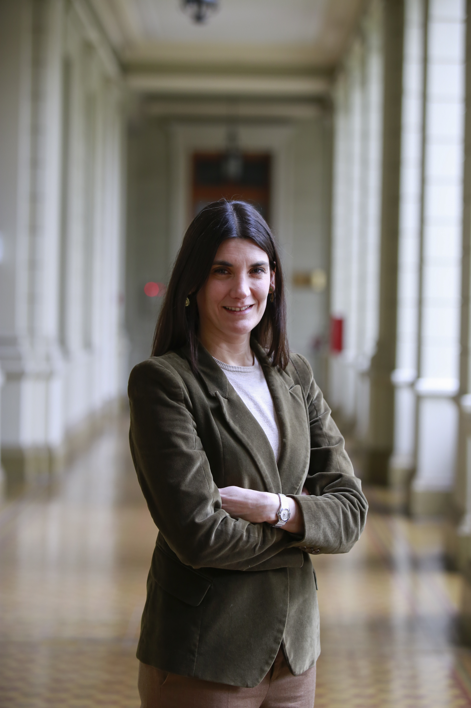
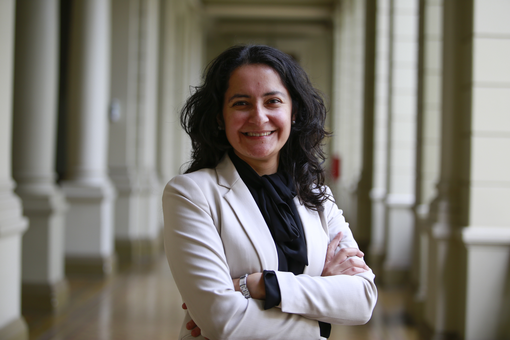
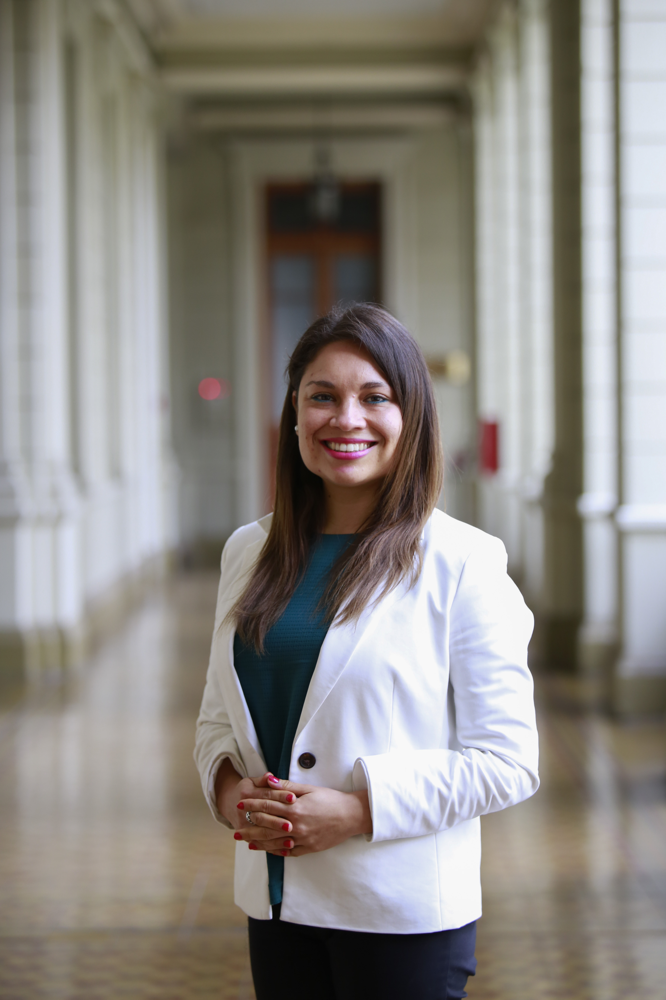
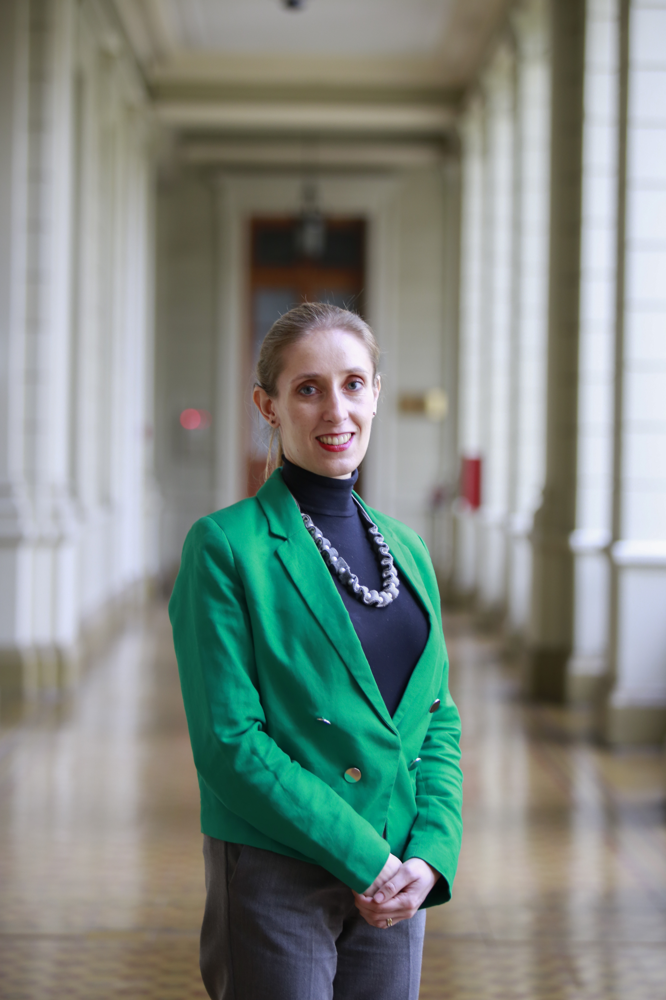

# Secretaria General

## Secretaria General

Imagen: [https://drive.google.com/open?id=13pVzwH\_7BGwQdTz2MzfkcnQSbVKVDCFS](https://drive.google.com/open?id=13pVzwH_7BGwQdTz2MzfkcnQSbVKVDCFS)

#### Su carrera

**Marisol Peña Torres es abogada y profesora del Departamento de Derecho Público y desde 2018 se incorporó como Miembro de Número de la Academia Chilena de Ciencias Sociales Políticas y Morales del Instituto de Chile**.

Desde el año 1982, la profesora Peña imparte las cátedras de Derecho Político y Constitucional, y fue una de las gestoras del programa de Magíster en Derecho Constitucional UC. Ha sido distinguida con los premios "Excelencia Docente" y "Reconocimiento a la Excelencia Docente", y ha dirigido el departamento de Derecho Público UC.

En el ámbito profesional, se ha desempeñado como abogada de la División de Municipalidades de la Contraloría General de la República y asesora jurídica de los ministerios Secretaría General de Gobierno y Secretaría General de la Presidencia.

**En enero de 2006 fue designada abogada integrante del Tribunal Constitucional y, en mayo del mismo año, ministra del Tribunal Constitucional por la Excma. Corte Suprema**.

En 2018, la profesora Marisol Peña se incorporó como Miembro de Número de la Academia Chilena de Ciencias Sociales Políticas y Morales del Instituto de Chile.

#### Sus tareas

El secretario o secretaria general es la autoridad que **tiene la función de ser ministro o ministra de fe de la Universidad, autorizar los actos administrativos y certificar los hechos de la vida universitaria**. Algunas de sus funciones específicas son:

* Propone e interpreta la normativa interna y vela por su eficaz cumplimiento.
* Realiza las citaciones, mantiene el registro de las sesiones y certifica los acuerdos del Honorable Consejo Superior y del Foro Universitario.
* Preside las comisiones de Títulos y Grados, Apelación y Centros UC.
* Autoriza el uso de espacio físico al interior de la Universidad.
* Inicia los procesos de responsabilidad académica y disciplinaria de los miembros de la comunidad.

Para conocer más detalles sobre su función puedes revisar el [documento de Estatutos Generales de la Universidad.](http://secretariageneral.uc.cl/documento/normas-generales/111-estatutos-generales/file)

### Su equipo

#### Pro secretaria general

Marisol Urrutia

#### Abogada

Ignacia Zalaquett 

#### Abogada

Estefanía Vergara

#### Abogada

María Graciela Donoso

#### Abogada

María José Wilson

#### Abogada

Catalina Salem

#### Abogada

María Teresa Bravo

#### Abogada

Darinka Barrueto

### Footer

### 

