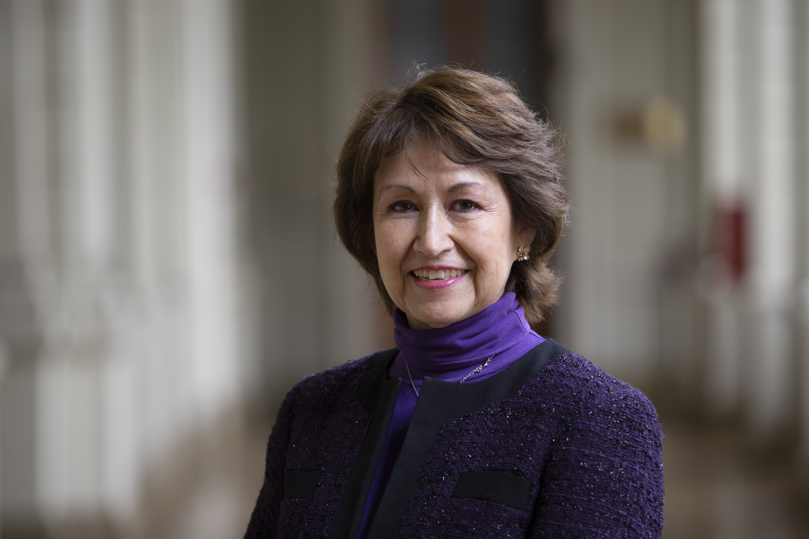

# Secretaria General

## Secretaria General

La Secretaria General es la autoridad que tiene la función de ser Ministro de Fe de la Universidad, autorizar los actos administrativos y certificar los hechos de la vida universitaria. Además, cumple con las siguientes funciones:

* Propone e interpreta la normativa interna y velar por su eficaz cumplimiento.
* Realiza las citaciones, mantiene el registro de las sesiones y certifica los acuerdos del Honorable Consejo Superior.
* Realiza las citaciones y mantiene los registros de sesiones del Foro Universitario UC.
* Preside las comisiones de Títulos y Grados, Apelación y Centros UC.
* Autoriza el uso de espacio físico al interior de la Universidad.
* Inicia los procesos de responsabilidad académica y disciplinaria de los miembros de la comunidad.

La Secretaria General es la abogada Marisol Peña.

[Revisa su currículum.](http://derecho.uc.cl/es/profesores/nomina-por-departamento/departamento-de-derecho-publico/635-pena-torres-marisol)

### Su equipo

#### Pro Secretaria General

Marisol Urrutia

#### Abogada

Ignacia Zalaquett 

#### Abogada

Estefanía Vergara

#### Abogada

María Graciela Donoso

#### Abogada

María José Wilson

#### Abogada

Catalina Salem

#### Abogada

María Teresa Bravo

#### Abogada

Darinka Barrueto

### Footer

### 

