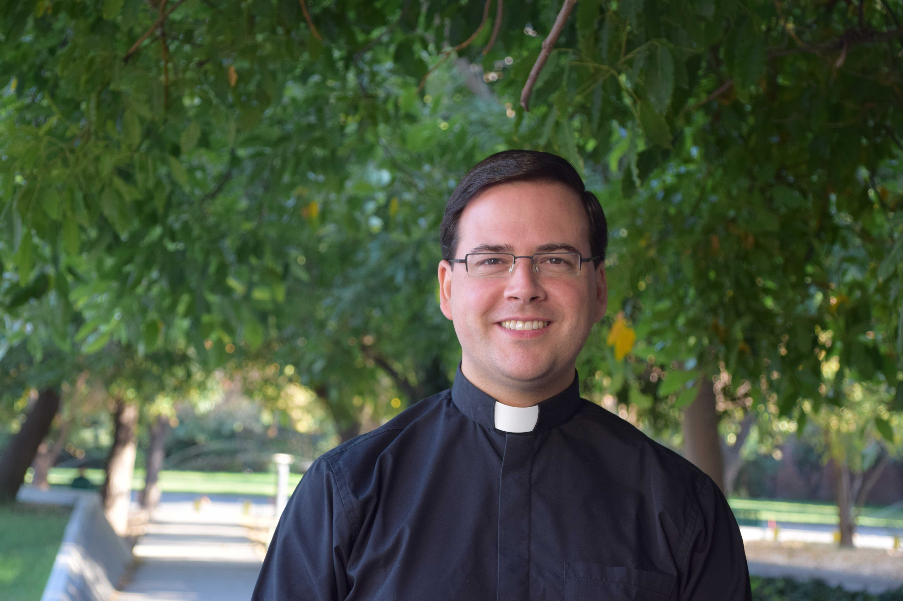

# Vice Gran Canciller

## Vice Gran Canciller

El Vice Gran Canciller es el representante del Gran Canciller en la Universidad. Cuando el Gran Canciller delega sus labores pastorales en él, presidirá y dirigirá la Dirección de Pastoral. Para orientar e inspirar la pastoral universitaria y las iniciativas que se emprendan para la evangelización de la cultura, contará con el apoyo del director de Pastoral.

El Vice Gran Canciller es el presbítero Tomás Scherz.

Revisa su currículum \(no hay\)

### Su equipo

#### Capellán General de la Universidad

Padre Guillermo Greene

#### Director de la Pastoral

Francisco Elorrieta

### Footer

