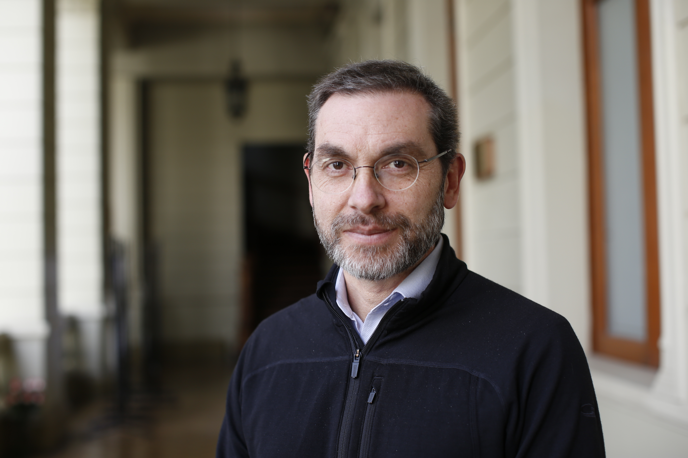
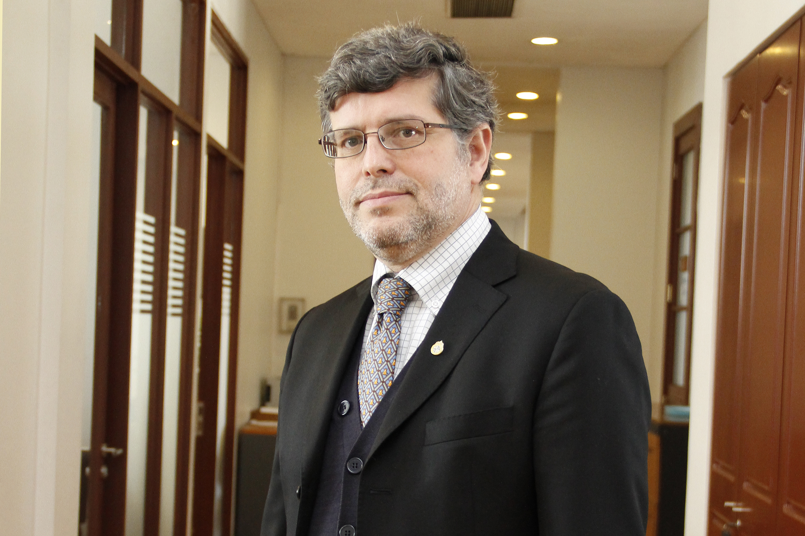
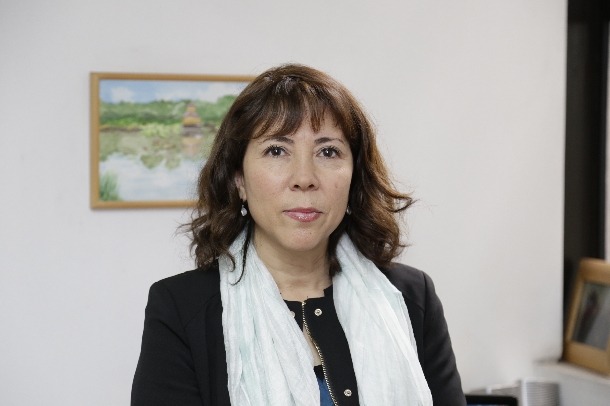
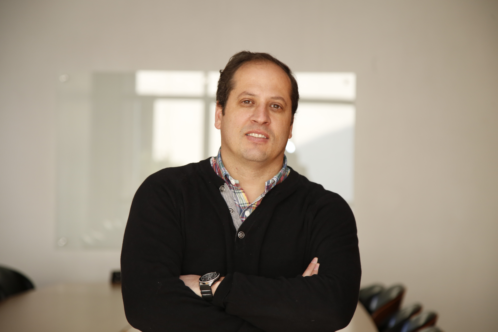

# Vicerrector Académico

## Vicerrector Académico

El vicerrector académico es la autoridad encargada de elaborar y ejecutar la política académica de la Universidad. Entre algunas de sus funciones se encuentran:

* Propone las políticas académicas de docencia universitaria de pregrado, magíster, postítulos, especialidades médicas, y doctorado.
* Propone las políticas sobre la planta de académicos, su carrera y perfeccionamiento.
* Propone y coordina acciones y proyectados relacionados con el desarrollo académico de la Universidad.
* Preside la Comisión Técnica de Admisión.
* Propone las políticas de admisión estudiantil universitaria, y las políticas académicas de inclusión.
* Aprueba convenios de la Universidad con otras instituciones.

El actual vicerrector académico es el biólogo Juan Larraín

[Revisa su currículum.](http://biologia.uc.cl/es/cuerpo-academico/profesor/41)

### Su equipo

#### Directora ejecutiva VRA

María José Salinas

#### Director Académico de Docencia

Gonzalo Pizarro

#### Director de Admisión y Financiamiento estudiantil

Juan Echeverría

#### Director Centro de Desarrollo Docente

#### Directora de Desarrollo Académico

Silvana Zanlungo

#### Directora de Inclusión

Catalina García

#### Director Programa de Estudios Generales College UC

Fernando Purcell

#### Directora de Sistemas y Registros Académicos

Paulina Rodríguez

### Footer

