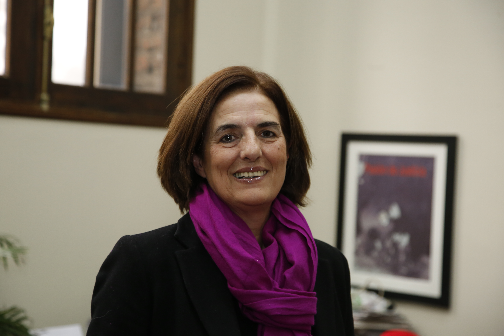
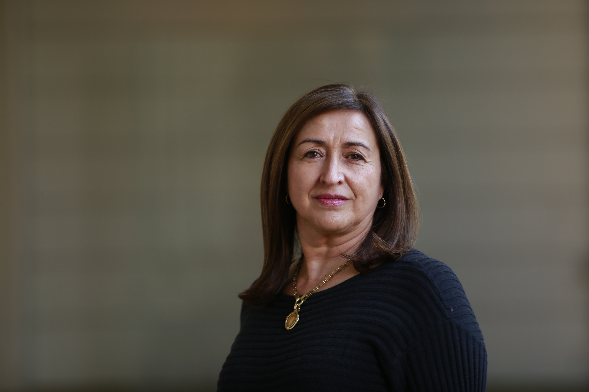
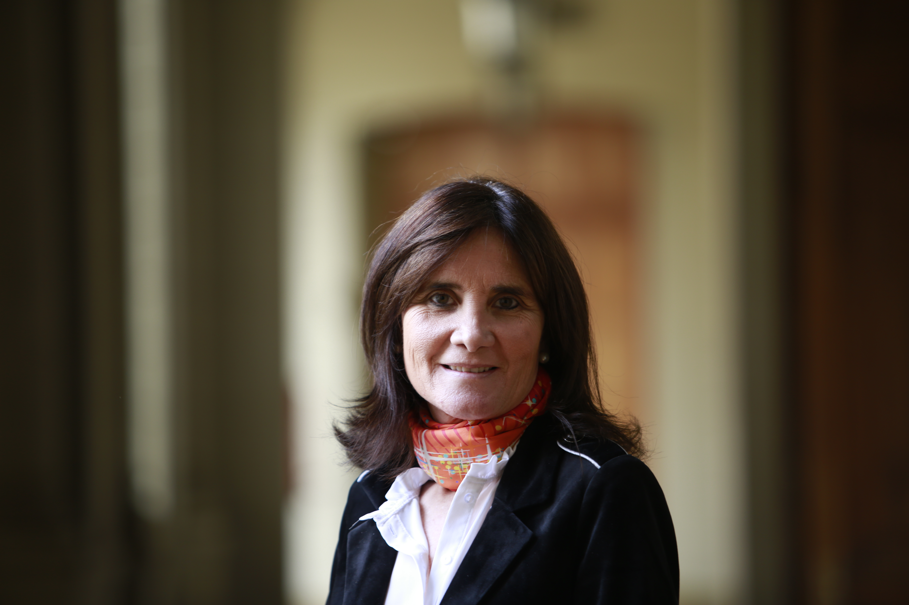
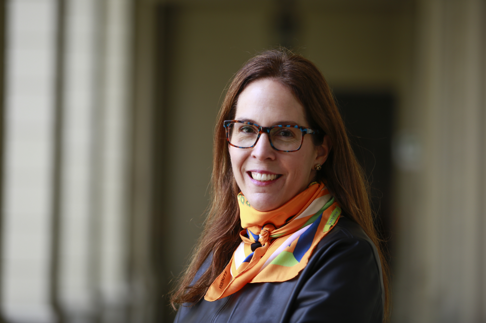
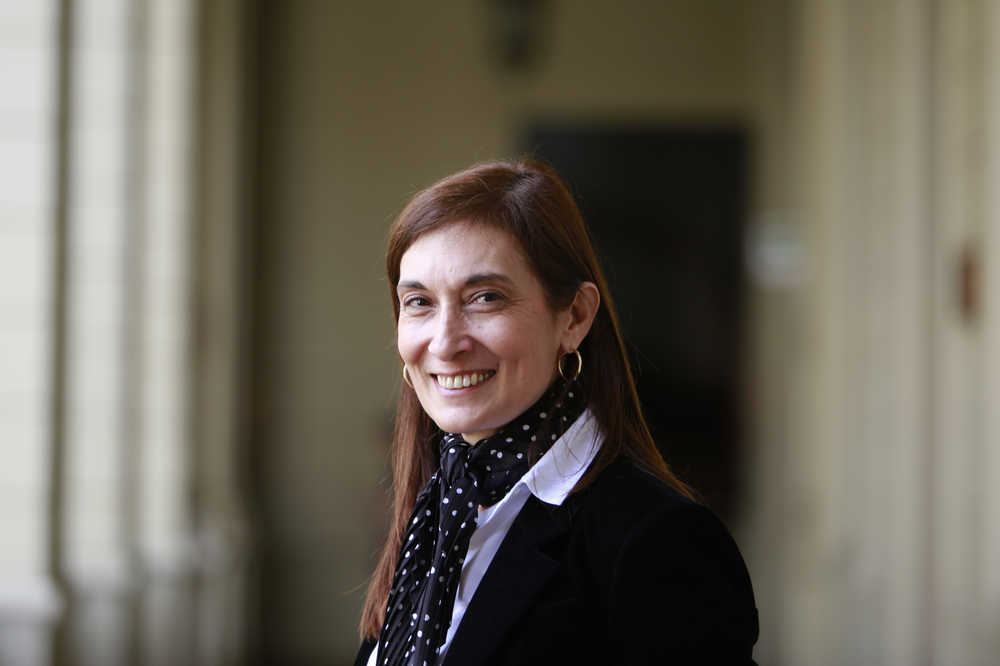
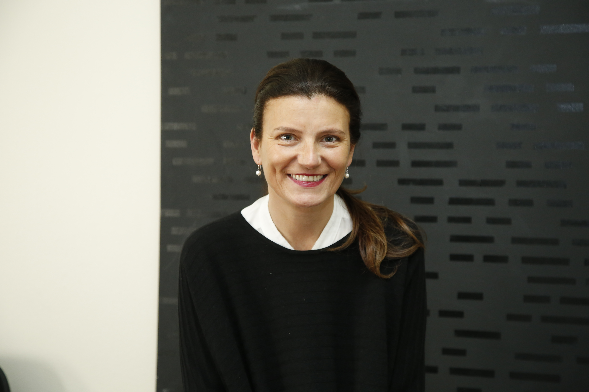

# Vicerrectora de Comunicaciones

## Vicerrectora de Comunicaciones

La vicerrectora de Comunicaciones es la autoridad encargada de elaborar y ejecutar la política de comunicaciones, extensión, educación continua, editorial, marketing y de la vinculación con los exalumnos de la Universidad. Además, cumple las siguientes funciones:

* Diseña, organiza y coordina las políticas y actividades de comunicación y marketing.
* Comunica a la comunidad las actividades e investigaciones que desarrollan las facultades.
* Presenta las actividades relacionadas con proyectos y programas de interés público que realizan las unidades.
* Promueve y coordina las actividades de extensión de la Universidad.
* Diseña y desarrolla las políticas y planes de educación a distancia.
* Mantiene la certificación del Sistema de Gestión de calidad que regula la educación continua en la Universidad. 
* Dirige las actividades editoriales de la Universidad.
* Diseña, organiza y coordina las políticas y actividades de vinculación con sus egresados.

La actual vicerrectora de comunicaciones es la periodista María Paulina Gómez.

[Revisa su currículum.](http://comunicaciones.uc.cl/personas/paulina-gomez-lorenzini/)

### Su equipo

#### Directora ejecutiva VRC

Rosa Íñiguez

#### Directora ejecutiva de desarrollo

Camila Rendic

#### Directora de Alumni

Rosa Íñiguez

#### Directora de Comunicaciones

María Verónica Guarda

#### Directora de Diseño Corporativo

María Soledad Hola

#### Directora de Ediciones UC

María Angélica Zegers

#### Directora de Extensión Cultural

Daniela Rosenfeld

#### Directora de Educación Continua

