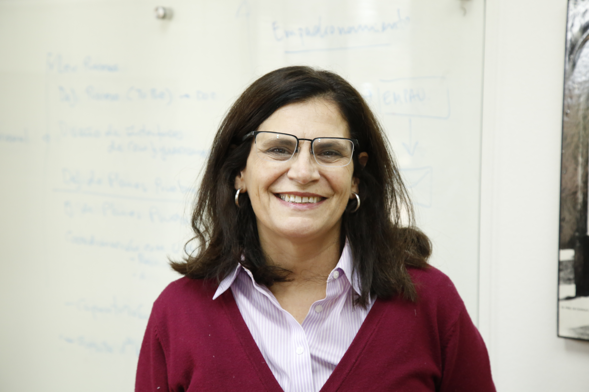

# Vicerrectora de Comunicaciones

### María Paulina Gómez Lorenzini

#### Vicerrectora de Comunicaciones

#### Su carrera

**María Paulina Gómez Lorenzini es periodista y licenciada en Información Social de la UC y Doctora en Ciencias de la Información por la Universidad Complutense de Madrid.**

**Profesora Asociada de la Facultad de Comunicaciones hasta la fecha.**

Comenzó a trabajar en el Centro de Extensión UC en 1990, donde desarrolló el Diplomado en Comunicación Corporativa, el primero de su tipo en el país. Luego, trabajó en la Facultad de Comunicaciones, donde fue subdirectora de Extensión, representante de los académicos ante el Consejo de la Facultad, directora del Departamento de Comunicación Aplicada y de la salida profesional de Publicidad. 

Sus áreas de estudio son la comunicación estratégica, la publicidad y la semiótica. 

Dictó el curso Semiología, en el plan común de pregrado en la Facultad de Comunicaciones; y en postgrado realizó los cursos Análisis del discurso y Gestión de Stakeholders. 

#### Sus tareas

**Es la autoridad encargada de elaborar y ejecutar la política de comunicaciones, extensión, educación continua, editorial, marketing y de la vinculación con los exalumnos de la Universidad**. Algunas de sus funciones son:

* Diseña, organiza y coordina las políticas y actividades de comunicación y marketing.
* Promueve y coordina las actividades de extensión de la Universidad.
* Diseña y desarrolla las políticas y planes de educación a distancia.
* Mantiene la certificación del Sistema de Gestión de calidad que regula la educación continua en la Universidad. 
* Dirige las actividades editoriales de la Universidad.
* Diseña, organiza y coordina las políticas y actividades de vinculación con sus egresados.

### Su equipo

#### Directora ejecutiva 

Rosa Íñiguez

#### Directora ejecutiva de desarrollo

Camila Rendic

#### Directora de Alumni

Rosa Íñiguez

#### Directora de Comunicaciones

María Verónica Guarda

#### Directora de Diseño Corporativo

María Soledad Hola

#### Directora de Ediciones UC

María Angélica Zegers

#### Directora de Educación Continua

Margarita Guarello

#### 

#### Directora de Extensión Cultural

Daniela Rosenfeld

#### Directora de Marketing

Magdalena del Río

#### Director de Capacitación y Desarrollo

Jorge Herrera

#### Director de Preuniversitario UC

Ariel Aguilar

### Footer

