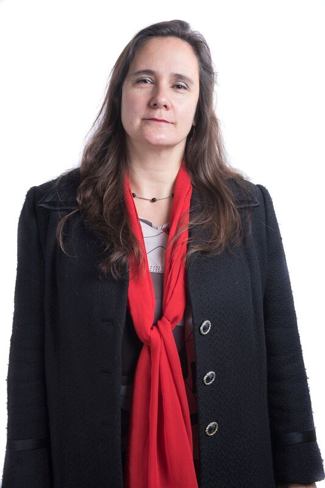
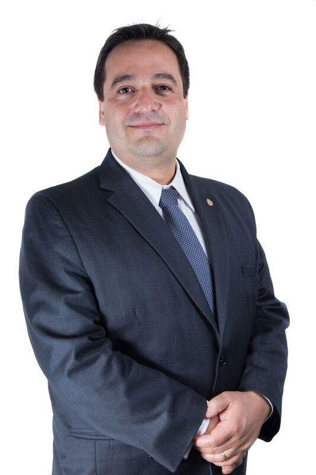
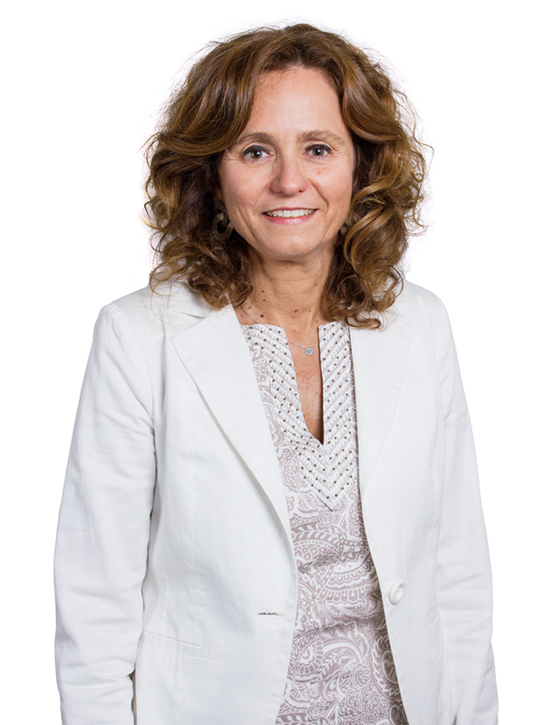
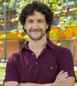
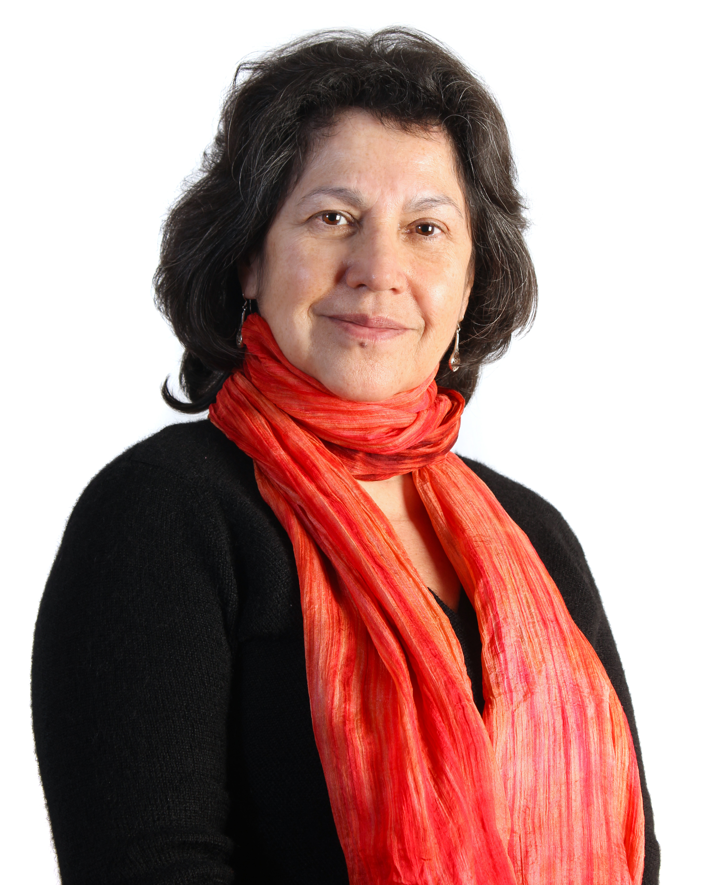
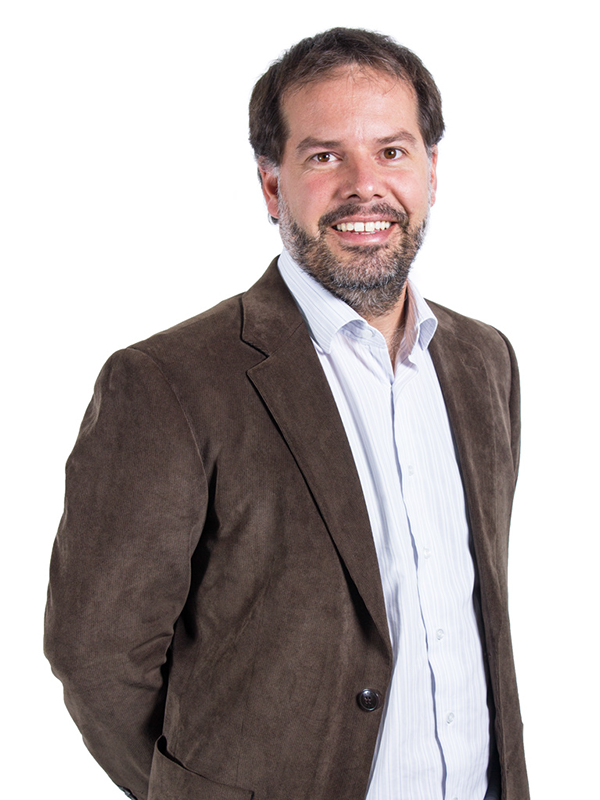

# Vicerrector de Investigación

## Vicerrector de Investigación

El vicerrector de Investigación es la autoridad a quien corresponde la dirección de la Vicerrectoría. Su misión es llevar a la UC a la excelencia, aportando con una investigación de primera línea para ser un aporte al país y al mundo.  

* Propone las políticas de doctorado y aprueba o modifica los planes y programas de estudio que dictan las Facultades. Asimismo establece los procesos de admisión, beneficios y administración de dichos programas.
* Elabora las políticas de apoyo a la investigación, innovación, propiedad intelectual, transferencia tecnológica y creación artística.
* Vela por la correcta ejecución de los proyectos de investigación en sus aspectos éticos y bioéticos.
* Revisa y aprueba los convenios o asociaciones con otras universidades.

El actual vicerrector de investigación es el ingeniero Pedro Bouchon.  

[**Revisa su currículum.**](https://www.ing.uc.cl/academicos-e-investigadores/pedro-alejandro-bouchon-aguirre/)  

### Su equipo 

#### Directora ejecutiva VRI

Pamela Fernández  

#### Director de Transferencia y Desarrollo

Álvaro Ossa  

#### Directora de Investigación

María Elena Boisier  

#### Director de Doctorado y Escuela de Graduados

Diego Cosmelli  

#### Directora de Artes y Cultura

Miryam Singer  

#### Director Ejecutivo del Centro de Innovación UC Anacleto Angelini

Conrad von Igel  

#### Directora Ética UC para la investigación

Andrea Leisewitz

