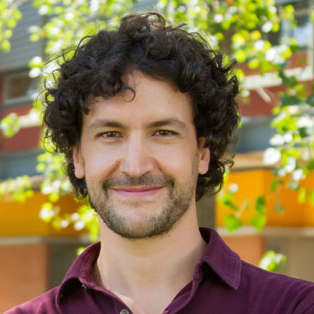

# Vicerrector de Investigación

## Vicerrector de Investigación

#### Su carrera

**Pedro Bouchon Aguirre es Ingeniero Civil Industrial de la Pontificia Universidad Católica de Chile y Doctor of Philosophy de School of Food Biosciences, The University of Reading**. 

Es Profesor Asociado del departamento de Ingeniería Química y Bioprocesos de la Facultad de Ingeniería, y además fue director y creador del Magíster en Innovación UC.

En el momento de su nombramiento, era Vicedecano de la Facultad de Ingeniería, y con anterioridad fue director de Investigación, Innovación y Postgrado de la Facultad de Ingeniería, y director del Proyecto Ingeniería 2030. 

Sus líneas de investigación están enfocadas en el diseño de alimentos con énfasis en la relación entre microestructura; y a los fenómenos de transporte y salud.

#### Sus tareas

Es la autoridad a quien corresponde la dirección de la Vicerrectoría. Su misión es llevar a la UC a la excelencia, aportando con una investigación de primera línea para ser un aporte al país y al mundo.  

* Propone las políticas de doctorado y aprueba o modifica los planes y programas de estudio que dictan las Facultades. Asimismo establece los procesos de admisión, beneficios y administración de dichos programas.
* Elabora las políticas de apoyo a la investigación, innovación, propiedad intelectual, transferencia tecnológica y creación artística.
* Vela por la correcta ejecución de los proyectos de investigación en sus aspectos éticos y bioéticos.
* Revisa y aprueba los convenios o asociaciones con otras universidades.

Para revisar el detalle de las funciones del Vicerrector de Investigación puedes revisar el [Reglamento de los Organismos de la Rectoría](http://secretariageneral.uc.cl/documento/normas-generales/101-reglamento-de-los-organismos-de-rectoria/file).

### Su equipo

#### Directora ejecutiva VRI

Pamela Fernández  

#### Director de Transferencia y Desarrollo

Álvaro Ossa  

#### Directora de Investigación

María Elena Boisier  

#### Director de Doctorado y Escuela de Graduados

Diego Cosmelli  

#### Directora de Artes y Cultura

Miryam Singer  

#### Director Ejecutivo del Centro de Innovación UC Anacleto Angelini

Conrad von Igel  

#### Directora Ética UC para la investigación

Andrea Leisewitz

